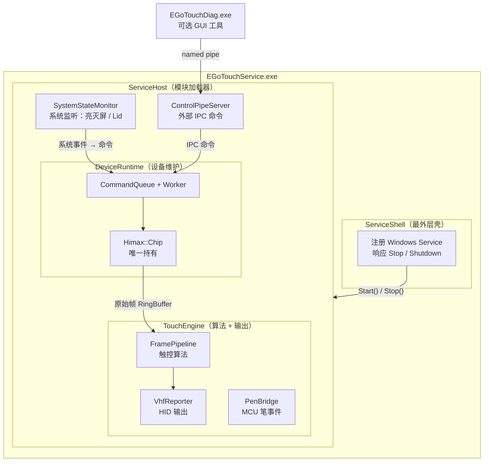
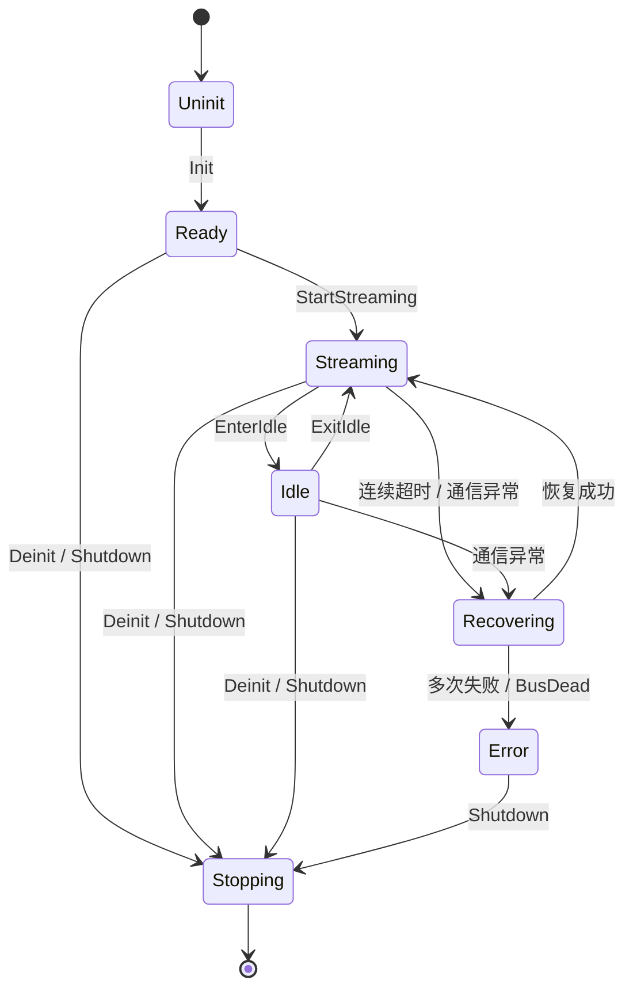

# EGoTouch 驱动服务 — 架构分析与重设计方案

## 一、现状问题诊断

### 1.1 当前层次结构（实际）

```text
App (EGoTouchApp.exe)
 ├── ApplicationEntry.cpp   — ImGui DX11 主循环 + 入口
 ├── RuntimeOrchestrator    — [核心问题：神对象]
 │     ├── 直接持有 Himax::Chip
 │     ├── 3条线程：AcquisitionThread / ProcessingThread / SystemStateThread
 │     ├── VHF/HID 注入逻辑
 │     ├── 笔 MCU 桥接 (PenCommandApi)
 │     ├── DVR 环形缓冲区 (480帧)
 │     ├── AFE 频移自动同步
 │     ├── 配置加载/保存
 │     └── GUI 取帧接口
 └── DiagnosticsWorkbench   — ImGui 调试面板

Control (EGoTouchControlService.exe — 未完成的 service 骨架)
 ├── ControlRuntime         — [mock 存根，无真实设备操作]
 ├── ControlPipeServer      — named pipe IPC
 └── ControlServiceMain     — service 入口 (已接入 SystemStateMonitor)

Host
 └── SystemStateMonitor     — 监听亮灭屏/Lid Named Event

Device
 └── Himax::Chip            — 底层 I²C/USB 硬件访问

Engine
 └── FramePipeline          — 触控算法管线
```


### 1.2 核心问题

| # | 问题 | 影响 |
|---|------|------|
| P1 | **神对象 [RuntimeOrchestrator](file:///d:/source/repos/EGoTouchRev-rebuild-%E8%87%AA%E5%BB%BA%E7%AE%97%E6%B3%95/App/include/RuntimeOrchestrator.h#27-28)** (46KB)：采集、处理、VHF、笔、系统状态、GUI、DVR、配置全混一处 | 难以测试维护；线程边界模糊 |
| P2 | **`ControlRuntime::Execute()` 是 mock**：只改布尔变量，从不调用 `Himax::Chip` | service 进程启动但什么都不做 |
| P3 | **两套独立入口，未真正服务化**：GUI exe 和 ControlService exe 各自独立，设备访问在 GUI 进程 | 无法以 Windows Service 后台运行 |
| P4 | **[SystemStateMonitor](file:///d:/source/repos/EGoTouchRev-rebuild-%E8%87%AA%E5%BB%BA%E7%AE%97%E6%B3%95/Host/include/SystemStateMonitor.h#20-21) 接入了 ControlService，但执行路径是假的** | 亮灭屏事件传入，但 Init/Deinit 不真正执行 |
| P5 | **层次过多且职责交叉**：Host→Control→App→Device 各层均有线程，App 直接读 Device | 无法推断数据所有权与线程安全边界 |
| P6 | **[RuntimeOrchestrator](file:///d:/source/repos/EGoTouchRev-rebuild-%E8%87%AA%E5%BB%BA%E7%AE%97%E6%B3%95/App/include/RuntimeOrchestrator.h#27-28) 内有 `m_systemStateThread`，与 [SystemStateMonitor](file:///d:/source/repos/EGoTouchRev-rebuild-%E8%87%AA%E5%BB%BA%E7%AE%97%E6%B3%95/Host/include/SystemStateMonitor.h#20-21) 功能重复** | SystemState 被处理两次 |

### 1.3 现有设计亮点（保留）

- `Host::SystemStateMonitor` — 只做监听+回调，逻辑清晰，**保留**
- `Control::ControlRuntime` — 命令队列、去重、优先级机制设计合理，**仅执行路径需改造**
- `Engine::FramePipeline` — 算法管线与 transport 无关，**保留**
- `Device::Himax::Chip` — 底层访问封装良好，**保留**
- `Control::ControlPipeServer` — IPC 通道，**保留**

---

## 二、目标架构（重设计）

### 2.1 设计原则

1. **扁平化**：去除 App 中间层，最多 3 个功能层
2. **单一 Device 所有者**：`Himax::Chip` 只由 `DeviceRuntime` 持有，其他模块不得直接访问
3. **单一服务入口**：`EGoTouchService.exe` 作为 Windows Service 运行，GUI 工具通过 IPC 连接
4. **事件驱动 + 状态机**：系统事件 → 命令队列 → 状态机执行 → Chip 操作
5. **Engine 与 Transport 解耦**：`FramePipeline` 不感知设备或 HID


### 2.2 新模块图




### 2.3 三层职责定义

**层1：Service Shell（服务壳）**

| 模块 | 职责 | 线程 |
|------|------|------|
| `ServiceEntry` | Windows SCM 注册 / 控制台回退 | 主线程 |
| [SystemStateMonitor](file:///d:/source/repos/EGoTouchRev-rebuild-%E8%87%AA%E5%BB%BA%E7%AE%97%E6%B3%95/Host/include/SystemStateMonitor.h#20-21) | 监听 Named Event → 提交命令 | 1 个 worker |
| `ControlPipeServer` | 接收外部 IPC 命令 | 1 个 listener |


**层2：DeviceRuntime（设备运行时）**

| 模块 | 职责 | 线程 |
|------|------|------|
| `DeviceRuntime` | 状态机 + 命令队列 + 帧采集 | 1 个 worker（串行） |
| `Himax::Chip` | I²C/USB 硬件，独占于 DeviceRuntime | 无（由 worker 调用） |

**层3：TouchEngine（触控引擎）**

| 模块 | 职责 | 线程 |
|------|------|------|
| `Engine::FramePipeline` | 触控算法处理 | 1 个 processing |
| `VhfReporter` | HID VHF 注入，从 RuntimeOrchestrator 拆出 | 无（由 processing 调用） |
| `PenBridge` | MCU 笔事件桥接，从 RuntimeOrchestrator 拆出 | 1 个 listener |

---

## 三、迁移路径

| 现有代码 | 去向 | 操作 |
|----------|------|------|
| `RuntimeOrchestrator::AcquisitionThreadFunc` | → `DeviceRuntime` worker | 拆分 |
| `RuntimeOrchestrator::ProcessingThreadFunc` | → `TouchEngine` processing | 拆分 |
| `RuntimeOrchestrator::SystemStateThreadFunc` | → 删除，由 [SystemStateMonitor](file:///d:/source/repos/EGoTouchRev-rebuild-%E8%87%AA%E5%BB%BA%E7%AE%97%E6%B3%95/Host/include/SystemStateMonitor.h#20-21) 替代 | **删除** |
| `RuntimeOrchestrator::Dispatch/BuildVhfReports` | → `TouchEngine::VhfReporter` | 拆出 |
| `RuntimeOrchestrator::InitializePenBridge` / `OnPenEvent` | → `TouchEngine::PenBridge` | 拆出 |
| `RuntimeOrchestrator::HandleAutoAfeFreqShiftSync` | → `DeviceRuntime` worker 内部 | 移入 |
| `RuntimeOrchestrator::m_dvrBuffer` / `TriggerDVRExport` | → `TouchEngine` 持有，IPC 触发导出 | 移入 |
| `ControlRuntime::Execute()` (mock) | → `DeviceRuntime::Execute()` 真实 Chip 调用 | **重写** |
| [ApplicationEntry.cpp](file:///d:/source/repos/EGoTouchRev-rebuild-%E8%87%AA%E5%BB%BA%E7%AE%97%E6%B3%95/App/source/ApplicationEntry.cpp)（ImGui 主循环） | → `EGoTouchDiag.exe` 独立 GUI 进程 | 拆出 |
| `Control::ControlPipeServer` | → 保留，移入服务主程序 | 保留 |
| `Host::SystemStateMonitor` | → 保留，移入服务主程序 | 保留 |
| `Engine::FramePipeline` | → 保留不变 | 保留 |
| `Device::Himax::Chip` | → 保留，仅 `DeviceRuntime` 持有 | 保留 |


---

## 四、DeviceRuntime 核心设计

### 4.1 状态机



**状态说明：**

| 状态 | 含义 | Worker 行为 |
|------|------|------------|
| `Uninit` | 冷启动 | 等待 `Init` 命令 |
| `Ready` | 芯片已初始化，未采集 | 等待命令 |
| `Streaming` | `GetFrame()` 循环中 | 持续采帧，发布到 RingBuffer |
| `Idle` | 盖上 Lid / 低功耗 | 低频探帧或挂起 |
| `Recovering` | 连续超时 / 通信异常 | 轻→中→重三级恢复 |
| `Error` | 不可恢复（BusDead） | 等待 Shutdown |
| `Stopping` | 收尾释放 | 退出 worker |

### 4.2 Worker 主循环

```cpp
void DeviceRuntime::WorkerLoop() {
    while (m_running) {
        if (auto cmd = TryPopCommand()) {
            Execute(*cmd);   // 修改状态，调用 Chip
            continue;
        }
        switch (m_state) {
        case State::Streaming:
            if (m_chip->GetFrame(m_slot, kTimeout).ok())
                m_ring.Push(m_slot);   // lock-free
            else
                OnAcqError();          // 累计超时 → Recovering
            break;
        case State::Idle:
            WaitOrPollIdle();
            break;
        default:
            m_cv.wait_for(lock, 50ms);
        }
    }
}
```


### 4.3 Execute() — 真实实现要点

```cpp
// 改造前：只改布尔变量（mock）
// 改造后：真正调用 Chip

case Init:
    m_state = m_chip->Init().ok() ? State::Ready : State::Error;
    break;
case StartStreaming:
    m_state = m_chip->SwitchToStreamMode().ok() ? State::Streaming : State::Error;
    break;
case Deinit:
    m_chip->Deinit();
    m_state = State::Uninit;
    break;
case EnterIdle:
    m_chip->SwitchAfeMode(AFE_Command::Idle);
    m_state = State::Idle;
    break;
```

> **关键约束**：[Execute()](file:///d:/source/repos/EGoTouchRev-rebuild-%E8%87%AA%E5%BB%BA%E7%AE%97%E6%B3%95/Control/source/ControlRuntime.cpp#310-406) 由 worker 线程独占调用，`m_chip` 全程无需额外加锁。

---

## 五、服务入口设计

### 5.1 启动序列

```text
main() / ServiceMain()
  1. Logger::Init()
  2. DeviceRuntime dr;  dr.Start()
  3. TouchEngine te(dr.RingBuffer());  te.Start()
  4. SystemStateMonitor mon;
     mon.Start([&dr](ev){ dr.SubmitCommand(...) })
  5. ControlPipeServer pipe;
     pipe.Start([&dr](cmd){ dr.SubmitCommand(cmd) })
  6. dr.SubmitCommand(Init)
  7. dr.SubmitCommand(StartStreaming)
  8. WaitForShutdown()
  9. dr.SubmitCommand(Shutdown);  dr.Stop()
```

### 5.2 线程汇总

| 线程 | 所属 | 职责 |
|------|------|------|
| `DeviceRuntime::worker` | DeviceRuntime | 状态机 + 帧采集（串行）|
| `TouchEngine::processing` | TouchEngine | 消费帧 + 算法 + VHF 输出 |
| `SystemStateMonitor::worker` | Host | 监听 Named Event |
| `ControlPipeServer::listener` | Control | 接收 IPC 命令 |
| `PenBridge::listener` | TouchEngine | 接收 MCU 笔事件 |

> 总计 **5 条线程**（改造前 RuntimeOrchestrator 单独就有 3 条，且不含 ControlService）

---

## 六、实施优先级

| 优先级 | 任务 |
|--------|------|
| 🔴 P0 | 改造 `ControlRuntime::Execute()` → 真实 `Chip::Init/Deinit/Stream` 调用 |
| 🔴 P0 | 将 `Himax::Chip` 从 [RuntimeOrchestrator](file:///d:/source/repos/EGoTouchRev-rebuild-%E8%87%AA%E5%BB%BA%E7%AE%97%E6%B3%95/App/include/RuntimeOrchestrator.h#27-28) 移入 `DeviceRuntime` |
| 🟠 P1 | 拆出 `VhfReporter` 类（从 RuntimeOrchestrator 到 TouchEngine） |
| 🟠 P1 | 拆出 `PenBridge` 类 |
| 🟡 P2 | 新建 `ServiceEntry.cpp` 替换 [ApplicationEntry.cpp](file:///d:/source/repos/EGoTouchRev-rebuild-%E8%87%AA%E5%BB%BA%E7%AE%97%E6%B3%95/App/source/ApplicationEntry.cpp)（支持 Windows SCM） |
| 🟡 P2 | 删除 `RuntimeOrchestrator::SystemStateThreadFunc`（重复逻辑） |
| 🟢 P3 | 将 `DiagnosticsWorkbench` 拆为独立 `EGoTouchDiag.exe` |
| 🟢 P3 | DVR buffer 移入 `TouchEngine`，导出通过 IPC 触发 |

---

## 七、目录结构建议

```text
EGoTouchService/        ← P0: 服务主程序
  ServiceEntry.cpp/.h

DeviceRuntime/          ← P0: 核心改造（ControlRuntime → 真实执行）
  DeviceRuntime.h/.cpp
  DeviceTypes.h

TouchEngine/            ← P1: 从 RuntimeOrchestrator 拆出
  TouchEngine.h/.cpp
  VhfReporter.h/.cpp
  PenBridge.h/.cpp

Engine/                 ← 保留不变
Device/                 ← 保留不变
Control/                ← 保留（ControlPipeServer）
Host/                   ← 保留（SystemStateMonitor）

EGoTouchDiag/           ← P3: 可选 GUI 工具（独立进程）
  ApplicationEntry.cpp  ←     改为 pipe client 模式
  DiagnosticsWorkbench.h/.cpp
```

