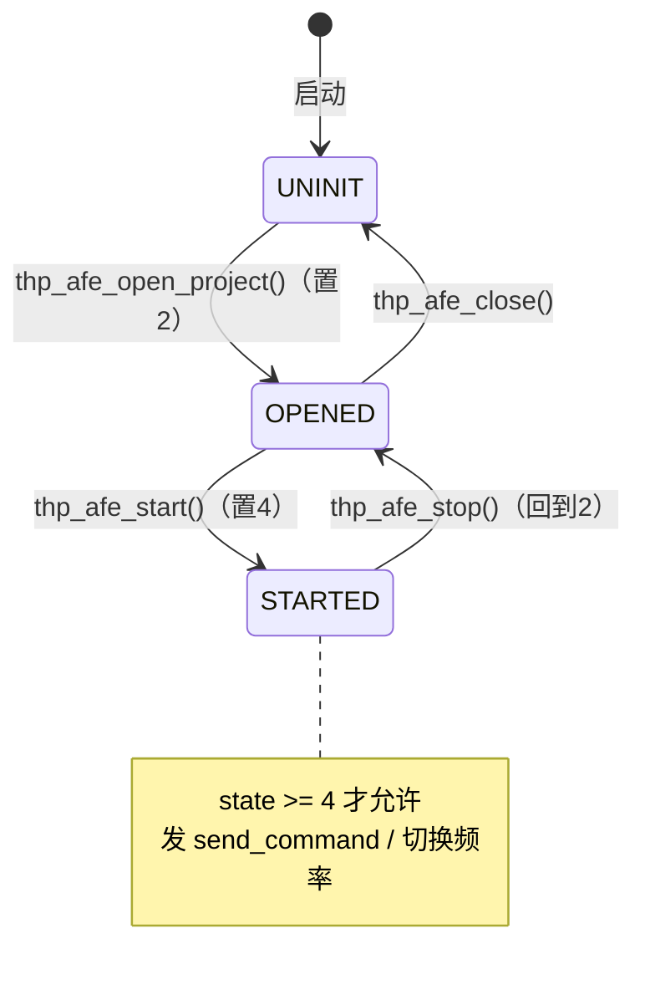
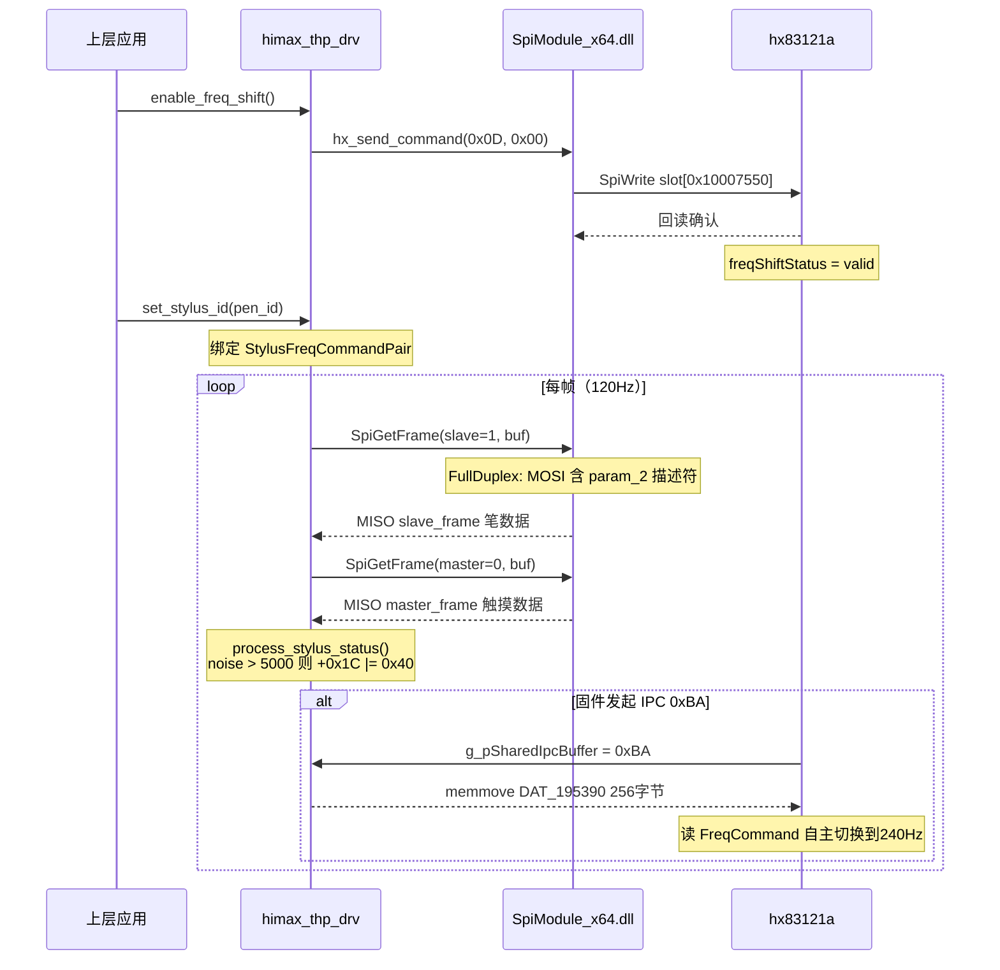

# hx83121a 芯片状态管理逆向分析

> 分析来源：`himax_thp_drv.dll`(port 8194)、`ApDaemon.dll`(port 8195)

---

## 一、底层 IPC 通信机制（`hx_send_command`）

**16字节命令帧格式：**

```
[0xA8][0x8A][cmd_id][0x00][cmd_val][0x00×7][csum_lo][csum_hi][0x00][0x00]
```

**checksum**：对前8字节以 uint16 两两求和，取二进制补码：`csum = (uint16)(0x10000 - sum)`

**5-slot 循环写入：**
```
addr = 0x10007550 + current_slot * 0x10    // slot 0..4
① writeReg(addr, 16 bytes of 0x00)         // 清空 slot
② writeReg(addr, [0xA8, 0x8A, ...])        // 写完整帧（魔数触发芯片识别）
③ readReg(addr, 16)                         // 回读验证
current_slot = (current_slot + 1) % 5
```


---

## 二、状态机（`projectInitState`）



---

## 三、120Hz 标准帧率

```c
hx_send_command(cmd_id=0x0E, cmd_val=0x00)
// 帧: [A8 8A 0E 00 00 00 00 00 00 00 00 00 00 csum_lo csum_hi 00]
```

---

## 四、手写笔 240Hz 协议 — 完整分析

### 4.1 前置命令：`thp_afe_enable_freq_shift`

```c
hx_send_command(cmd_id=0x0D, cmd_val=0x00)
// 帧: [A8 8A 0D 00 00 00 00 00 00 00 00 00 00 csum_lo csum_hi 00]
```
执行后芯片内部 `freqShiftStatus = 有效`，开始处理上行帧中的频率切换请求。

### 4.2 手写笔 ID 注册：`thp_afe_set_stylus_id`

驱动在 **4条目频率表**（基址 `DAT_18016dc80`，条目大小 `0x2a*4` 字节）中查找 `pen_id`：
- 匹配成功 → `g_StylusFreqCommandPairPtr` 指向该条目的 `[freq0_cmd(u16), freq1_cmd(u16)]`
- 无匹配 → 强制使用 ID=5（默认笔 "CD54"），`DAT_18012cbc6=5`，`DAT_18016dc50=1`

### 4.3 SPI 架构

```
SpiModule_x64.dll
  SpiGetFrame(channel, buf, size)
    → Ptr_SpiFullDuplex()  // 全双工 SPI
        MOSI: [outgoing request frame（含 Slave Uplink Descriptor）]
        MISO: [chip response → slave_frame/master_frame]
```

**没有独立的 `SpiSetFrame`。** 频率切换请求嵌在 `SpiGetFrame` 的 MOSI 发送侧。


### 4.4 双结构设计：`process_stylus_status(param_1, param_2, ...)`

`thp_afe_process_stylus_status` 同时维护两个**不同方向**的结构：

| | param_1 (`int *`) | param_2 (`longlong`) |
|--|--|--|
| **名称** | IPC 输出状态结构体 | Slave 上行帧描述符 |
| **方向** | → 向上传递给 TSACore/ApDaemon | → 嵌入 SpiGetFrame MOSI，发往芯片 |
| **位置** | `g_FrameOutTimestampSec` 区（0x180195610） | slave 帧局部缓冲的前缀描述区 |

---

### 4.5 **`param_2`：Slave 上行帧描述符**（随 SpiGetFrame MOSI 发往芯片）

这是频率切换请求的**实际载体**。每次 `SpiGetFrame(slave)` 调用时，此结构随 MOSI 下行到芯片。

| 偏移 | 大小 | 字段 | 写入时机 |
|------|------|------|----------|
| `+0x10` | u16 | 当前频率命令 `freq_pair[cur_idx]` | 每帧写入（来自 `g_StylusFreqCommandPairPtr[0]`） |
| `+0x12` | u16 | 当前频率参数 `0xA1` | 每帧固定写入 |
| `+0x1C` | u32 | **模式/控制字** | 每帧写入（基础值见下表） |
| `+0x28` | u16 | 目标频率命令（频率切换时） | 仅在请求切換时写入 |
| `+0x2A` | u16 | 目标频率参数（频率切换时） | 仅在请求切換时写入 |

#### `+0x1C` 控制字各位定义（`uint32`）

| 位值 | 含义 | 设置条件 |
|------|------|----------|
| `0x06` | 基础模式（无笔/手写笔未按压） | `param_5 == 0`（笔未接触屏幕） |
| `0x12` | 笔压模式（笔按下） | `param_5 != 0`（笔与屏幕接触） |
| `0x20` | **强制频率切换标志** | `g_StylusFreqSwitchForceFlag == 1` 时额外叠加 |
| `0x40` | **频率切换请求标志** | F0/F1 噪声差 > 5000 或 `g_StylusFreqSwitchReqPending == 1` |

> **关键**：`0x40` 是下一次 `SpiGetFrame(slave)` MOSI 发出时被芯片读取的"请求位"。  
> 芯片读到后，结合 `+0x28/+0x2A` 的目标频率命令，自主切换扫描频率（→ 240Hz）。


### 4.6 **`param_1`：IPC 输出状态结构体**（向上传递给 TSACore/ApDaemon）

此结构从 `g_FrameOutTimestampSec`（0x180195610）开始，由 `thp_afe_get_frame` 每帧填写后返回给上层。

**已确认字段（来自逆向）：**

| 偏移 | 类型 | 字段名 | 说明 |
|------|------|--------|------|
| `+0x00` | u32 | `FrameOutTimestampSec` | 帧时间戳（秒） |
| `+0x04` | u32 | `FrameOutTimestampUsec` | 帧时间戳（微秒部分） |
| `+0x08` | u16 | `FrameSequenceCounter` | 全局帧序列号（由 `process_stylus_status` 写） |
| `+0x0C` | u16 | `param_1[0xc/2]`（AfeCurrentFreqCmd） | 当前 AFE 正在使用的频率命令（用于 freqShift 状态比较） |
| `+0x18` | u32 | `FrameOutSequenceId` | 帧输出序列（由 `thp_afe_get_frame` 写） |
| `+0x1C` | u16 | `FrameOutHwStatus0` | 当前 AFE 频率表首项（`*g_AfeFreqTablePtr`） |
| `+0x1E` | u16 | `FrameOutHwStatus1` | AFE 硬件信息 `g_AfeHwInfoPtr+6` |
| `+0x32` | u16 | AFE HW 信息 | `*g_AfeHwInfoPtr`（process_stylus_status 写） |
| `+0x34`（`[0xd]*4`） | u32 | **StatusFlags** | 见下表 |

#### `StatusFlags`（`param_1[0xd]`）各位定义

| 值 | 含义 | 条件 |
|----|------|------|
| `0` | 无数据（空帧） | 无笔数据且无触摸数据 |
| `2` | 有效数据 | `param_3 != 0`（有笔） 或 `param_5 != 0`（有触摸） |
| `3` | 请求重试 | `DAT_180195390 == 1`（firmware retry flag） |
| `\|= 0x04` | 频率偏移已激活 | `freqShiftStatus` 有效 且 `AfeCurrentFreqCmd` 匹配目标 且 `DAT_180195394 != 0` |
| `\|= 0x08` | 特殊状态 0xBB | `DAT_180195396 == 0xBB`（调试/异常标志） |
| `\|= 0x20` | 噪声过高 | `DAT_1801953ac > 0x5DB` 或 `DAT_1801953b0 > 0x5DB`（>1499） |
| `\|= 0x40` | 已有未完成的频率切换请求 | `DAT_18019539c != 0` |


---

### 4.7 频率切换决策流程（`process_stylus_status` 核心逻辑）

```
每帧执行，前提：g_StylusFreqSwitchPolicy >= 2

① 基础写入（无论是否需要切换）:
   param_2[+0x10] = g_StylusFreqCommandPairPtr[freq_idx]  // 当前频率命令
   param_2[+0x12] = 0xA1                                  // 当前频率参数
   param_2[+0x1C] = 0x06 or 0x12                          // 基础控制字

② 噪声判断:
   if (F0_noise - F1_noise) > 5000 AND freq_idx != 1:
      param_2[+0x1C] |= 0x40         // 请求切到频点1（高频，240Hz）
      param_2[+0x28] = freq_pair[1]  // 目标频率命令
      param_2[+0x2A] = 0x18          // 目标频率参数
      g_StylusFreqSwitchTargetIndex = 1
      g_StylusFreqSwitchReqPending = 1

   if (F1_noise - F0_noise) > 5000 AND freq_idx != 0:
      param_2[+0x1C] |= 0x40         // 请求切回频点0（标准频率）
      param_2[+0x28] = freq_pair[0]
      param_2[+0x2A] = 0xA1
      g_StylusFreqSwitchTargetIndex = 0
      g_StylusFreqSwitchReqPending = 1

③ 若 g_StylusFreqSwitchReqPending=1 但 freq_idx 还未完成切换:
      继续设置 param_2[+0x1C] |= 0x40（保持请求）

④ 强制标志: g_StylusFreqSwitchForceFlag=1 → param_2[+0x1C] |= 0x20

⑤ 更新 param_1[0xd/StatusFlags] 见上节
   写 param_1[+0x0C] = AFE 当前频率槽命令（最终步骤）
```

---

### 4.8 完整连接时序图



---

## 五、ApDaemon — VHF 手写笔 HID 报告（13字节）

`DriverThp_ReportStylusPoints` 在 `this+0x66C` 处构建，通过 vtbl[1] 派发到系统：

| 偏移 | 大小 | 值 | 说明 |
|------|------|----|------|
| +0 | 1 | `0x08` | 固定帧头 |
| +1 | 1 | `bit0=tip_switch, bit5-6=mode` | 触笔离合 + 模式（来自 param_2[0] bit[5:4]） |
| +2 | 1 | `0x80` | 固定标志 |
| +3 | 2 | `input_x × −10 + 16000` | X 坐标（0-16000，含坐标轴反向） |
| +5 | 2 | `input_y × 10` | Y 坐标 |
| +7 | 2 | pressure | 压力值（来自 param_2+0x24） |
| +9 | 2 | tilt_x | 来自 `(char)param_2+0x29` |
| +11 | 2 | tilt_y | 来自 `(char)param_2[5]` |

---

## 六、命令速查表

| 功能 | cmd_id | cmd_val | 触发函数 | 说明 |
|------|--------|---------|----------|------|
| **启用频率偏移**（240Hz 前置） | `0x0D` | `0x00` | `thp_afe_enable_freq_shift` | IPC slot 写入 |
| 标准扫描率（120Hz） | `0x0E` | `0x00` | `thp_afe_force_to_scan_rate` | IPC slot 写入 |
| 频率切换请求 | — | 嵌入 `param_2[+0x1C]` bit `0x40` | `process_stylus_status`（每帧自动） | 随 SpiGetFrame MOSI 下行 |
| 模式密码握手 | — | reg `0x10007F04` = `0x7777/0x1111/0xAAAA` | `hx_switch_mode` | AHB 寄存器直写 |


