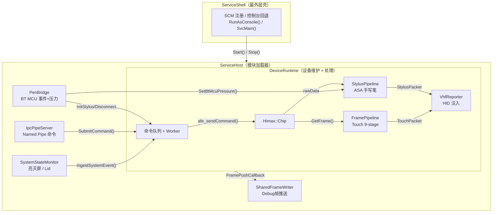
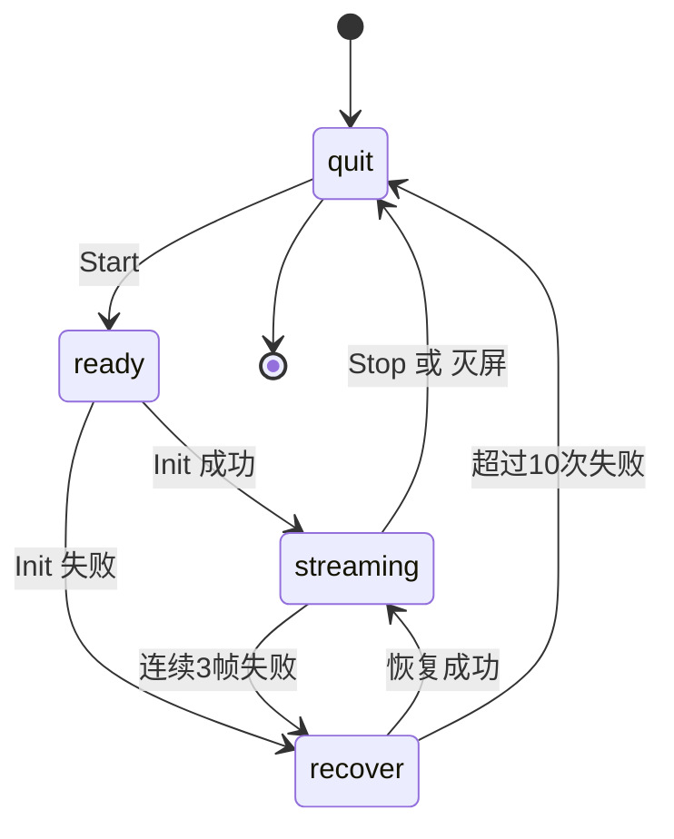
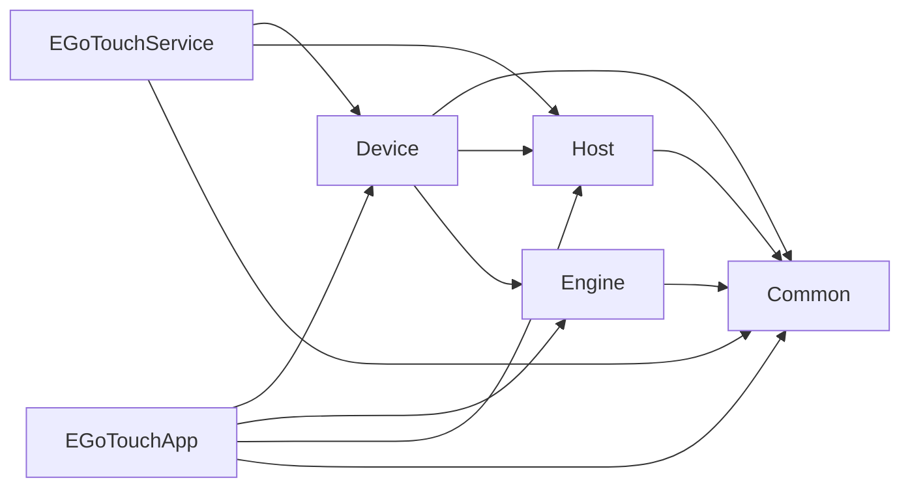

# EGoTouch 驱动服务 — 架构文档 (v2)

> **最后更新**: 2026-03-29
> **状态**: 第一阶段重构已完成；正在规划第二阶段（正式 Windows Service + Touch-Only 模式）

---

## 一、架构演进概述

### 1.1 第一阶段重构成果（已完成 ✅）

原文档 v1 诊断出的六大核心问题，通过第一阶段重构已解决大半：

| # | 原 v1 问题 | 当前状态 |
|---|-----------|---------|
| P1 | **神对象 RuntimeOrchestrator (46KB)** | ✅ **已拆解**。采集/处理/VHF/笔/状态机均已分离到各自模块 |
| P2 | **ControlRuntime::Execute() 是 mock** | ✅ **已重写**。`DeviceRuntime` 真实调用 `Himax::Chip` |
| P3 | **两套独立入口，未服务化** | ⚠️ **部分完成**。`ServiceShell` 已实现 SCM 注册，但尚未安装为正式 Windows Service |
| P4 | **SystemStateMonitor 执行路径假** | ✅ **已修复**。事件→`DeviceRuntime::IngestSystemEvent()`→Stop/Start 真实执行 |
| P5 | **层次过多、职责交叉** | ✅ **已扁平化**。3 层结构：Shell → Host → Device+Engine |
| P6 | **SystemState 被处理两次** | ✅ **已删除**。RuntimeOrchestrator 已不存在 |

### 1.2 当前实际层次结构

```text
EGoTouchService.exe                     ← 生产服务进程
  ServiceEntry.cpp                      — wmain(): SCM 注册 / --console 回退
  ├── ServiceShell                      — SCM 控制码处理 (Stop/Shutdown/PreShutdown)
  │     └── ServiceHost                 — 模块加载器：创建、连接、启停所有子模块
  │           ├── DeviceRuntime         — 状态机 + 帧采集 Worker + 命令队列
  │           │     ├── Himax::Chip     — I²C/USB 硬件独占
  │           │     ├── FramePipeline   — Touch 算法管线 (9 stage processors)
  │           │     ├── StylusPipeline  — Stylus 独立管线 (ASA)
  │           │     └── VhfReporter     — HID VHF 系统注入
  │           ├── SystemStateMonitor    — 监听亮灭屏/Lid Named Event
  │           ├── PenBridge             — BT MCU 双通道 (事件+压力)
  │           ├── IpcPipeServer         — Named Pipe IPC 命令通道
  │           ├── SharedFrameWriter     — Shared Memory 帧推送 (Debug mode)
  │           └── ConfigDirtyFlag       — config.ini 同步标记

EGoTouchApp.exe                         ← 调试诊断上位机 (Tools/)
  ApplicationEntry.cpp                  — ImGui DX11 主循环
  ├── ServiceProxy                      — Named Pipe + SharedMem 客户端
  │     ├── IpcPipeClient               — 命令通道客户端
  │     ├── SharedFrameReader           — 帧数据读取 (DebugMode)
  │     ├── FramePipeline (local copy)  — GUI 参数镜像
  │     └── DVR RingBuffer              — 本地 480帧回放
  └── DiagnosticsWorkbench              — ImGui 调试面板 (66KB)

BtMcuTestTool.exe                       ← BT MCU 协议验证工具 (Tools/)
```

### 1.3 设计亮点（保留自 v1 + 新增）

**保留：**
- `Host::SystemStateMonitor` — 只做监听+回调，逻辑清晰
- `Engine::FramePipeline` — 触控算法管线与 transport 解耦
- `Device::Himax::Chip` — 底层 I²C/USB 封装完善

**新增 (v2 落地)：**
- `DeviceRuntime` — 真实状态机 + 串行 Worker，`Himax::Chip` 独占持有
- `ServiceShell` + `ServiceHost` — 清晰的 Shell→Host 两层分离
- `IPC 双通道` (Named Pipe + Shared Memory) — Service/App 完全解耦
- `ServiceProxy` — App 端纯代理，零设备访问
- `PenBridge` — 独立双线程，事件通道+压力通道各自专用 transport
- `StylusPipeline` — 取代旧 StylusProcessor stub，完整 ASA 管线

---

## 二、当前模块详解

### 2.1 服务端三层架构



### 2.2 IPC 通信协议

**App ↔ Service 命令通道** (Named Pipe `\\.\pipe\EGoTouchControl`):

| 命令 | 方向 | 用途 |
|------|------|------|
| `Ping` | App→Svc | 连接探活 |
| `EnterDebugMode` | App→Svc | 开启 SharedMem 帧推送 |
| `ExitDebugMode` | App→Svc | 关闭帧推送 |
| `StartRuntime` / `StopRuntime` | App→Svc | 远程启停设备 |
| `AfeCommand` | App→Svc | AFE 命令（频移/校准/频点切换…） |
| `SetVhfEnabled` / `SetVhfTranspose` | App→Svc | VHF HID 开关/转置 |
| `ReloadConfig` / `SaveConfig` | App→Svc | config.ini 远程读写 |
| `GetLogs` | App→Svc | 拉取 Service 端日志 |
| `GetPenBridgeStatus` | App→Svc | PenBridge 压感/状态查询 |

**帧数据通道** (Shared Memory `Local\EGoTouchSharedFrame`):
- Service 写入 → App 轮询读取
- 仅在 DebugMode 时激活

### 2.3 DeviceRuntime 状态机



**状态说明：**

| 状态 | Worker 行为 |
|------|------------|
| `quit` | Deinit Chip → 退出线程，等待 `Start()` 重新创建 |
| `ready` | 若 auto mode，立即 `Chip::Init()` |
| `streaming` | `GetFrame()` → Touch Pipeline → Stylus Pipeline → VHF 输出 |
| `recover` | `check_bus()` → `Init()` → 成功则回 streaming |

### 2.4 线程汇总

| 线程 | 所属 | 职责 | 创建时机 |
|------|------|------|---------|
| `DeviceRuntime::worker` | DeviceRuntime | 状态机 + 帧采集 + Pipeline + VHF（串行） | `Start()` |
| `SystemStateMonitor::worker` | Host | 监听 Named Event，回调 `IngestSystemEvent` | `ServiceHost::Start()` |
| `PenBridge::evtThread` | Device/btmcu | BT MCU 事件通道读取 + ACK + 握手 | `PenBridge::Start()` |
| `PenBridge::pressThread` | Device/btmcu | BT MCU 压力通道连续读取 | `PenBridge::Start()` |
| `IpcPipeServer::listener` | Common | 接收/应答 App IPC 命令 | `IpcPipeServer::Start()` |
| *(App侧)* `ServiceProxy::pollThread` | App | 轮询 SharedMem 帧数据 | 进入 DebugMode |
| *(App侧)* `ServiceProxy::discoveryThread` | App | 自动发现 Service 连接 | App 启动 |

> 服务端总计 **5 条常驻线程**。App 端额外 2 条。

### 2.5 Engine Pipeline 处理链

```text
Touch Pipeline (FramePipeline — 9 stages):
  1. MasterFrameParser      — 5063B → 40×60 int16 heatmap
  2. BaselineSubtraction    — 基线校正
  3. CMFProcessor           — CMF 滤波
  4. GridIIRProcessor       — IIR 网格滤波
  5. FeatureExtractor       — 峰值检测 + 连通域 + 坐标提取
  6. StylusProcessor [DEPRECATED STUB]
  7. TouchTracker           — 手指跟踪 + ID 分配
  8. CoordinateFilter       — 坐标滤波/IIR平滑
  9. TouchGestureStateMachine — 手势状态机 (Down/Move/Up)

Stylus Pipeline (StylusPipeline — independent):
  Parse slave frame → 9×9 Grid → GridPeakDetector →
  CoordinateSolver → CoorPostProcessor → Tilt/Pressure →
  Recheck → AnimationProcess → Calibration → StylusPacket
```

---

## 三、目录结构（当前）

```text
EGoTouchRev-rebuild/
├── CMakeLists.txt               ← Build: 4 targets (Service, App, BtMcuTestTool, tests)
│
├── Common/                      ← 公共基础设施
│   ├── include/
│   │   ├── Logger.h / GuiLogSink.h
│   │   ├── IpcProtocol.h / IpcPipeServer.h / IpcPipeClient.h
│   │   ├── SharedFrameBuffer.h
│   │   └── ConfigSync.h
│   ├── source/
│   └── imgui-docking/           ← ImGui (submodule)
│
├── EGoTouchService/             ← 服务主程序
│   ├── include/
│   │   ├── ServiceShell.h       ← SCM 壳
│   │   └── ServiceHost.h        ← 模块加载器
│   ├── source/
│   │   ├── ServiceEntry.cpp     ← wmain()
│   │   ├── ServiceShell.cpp
│   │   └── ServiceHost.cpp
│   ├── Device/
│   │   ├── Device.h             ← ChipError, AFE_Command, StylusState
│   │   ├── himax/               ← HimaxChip, HimaxProtocol, HimaxRegisters
│   │   ├── runtime/             ← DeviceRuntime (状态机 + Worker)
│   │   ├── vhf/                 ← VhfReporter (HID VHF 注入)
│   │   └── btmcu/               ← PenBridge, PenSession, PenCommandApi, PenUsb*
│   ├── Engine/
│   │   ├── FramePipeline.h/cpp  ← IFrameProcessor 管线框架
│   │   ├── EngineTypes.h        ← HeatmapFrame, TouchContact, StylusPacket
│   │   ├── IFrameProcessor.h    ← 管线处理器接口
│   │   ├── Preprocessing/       ← MasterFrameParser, Baseline, CMF, GridIIR, Gaussian...
│   │   ├── TouchSolver/         ← PeakDetector, ZoneExpander, EdgeComp, Tracker...
│   │   ├── Reporting/           ← StylusProcessor[DEPRECATED], TouchTracker, GestureStateMachine
│   │   └── StylusSolver/        ← StylusPipeline, GridPeakDetector, CoordinateSolver, CoorPostProcessor
│   └── Host/
│       ├── include/             ← SystemStateMonitor.h, SystemStateEvent.h
│       └── source/              ← SystemStateMonitor.cpp
│
├── Tools/
│   ├── EGoTouchApp/             ← 调试诊断 GUI
│   │   ├── include/             ← ServiceProxy.h, DiagnosticsWorkbench.h, ConcurrentRingBuffer.h
│   │   └── source/              ← ApplicationEntry.cpp, ServiceProxy.cpp, DiagnosticsWorkbench.cpp
│   ├── BtMcuTestTool/           ← BT MCU 协议验证
│   └── tests/                   ← 单元测试 (SystemStateMonitor, RawdataBenchmark)
│
├── docs/                        ← 文档
│   ├── architecture_redesign.md ← 本文件
│   ├── stylus_system_reference.md
│   ├── stylus_coordinate_pipeline.md
│   ├── chip_state_analysis.md
│   ├── frame_layout_analysis.md
│   ├── tsa_asa_process_analysis.md
│   ├── tsacore_algorithm_analysis.md
│   └── ...
│
└── config.ini                   ← 运行时配置
```

---

## 四、第二阶段规划

### 4.1 当前遗留问题

| # | 问题 | 影响 | 优先级 |
|---|------|------|--------|
| R1 | **Service 未安装为正式 Windows Service** | 当前只能 `--console` 运行或手动 SCM 注册。生产环境需开机自启、崩溃自恢复 | 🔴 P0 |
| R2 | **手写笔固件不稳定** | BT MCU 协议虽已实现，但笔固件侧有问题，导致 Stylus 通道不可靠。需暂时搁置笔功能，出一版 Touch-Only 服务 | 🔴 P0 |
| R3 | **App (DiagnosticsWorkbench) 仍然庞大** | 66KB 单文件，但已完全通过 IPC 运行，不再直接访问硬件。解耦已完成，优化可后续进行 | 🟡 P2 |
| R4 | **StylusProcessor 废弃 stub 仍在 Pipeline 中注册** | `BuildDefaultPipeline()` 仍注册了 DEPRECATED 的 `StylusProcessor`。应移除 | 🟢 P3 |
| R5 | **config.ini 加载路径硬编码为工作目录** | 应改用 `ProgramData` 固定路径 | 🟡 P2 |

### 4.2 目标

1. **正式 Windows Service 封装** — `sc create` / 安装脚本 / 崩溃恢复策略
2. **Touch-Only 模式** — 可配置地禁用 PenBridge 和 StylusPipeline
3. **App 解耦确认** — 确保 App 在 Service 未运行时仍可优雅降级

### 4.3 设计方案

#### 4.3.1 正式 Windows Service 封装

**当前状态**：
- `ServiceShell` 已实现 `SvcMain()` → `RegisterServiceCtrlHandlerExW()` → `ServiceHost::Start()`
- `ServiceEntry.cpp` 已实现 `wmain()` → `StartServiceCtrlDispatcherW()` + 回退逻辑
- 缺少：服务安装/卸载脚本、崩溃恢复配置、日志路径固定

**方案**：

```text
新增文件：
  scripts/
    install_service.bat    — sc create + sc failure 配置
    uninstall_service.bat  — sc stop + sc delete
    
修改：
  ServiceEntry.cpp
    - 增加 --install / --uninstall 命令行参数支持
    - 日志路径改用 ProgramData 绝对路径
  
  ServiceHost.cpp
    - config.ini 路径改用 ProgramData
```

安装脚本核心逻辑：
```bat
sc create EGoTouchService binPath= "%~dp0EGoTouchService.exe" start= auto
sc failure EGoTouchService reset= 86400 actions= restart/5000/restart/10000/restart/30000
sc description EGoTouchService "EGoTouch Capacitive Touch Controller Driver Service"
```

`ServiceEntry.cpp` 新增自注册：
```cpp
if (argc >= 2 && std::wstring_view(argv[1]) == L"--install") {
    // CreateService() with SERVICE_WIN32_OWN_PROCESS | SERVICE_INTERACTIVE_PROCESS
    // ChangeServiceConfig2W() for failure actions
}
if (argc >= 2 && std::wstring_view(argv[1]) == L"--uninstall") {
    // ControlService(SERVICE_CONTROL_STOP)
    // DeleteService()
}
```

#### 4.3.2 Touch-Only 模式

**动机**：手写笔固件端存在问题（BT MCU 握手偶发失败、压力通道数据不稳定），暂时需要一版只处理触摸屏输入、不启动笔相关模块的运行配置。

**方案**：

```text
config.ini 新增：
  [Service]
  mode=touch_only    ; touch_only | full

影响范围：
  ServiceHost::Start()
    - mode=touch_only 时：
      ✅ DeviceRuntime（触摸采集+Pipeline+VHF）正常启动
      ✅ SystemStateMonitor 正常启动
      ✅ IpcPipeServer 正常启动
      ❌ PenBridge 不启动
    
  DeviceRuntime::OnStreaming()
    - mode=touch_only 时：
      ✅ Touch Pipeline 正常执行
      ❌ StylusPipeline::Process() 不调用
      ❌ VhfReporter::DispatchStylus() 不调用 (已禁用)
    
  ServiceHost PenEvent 回调
    - mode=touch_only 时：
      ❌ InitStylus/DisconnectStylus 命令不提交
```

代码改动概要：

```cpp
// ServiceHost.h — 新增
enum class ServiceMode { Full, TouchOnly };

// ServiceHost.cpp — Start() 中读取配置
ServiceMode mode = ServiceMode::Full;
{
    std::ifstream cfg("config.ini");  // TODO: use ProgramData path
    // parse [Service] mode=touch_only
}

// 条件启动 PenBridge
if (mode == ServiceMode::Full) {
    m_penBridge = std::make_unique<Himax::Pen::PenBridge>();
    // ... setup callbacks, Start() ...
}

// DeviceRuntime — 新增模式开关
void SetTouchOnlyMode(bool v) { m_touchOnly.store(v); }
// OnStreaming() 中:
if (!m_touchOnly.load()) {
    m_stylusPipeline.Process(...);
}
```

#### 4.3.3 App 解耦状态确认

**当前解耦状态**：已完成 ✅

| 维度 | 状态 |
|------|------|
| 设备访问 | ✅ App 不持有 `Himax::Chip`，全部通过 `ServiceProxy` IPC |
| 帧获取 | ✅ Shared Memory 读取，非直接总线访问 |
| AFE 命令 | ✅ 通过 `AfeCommand` IPC 转发 |
| VHF 控制 | ✅ 通过 `SetVhfEnabled`/`SetVhfTranspose` IPC |
| 配置管理 | ✅ 通过 `ReloadConfig`/`SaveConfig` IPC |
| 手写笔状态 | ✅ 通过 `GetPenBridgeStatus` IPC 查询 |
| 日志 | ✅ 通过 `GetLogs` IPC 拉取 |

**待优化项**：
- `ServiceProxy` 在 Connect 失败时应有更明确的 UI 提示
- `DiagnosticsWorkbench` 可进一步拆分为独立模块（P3 优先级）

---

## 五、实施优先级

| 优先级 | 任务 | 涉及文件 |
|--------|------|---------|
| 🔴 P0 | **Touch-Only 模式开关** — `config.ini` 配置 + ServiceHost/DeviceRuntime 条件跳过 | `ServiceHost.h/cpp`, `DeviceRuntime.h/cpp`, `config.ini` |
| 🔴 P0 | **Service 安装脚本** — `--install`/`--uninstall` + `sc failure` 崩溃恢复 | `ServiceEntry.cpp`, `scripts/*.bat` |
| 🟠 P1 | **日志/配置路径固化** — 改用 `C:/ProgramData/EGoTouchRev/` | `ServiceEntry.cpp`, `ServiceHost.cpp` |
| 🟠 P1 | **移除 StylusProcessor 废弃 stub** — 从 `BuildDefaultPipeline()` 移除 | `ServiceHost.cpp`, 可选删除 `StylusProcessor.h/cpp` |
| 🟡 P2 | **App Service 连接失败 UI 优化** — 明确提示 Service 未运行 | `DiagnosticsWorkbench.cpp` |
| 🟢 P3 | **DiagnosticsWorkbench 拆分** — 按功能域拆为多个 Inspector 面板文件 | `Tools/EGoTouchApp/` |

---

## 六、构建目标 (CMake)

| Target | 类型 | 用途 |
|--------|------|------|
| `EGoTouchService` | EXE | 生产服务 (Service Shell + Host + Device + Engine) |
| `EGoTouchApp` | EXE | 调试诊断 GUI (ImGui DX11 + ServiceProxy IPC) |
| `BtMcuTestTool` | EXE | BT MCU 协议验证工具 |
| `HostSystemStateMonitorTest` | EXE | 系统状态监控测试 |
| `EngineRawdataBenchmarkTest` | EXE | 算法性能基准测试 |

**依赖图**:


---

## 七、核心接口速查

### DeviceRuntime
```cpp
class DeviceRuntime {
    bool Start();                          // 启动 Worker 线程
    void Stop();                           // 停止并 join
    void SetAutoMode(bool);                // 自动 Init+Stream
    uint64_t SubmitCommand(command, CommandSource, const char* reason);
    void IngestSystemEvent(const SystemStateEvent&);
    
    FramePipeline& GetPipeline();          // Touch 管线配置
    StylusPipeline& GetStylusPipeline();   // Stylus 管线配置
    VhfReporter& GetVhfReporter();         // HID 输出配置
    void SetBtMcuPressure(uint16_t);       // 外部压感注入
    void SetFramePushCallback(FramePushCallback); // Debug帧推送
    
    RuntimeSnapshot GetSnapshot() const;   // 状态查询
    std::vector<HistoryEntry> GetHistory(size_t n) const; // 审计日志
};
```

### ServiceHost
```cpp
class ServiceHost {
    bool Start();   // 按顺序启动: DeviceRuntime → SystemStateMonitor → IPC → PenBridge
    void Stop();    // 逆序停止: IPC → PenBridge → SystemStateMonitor → DeviceRuntime
};
```

### ServiceProxy (App 端)
```cpp
class ServiceProxy {
    bool Connect();
    void Disconnect();
    bool GetLatestFrame(HeatmapFrame& out);
    bool SwitchAfeMode(uint8_t cmd, uint8_t param);
    bool StartRemoteRuntime() / StopRemoteRuntime();
    void SaveConfig() / LoadConfig();
    bool SetVhfEnabled(bool) / SetVhfTranspose(bool);
    PenBridgeStatus GetPenBridgeStatus() const;
};
```
