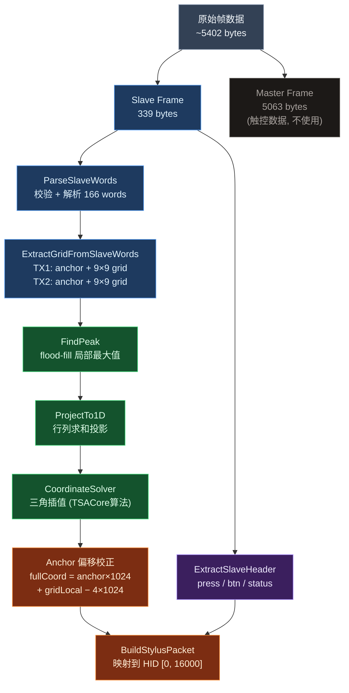
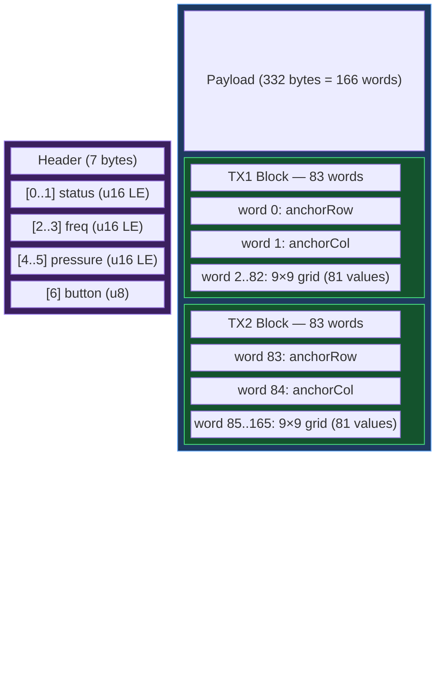
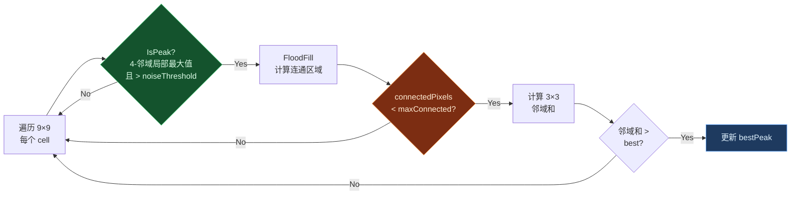
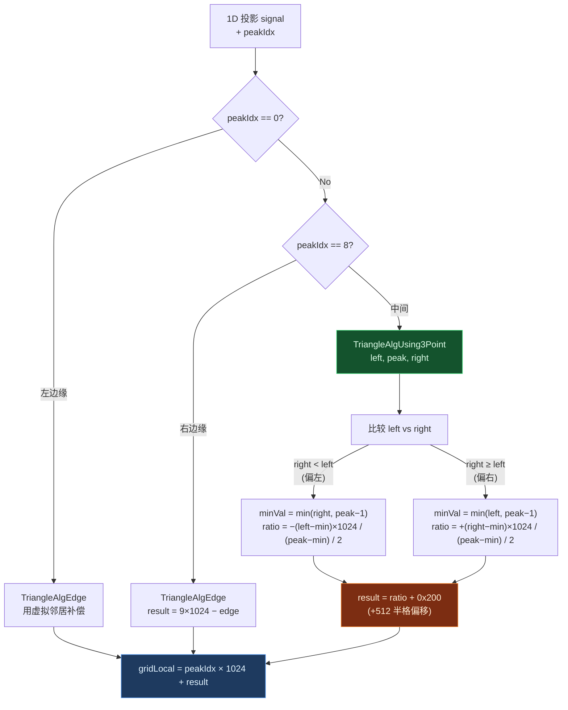
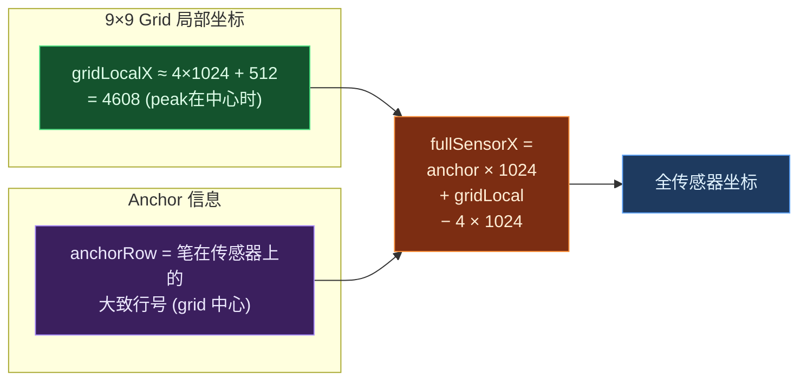
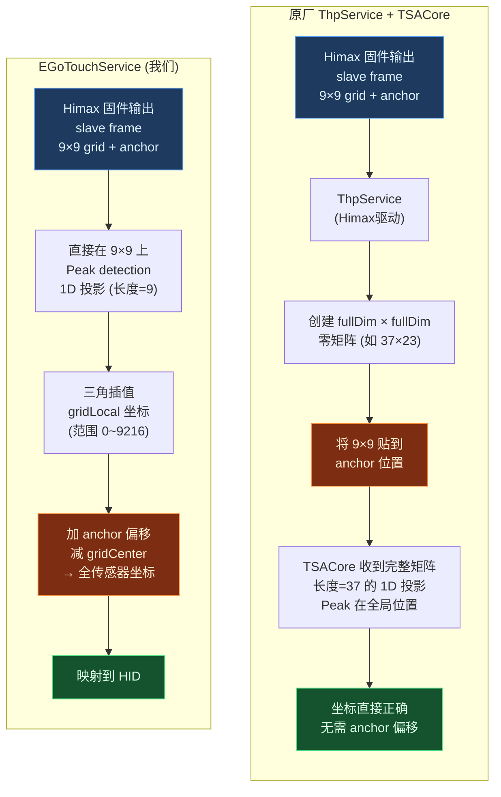
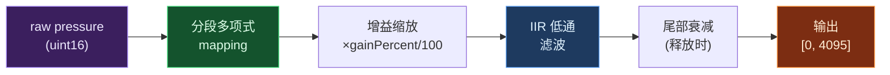

# 手写笔坐标解算管线文档

> 最后更新: 2026-03-28

## 1. 总体架构



## 2. 数据帧结构

### 2.1 完整帧布局

| Offset | Size | Description |
|--------|------|-------------|
| `0x0000` | 5063 | Master Frame (触控 mutual capacitance, 本管线不直接使用) |
| `0x13C7` | 339 | Slave Frame (手写笔核心数据) |

### 2.2 Slave Frame 结构



> [!IMPORTANT]
> **Anchor 含义**: `anchorRow` / `anchorCol` 代表 9×9 grid 的 **中心位置** (grid index 4) 在完整传感器阵列上的坐标。这是固件在扫描时确定的笔的大致位置。

### 2.3 TX Block 内 Grid 排列

9×9 grid 按**行优先**存储在 word[2..82] 中:

```
grid[r][c] = (int16_t) words[2 + r × 9 + c]

     c=0  c=1  c=2  ...  c=8
r=0 [ w2   w3   w4  ...  w10 ]
r=1 [ w11  w12  w13 ...  w19 ]
 ⋮
r=8 [ w74  w75  w76 ...  w82 ]
```

## 3. 坐标解算流程详解

### 3.1 Step 1 — Slave Words 解析

> 📄 [StylusPipeline.cpp](file:///d:/source/repos/EGoTouchRev-rebuild-自建算法/EGoTouchService/Engine/StylusSolver/StylusPipeline.cpp#L28-L52) :: `ParseSlaveWords`

- 跳过 slave header 的 7 字节
- 读取 166 个 little-endian uint16 words
- (可选) 校验和验证: `sum(all_words) & 0xFFFF == 0`

### 3.2 Step 2 — Grid 提取

> 📄 [AsaTypes.h](file:///d:/source/repos/EGoTouchRev-rebuild-自建算法/EGoTouchService/Engine/StylusSolver/AsaTypes.h#L71-L99) :: `ExtractGridFromSlaveWords`

```cpp
TX1.anchorRow = words[0];
TX1.anchorCol = words[1];
TX1.grid[r][c] = (int16_t) words[2 + r*9 + c];
TX1.valid = (anchorRow != 0x00FF) || (anchorCol != 0x00FF);
```

### 3.3 Step 3 — Peak 检测

> 📄 [GridPeakDetector.cpp](file:///d:/source/repos/EGoTouchRev-rebuild-自建算法/EGoTouchService/Engine/StylusSolver/GridPeakDetector.cpp#L76-L103) :: `FindPeak`



| 参数 | 默认值 | 说明 |
|------|--------|------|
| `noiseThreshold` | 50 | 低于此值的 cell 视为噪声 |
| `maxConnected` | 20 | 连通区域超过此值视为噪声块 |

### 3.4 Step 4 — 1D 投影

> 📄 [GridPeakDetector.cpp](file:///d:/source/repos/EGoTouchRev-rebuild-自建算法/EGoTouchService/Engine/StylusSolver/GridPeakDetector.cpp#L106-L139) :: `ProjectTo1D`

以 peak 为中心，取 ±`projRadius` (默认 2) 行/列做求和投影:

```
dim1[c] = Σ grid[rMin..rMax][c]   (c = 0..8)  → 列方向信号
dim2[r] = Σ grid[r][cMin..cMax]   (r = 0..8)  → 行方向信号

peakIdxDim1 = argmax(dim1)
peakIdxDim2 = argmax(dim2)
```

### 3.5 Step 5 — 三角插值 (核心算法)

> 📄 [CoordinateSolver.cpp](file:///d:/source/repos/EGoTouchRev-rebuild-自建算法/EGoTouchService/Engine/StylusSolver/CoordinateSolver.cpp) :: 逆向自 TSACore.dll `TriangleAlgUsing3Piont`



> [!NOTE]
> `0x200` (512) 偏移将结果定位在 cell 中心。当三个信号值相等时，`ratio = 0`，结果为 `peakIdx × 1024 + 512` — 即 cell 正中央。

### 3.6 Step 6 — Anchor 偏移 (关键步骤)

> 📄 [StylusPipeline.cpp](file:///d:/source/repos/EGoTouchRev-rebuild-自建算法/EGoTouchService/Engine/StylusSolver/StylusPipeline.cpp#L247-L264) :: 坐标重建



**公式**:
```
fullSensorX = (anchorRow − gridCenter) × kCoorUnit + gridLocalX
fullSensorY = (anchorCol − gridCenter) × kCoorUnit + gridLocalY

其中 gridCenter = 4, kCoorUnit = 1024
```

> [!WARNING]
> 如果不减去 `gridCenter × kCoorUnit`，坐标会固定偏移 ~4096，因为 anchor 指的是 grid **中心** 而非左上角。

### 3.7 Step 7 — HID 报告映射

> 📄 [StylusPipeline.cpp](file:///d:/source/repos/EGoTouchRev-rebuild-自建算法/EGoTouchService/Engine/StylusSolver/StylusPipeline.cpp#L572-L608) :: `BuildStylusPacket`

```
reportX = (1.0 − fullSensorX / (sensorDimX × 1024)) × 16000
reportY = fullSensorY / (sensorDimY × 1024) × 16000

输出范围: [0, 16000] → Windows HID 映射到屏幕像素 (2560×1600)
```

X 轴反转 (`1.0 − ...`) 是横屏方向约定。

## 4. 原厂 vs 我们的实现



> [!TIP]
> 两种方案**数学等价**: 原厂在完整矩阵中做投影时，只有 anchor 附近的 9×9 区域有非零值，peak 总是在 `[anchor, anchor+8]` 范围内。我们直接用 anchor 偏移得到相同结果。

## 5. 关键参数表

| 参数 | 值 | 说明 |
|------|------|------|
| `kGridDim` | 9 | 网格维度 |
| `kCoorUnit` | 1024 (`0x400`) | 每传感器间距的子单位数 |
| `kGridCenter` | 4 | 网格中心索引 (`kGridDim / 2`) |
| `sensorDimX` | **待确定** (默认 37) | 完整传感器行数 |
| `sensorDimY` | **待确定** (默认 23) | 完整传感器列数 |
| `noiseThreshold` | 50 | Peak 检测信号门限 |
| `projRadius` | 2 | 1D 投影的行/列范围 |
| HID Report Max | 16000 | HID 逻辑坐标最大值 |
| 屏幕分辨率 | 2560 × 1600 | Gaokun CSOT 面板 |

### 确定 sensorDimX/Y

将笔移到屏幕四角，观察日志 `Anchor` 行的值:

```
sensorDimX = max(anchorRow) + kGridDim   (最大 anchorRow + 9)
sensorDimY = max(anchorCol) + kGridDim   (最大 anchorCol + 9)
```

## 6. Pressure / Button 处理

### 6.1 数据来源

从 **slave frame header** (前 7 字节) 提取:

| Offset | Size | Field |
|--------|------|-------|
| 0-1 | uint16 LE | status |
| 2-3 | uint16 LE | frequency |
| 4-5 | uint16 LE | pressure `[0, 0x0FFF]` |
| 6 | uint8 | button (bit 0 = pressed) |

> [!NOTE]
> 此布局基于 Himax HPP3 协议假设，需通过日志中 `SlaveHdr` 的实际字节验证。

### 6.2 Pressure 处理链



## 7. 文件索引

| 文件 | 职责 |
|------|------|
| [AsaTypes.h](file:///d:/source/repos/EGoTouchRev-rebuild-自建算法/EGoTouchService/Engine/StylusSolver/AsaTypes.h) | 常量、数据结构、Grid 提取 |
| [GridPeakDetector.cpp](file:///d:/source/repos/EGoTouchRev-rebuild-自建算法/EGoTouchService/Engine/StylusSolver/GridPeakDetector.cpp) | Peak 检测 + 1D 投影 |
| [CoordinateSolver.cpp](file:///d:/source/repos/EGoTouchRev-rebuild-自建算法/EGoTouchService/Engine/StylusSolver/CoordinateSolver.cpp) | 三角插值坐标解算 |
| [CoorPostProcessor.cpp](file:///d:/source/repos/EGoTouchRev-rebuild-自建算法/EGoTouchService/Engine/StylusSolver/CoorPostProcessor.cpp) | 坐标后处理 (IIR, jitter) |
| [StylusPipeline.cpp](file:///d:/source/repos/EGoTouchRev-rebuild-自建算法/EGoTouchService/Engine/StylusSolver/StylusPipeline.cpp) | 主管线、帧解析、anchor偏移、HID |
| [StylusPipeline.h](file:///d:/source/repos/EGoTouchRev-rebuild-自建算法/EGoTouchService/Engine/StylusSolver/StylusPipeline.h) | 所有可配置参数定义 |

## 8. 已知问题

- [ ] `sensorDimX` / `sensorDimY` 待通过实际 anchor 范围确定
- [ ] Slave header 字节布局需日志验证 (pressure/button 偏移)
- [ ] Tilt 输出暂时禁用，需正确 TX2 参数
- [ ] `CoorMultiOrderFitCompensate` (多项式校正) 未实现
- [ ] `SensorPitchSizeMap` (非线性间距映射) 未实现，当前为线性近似
- [ ] Edge compensation 参数使用默认值，应从 TSAPrmt 提取
