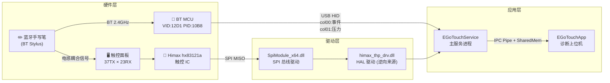
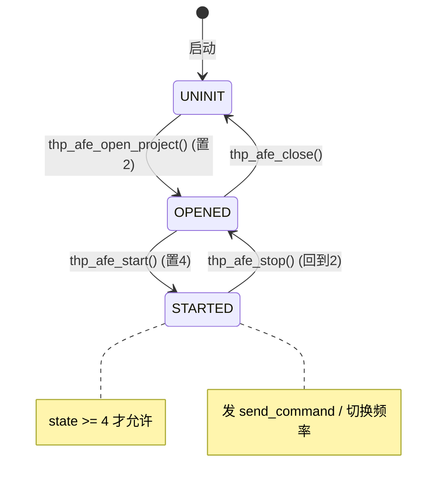
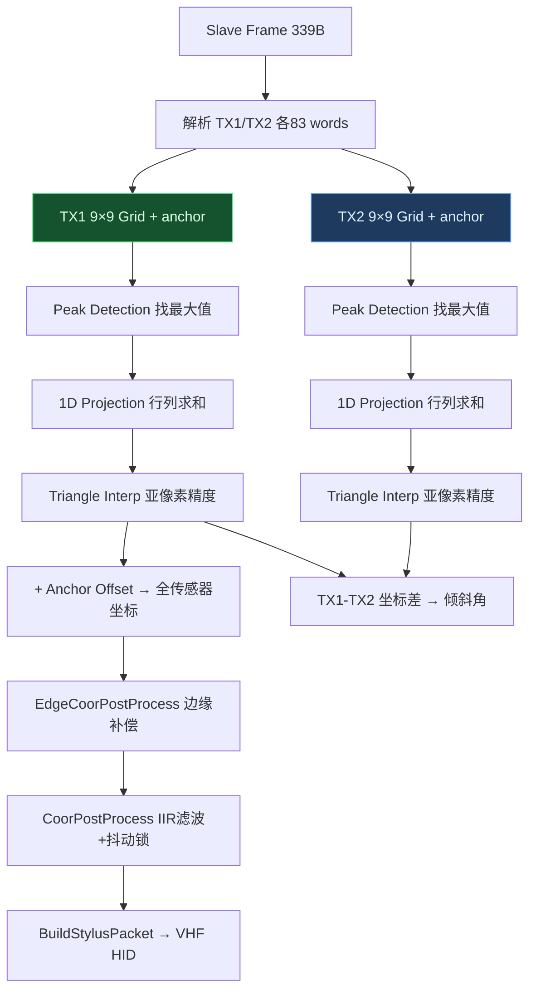
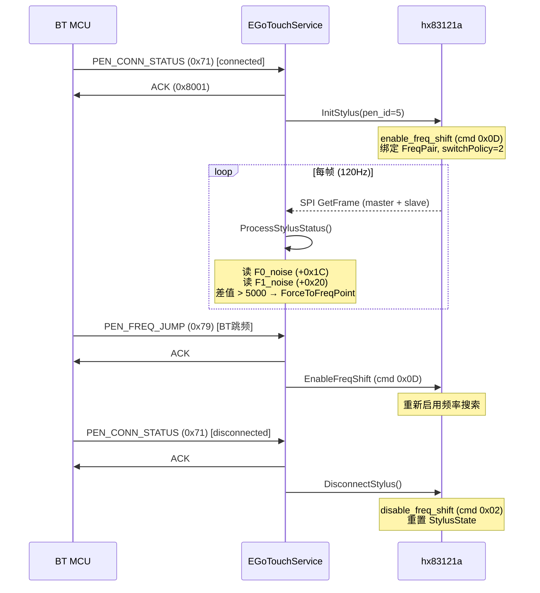
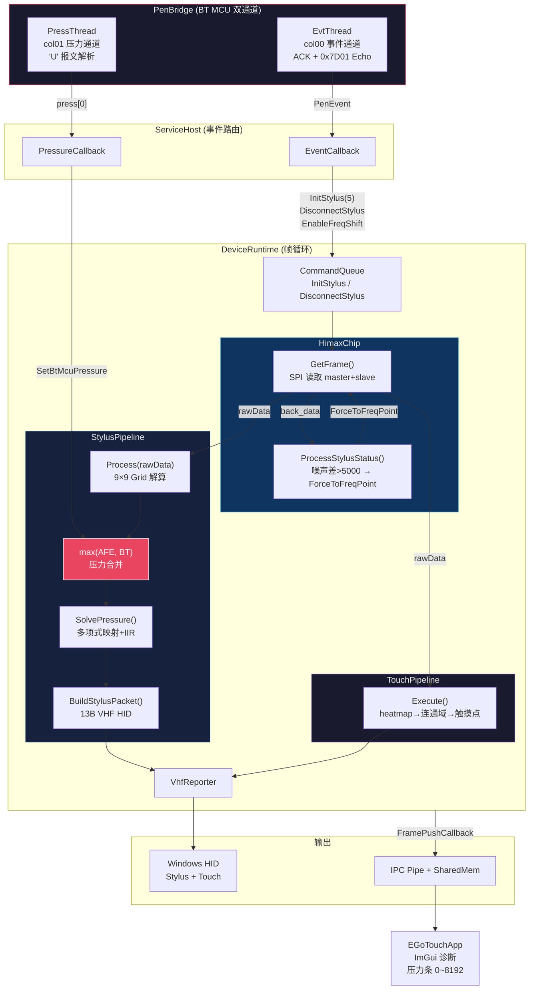

# EGoTouch 手写笔系统完整技术参考

> 整合自 Ghidra 逆向分析 `himax_thp_drv.dll` + `ApDaemon.dll` + `BtMcuTestTool` 实测验证
>
> 最后更新：2026-03-29

---

## 目录

1. [系统总览](#一系统总览)
2. [硬件架构](#二硬件架构)
3. [HX83121a 芯片 IPC 协议](#三hx83121a-芯片-ipc-协议)
4. [SPI 帧结构](#四spi-帧结构)
5. [手写笔坐标解算管线](#五手写笔坐标解算管线)
6. [手写笔频率跟踪协议](#六手写笔频率跟踪协议)
7. [BT MCU HID 协议](#七bt-mcu-hid-协议)
8. [VHF 报告格式](#八vhf-stylus-hid-报告格式)
9. [软件架构（当前实现）](#九软件架构当前实现)
10. [命令速查表](#十命令速查表)
11. [已知常量表](#十一已知常量表)

---

## 一、系统总览



**核心数据链路**：

| 数据 | 路径 | 频率 |
|------|------|------|
| 坐标 (X, Y) | 笔 → 面板电感耦合 → IC SPI → Slave Frame → 9×9 Grid 解算 | 120/240 Hz |
| 压感 (Pressure) | 笔 → BT → MCU → USB HID col01 'U' 报文 | ~120 Hz |
| 按键 (Button) | 笔 → BT → MCU → USB HID col01 'U' 报文 | 同上 |
| 倾斜角 (Tilt) | TX1-TX2 坐标差 → arcsin 计算 | 120 Hz |

---

## 二、硬件架构

### 2.1 Himax hx83121a 触控IC

| 参数 | 值 |
|------|-----|
| TX 通道数 | 40 |
| RX 通道数 | 60 |
| 标准帧率 | 120 Hz |
| 笔模式帧率 | 240 Hz |
| 笔扫描频点 | 2 个（F0/F1，支持自动切换） |
| SPI 通道 | 2（master=触摸, slave=手写笔） |
| Master 帧大小 | 5063 字节 (7+4800+256) |
| Slave 帧大小 | 339 字节 (7+166*2) |

### 2.2 BT MCU

| 参数 | 值 |
|------|-----|
| VID:PID | `12D1:10B8` |
| 接口 | USB HID，MI=00 |
| 事件通道 | col00，通过 SetupDi GUID 发现 |
| 压力通道 | col01，通过 HID 路径匹配发现 |
| 事件通道 GUID | `{DD0EBEDB-F1D6-4CFA-ACCA-71E66D3178CA}` |
| 压力通道匹配串 | `vid_12d1&pid_10b8&mi_00&col01` |

---

## 三、HX83121a 芯片 IPC 协议

### 3.1 命令帧格式 (16字节)

```
[0xA8][0x8A][cmd_id][0x00][cmd_val][0x00×7][csum_lo][csum_hi][0x00][0x00]
```

- **Magic**: `0xA8 0x8A`（芯片固件靠此识别命令帧）
- **Checksum**: 前8字节以 uint16 两两求和，取二进制补码 `csum = (uint16)(0x10000 - sum)`

### 3.2 5-Slot 循环写入

```
addr = 0x10007550 + current_slot * 0x10    // slot 0..4
① writeReg(addr, 16 bytes of 0x00)        // 清空 slot
② writeReg(addr, [0xA8, 0x8A, ...])       // 写完整帧（魔数触发芯片识别）
③ readReg(addr, 16)                        // 回读验证
current_slot = (current_slot + 1) % 5
```

### 3.3 芯片状态机



---

## 四、SPI 帧结构

### 4.1 7字节协议头（Master/Slave 共用）

```
Offset  Size  说明
+0      1     设备标识（SpiRead: 0xF3=master, 0xF5=slave）
+1      1     帧类型/命令字节
+2      1     保留 (0x00)
+3      2     帧序列号或长度 (u16 LE)
+5      2     半帧 checksum (u16)
```

校验：`thp_compute_checksum16(frame+5, (size-5)>>1)` = 0 且非零 → 通过

### 4.2 Master 帧 (5063 字节)

```
Offset    Size       说明
────────────────────────────────────────────
+0        7 字节     协议头
+7        4800 字节  电容原始矩阵 (40TX × 60RX × 2byte)
+4807     256 字节   Master 状态表 (128 × u16)
```

#### Master 状态表已确认字段

| 偏移 (字节) | 类型 | 字段名 | 含义 |
|-------------|------|--------|------|
| `+0x00` | u16 | FirmwareRetryFlag | 1 = FW 请求主机重试本帧 |
| `+0x04` | u16 | FreqShiftDone | ≠0 = 芯片已完成频率切换 |
| `+0x06` | u16 | DiagStatus | 0xBB = 特殊调试/异常标记 |
| `+0x0C` | u16 | PendingFreqSwitch | ≠0 = 有未完成的频率切换请求 |
| **`+0x1C`** | u16 | **PenF0NoiseCount** | 频点0笔噪声计数（>5000触发切换）|
| **`+0x20`** | u16 | **PenF1NoiseCount** | 频点1笔噪声计数（>5000触发切换）|

#### Master Suffix (128 words = 256 bytes，从 offset 4807 开始)

```
Auto-detect 16-word block (base = auto-detected):
┌──────────────────────────────────────────────────┐
│ word[base+8]     = tx1Freq  (0x0018/0x00A1)      │
│ word[base+9]     = tx2Freq  (0x00A1/0x0018)      │
│ word[base+10]    = pressure (auto-detect, 不可靠) │
│ word[base+12..13]= button (uint32)                │
│ word[base+14..15]= status (uint32)                │
└──────────────────────────────────────────────────┘

固定偏移（不依赖 auto-detect）:
┌──────────────────────────────────────────────────┐
│ word[102] = penSignalPressure  (笔压力信号)       │
│ word[103] = penSignalTilt      (倾角信号)         │
└──────────────────────────────────────────────────┘
```

### 4.3 Slave 帧 (339 字节)

```
Offset              Size       说明
────────────────────────────────────────────
+0                  7 字节     协议头
+7                  166 字节   TX1 Block (83 words)
+7+166              166 字节   TX2 Block (83 words)
```

#### TX Block 结构 (83 words)

```
word[0]  low byte = anchorRow (TX中心坐标)
word[1]  low byte = anchorCol (RX中心坐标)
word[2]  保留/填充
word[3..83] = 9×9 = 81 信号值 (行主序, i16)
```

> **全 0xFF 表示无效**：`word[0]==0xFF && word[1]==0xFF` → 无笔接触

### 4.4 帧数据流

```
芯片 MISO
  │
  ├── SpiGetFrame(slave=1)
  │     [0..6]              协议头
  │     [7..172]            TX1 9×9 Block + anchor → 坐标/压力
  │     [173..338]          TX2 9×9 Block + anchor → 倾斜角
  │
  └── SpiGetFrame(master=0)
        [0..6]              协议头
        [7..4806]           TX×RX×2 电容矩阵 → 触摸 heatmap
        [4807..5062]        256字节状态表
                             ├── [+0x04] FreqShiftDone
                             ├── [+0x1C] PenF0NoiseCount
                             └── [+0x20] PenF1NoiseCount
```

---

## 五、手写笔坐标解算管线

### 5.1 管线总览



### 5.2 Anchor — 9×9 窗口在全传感器上的位置

```
全传感器阵列 (37 × 23):
┌────────────────────────────────────────┐
│                                        │
│     ┌─────────┐                        │
│     │ 9×9 窗口 │ ← anchor=(15,10)      │
│     │  ●peak  │   窗口中心在           │
│     │         │   row=15, col=10       │
│     └─────────┘                        │
│                                        │
└────────────────────────────────────────┘
```

> [!IMPORTANT]
> Anchor 是窗口的 **中心** (index 4)，不是左上角！
> `anchorCenterOffset = 4` → 全坐标 = `(anchor - 4) × 1024 + local_coord`

### 5.3 三角插值（核心算法）

```c
// 原厂 TriangleAlgUsing3Point (Ghidra 逆向):
int32_t TriangleAlgUsing3Point(int16_t left, int16_t peak, int16_t right) {
    if (peak <= 0) return 0x200;    // 返回中心
    int32_t sum = left + peak + right;
    if (sum == 0) return 0x200;
    return (0x400 * peak + 0x800 * right) / sum;
    // 范围: [0, 0x800]，0x400 = 精确在 peak 位置
}
```

**最终坐标**：`(peak_index - 1) × 0x400 + interpolation_result`

### 5.4 压力来源

| 来源 | 字段 | 说明 |
|------|------|------|
| Master Suffix word[102] | `penSignalPressure` | AFE 直接测量，来自电容信号 |
| Slave Header offset 4-5 | `slaveHdrPressure` | slave 帧头部 u16 LE |
| **BT MCU 'U' 报文** | `press[0]` (PenBridge) | **蓝牙通道的压力值** |

> [!TIP]
> 当前实现使用 `max(AFE_pressure, BT_MCU_pressure)` 合并两个来源，取较大值作为最终输入。

### 5.5 VHF 坐标映射

```c
// 全传感器 → HID 报告 [0, 16000]
report_X = (1.0 - full_X / (sensorDimX × 1024)) × 16000  // X 轴反转
report_Y = full_Y / (sensorDimY × 1024) × 16000
```

---

## 六、手写笔频率跟踪协议

### 6.1 核心机制

芯片 AFE 必须与笔的蓝牙频率保持同步。BT MCU 跳频后，芯片若不跟随调整扫描频率，会导致 slave frame 丢失笔信号，MCU 判断笔离开，停止压力输出。

### 6.2 频率表 (Ghidra 逆向自 `DAT_18016dc80`)

| pen_id | freq0_cmd | freq1_cmd | 说明 |
|--------|-----------|-----------|------|
| 0 | 0x00A1 | 0x0018 | 笔 0 |
| 1 | 0x00A2 | 0x0019 | 笔 1 |
| 2 | 0x00A3 | 0x001A | 笔 2 |
| 3 | 0x00A4 | 0x001B | 笔 3 |
| 5 | 0x00A1 | 0x0018 | 默认笔 "CD54" |

### 6.3 完整协议时序



### 6.4 噪声自动切频逻辑 (`ProcessStylusStatus`)

```
每帧，前提：m_stylus.connected && switchPolicy >= 2

1. 读取 back_data[4807 + 0x1C] → F0_noise (u16 LE)
2. 读取 back_data[4807 + 0x20] → F1_noise (u16 LE)
3. 读取 back_data[4807 + 0x04] → FreqShiftDone (u16)

4. 若 FreqShiftDone != 0 且有 pending 请求：
     → 确认切换完成, freqIdx = targetIdx

5. 若无 pending 请求：
     if (F0 - F1) >= 5000 且 freqIdx != 1:
         → ForceToFreqPoint(1)  // F0 太吵，切到频点1
     elif (F1 - F0) > 5000 且 freqIdx != 0:
         → ForceToFreqPoint(0)  // F1 太吵，切回频点0
```

> 阈值 5000 来自原厂固件，对应全局变量比较。

### 6.5 IPC 0xBA — 芯片主动拉取（原厂完整模型）

```
[芯片固件侧] FW 发 IPC 中断 cmd=0xBA
    → [主机侧] handler case 0xBA:
         memmove(SharedIpcBuf + 0x42a, DAT_180195390, 256)
         // 共享缓冲包含：频率命令对、SwitchTargetIndex
    → [芯片固件侧] 读 SharedIpcBuf, 自主完成频率切换
    → 下一帧 DAT_180195394 != 0 (FreqShiftDone)
```

> [!NOTE]
> 当前实现使用 `ForceToFreqPoint` 命令直接指定目标频点，
> 而非原厂的 IPC 0xBA 拉取模型。效果等价但路径更短。

---

## 七、BT MCU HID 协议

### 7.1 事件通道 (col00) 命令码

| 事件码 | 名称 | 方向 | 需 ACK | 附加处理 |
|--------|------|------|--------|----------|
| `0x71` | PEN_CONN_STATUS | MCU→主机 | ✅ 0x8001 | payload[0]: 0=断连, 1=连接 |
| `0x73` | PEN_TYPE_INFO | MCU→主机 | ✅ 0x8001 | 笔型号/ID 信息 |
| `0x77` | PEN_READY | MCU→主机 | ✅ 0x8001 | 笔就绪通知 |
| `0x79` | PEN_FREQ_JUMP | MCU→主机 | ✅ 0x8001 | BT 频点切换通知 |
| `0x7B` | PEN_INIT_PARAM | MCU→主机 | ✅ 0x8001 | **需 echo 0x7D01** |
| `0x01` | Handshake Step1 | 主机→MCU | — | 对应 0x71 ACK |
| `0x01` via 0x7D | Config Echo | 主机→MCU | — | 0x7B 参数回写 |

### 7.2 ACK 映射表

```c
static int GetAckCode(uint8_t eventCode) {
    switch (eventCode) {
    case 0x71: return 0x8001;  // PEN_CONN_STATUS
    case 0x73: return 0x8001;  // PEN_TYPE_INFO
    case 0x77: return 0x8001;  // PEN_READY
    case 0x79: return 0x8001;  // PEN_FREQ_JUMP
    case 0x7B: return 0x8001;  // PEN_INIT_PARAM
    default:   return -1;      // 不需要 ACK
    }
}
```

### 7.3 握手序列

```
主机 → MCU: 0x7101 (8 bytes, padded with 0AF)  // Step 1
MCU → 主机: 收到后响应
主机 → MCU: 0x7701 (8 bytes, padded with 0AF)  // Step 2: Ready confirm
```

### 7.4 配置回显 (0x7D01)

收到 `0x7B` 后，必须在 500ms 内将 payload 原样回写为 `0x7D01` 报文：

```
[0x7D][0x01][payload_0..payload_N][0xAF padding]  // 共 8 字节
```

> [!CAUTION]
> **不回显 0x7D01 会导致 MCU 超时断开连接。**

### 7.5 压力通道 (col01) — 'U' 报文

```
偏移  大小  说明
+0    1     报文类型 = 0x55 ('U')
+1    1     freq1 (BT 跳频频率1)
+2    1     freq2 (BT 跳频频率2)
+3    2     press[0] (u16 LE, 第一通道压力, 范围 0~8192)
+5    2     press[1] (u16 LE, 第二通道压力)
+7    2     press[2] (u16 LE, 第三通道压力)
+9    2     press[3] (u16 LE, 第四通道压力)
```

---

## 八、VHF Stylus HID 报告格式

13 字节，report ID = 0x08：

| 偏移 | 大小 | 值 | 说明 |
|------|------|----|------|
| +0 | 1 | `0x08` | 固定帧头 (report ID) |
| +1 | 1 | `status & 0x7F` | bit0=tip_switch, bit5-6=mode |
| +2 | 1 | `0x80` | 固定标志 (in-range) |
| +3 | 2 | X (u16 LE) | 0~16000，含X轴反转 |
| +5 | 2 | Y (u16 LE) | 0~16000 |
| +7 | 2 | pressure (u16 LE) | 0~4095 (clamp 0x0FFF) |
| +9 | 2 | tiltX (i16 LE) | -90 ~ +90 度 |
| +11 | 2 | tiltY (i16 LE) | -90 ~ +90 度 |

---

## 九、软件架构（当前实现）

### 9.1 数据流



### 9.2 关键类职责

| 类 | 文件 | 职责 |
|----|------|------|
| `HimaxChip` | `Device/himax/HimaxChip.h/.cpp` | SPI 通信、IPC 命令、帧获取、频率跟踪 |
| `DeviceRuntime` | `Device/runtime/DeviceRuntime.h/.cpp` | 帧循环、管线编排、命令队列 |
| `PenBridge` | `Device/btmcu/PenBridge.h/.cpp` | BT MCU 双通道通信、ACK/Echo |
| `StylusPipeline` | `Engine/StylusSolver/StylusPipeline.h/.cpp` | 坐标解算、压力映射、倾斜角 |
| `ServiceHost` | `source/ServiceHost.cpp` | 模块编排、事件路由、压感链路 |
| `DiagnosticsWorkbench` | `Tools/EGoTouchApp/source/DiagnosticsWorkbench.cpp` | ImGui 诊断面板 |

### 9.3 StylusState 结构 (HimaxChip 内部)

```cpp
struct StylusState {
    bool    connected       = false;
    uint8_t pen_id          = 5;       // 默认 CD54
    StylusFreqPair freqPair = {0x00A1, 0x0018};
    uint8_t freqIdx         = 0;       // 当前频点 (0 或 1)
    uint8_t switchPolicy    = 0;       // 0=无, 2=噪声触发
    uint8_t switchTargetIdx = 0;       // 目标频点
    bool    switchReqPending = false;  // 切换请求挂起
};
```

---

## 十、命令速查表

| 功能 | cmd_id | cmd_val | 函数 | AFE_Command 枚举 |
|------|--------|---------|------|-------------------|
| 启用频率偏移 | `0x0D` | `0x00` | `thp_afe_enable_freq_shift` | `EnableFreqShift` |
| 禁用频率偏移 | `0x02` | `0x00` | `thp_afe_disable_freq_shift` | `DisableFreqShift` |
| 清除状态 | `0x06` | `param` | `thp_afe_clear_status` | `ClearStatus` |
| 标准帧率 (120Hz) | `0x0E` | `0x00` | `thp_afe_force_to_scan_rate` | `ForceToScanRate` |
| 强制频点 | `0x0B` | `idx` | `thp_afe_force_to_freq_point` | `ForceToFreqPoint` |
| 进入空闲 | `0x03` | `0x00` | `thp_afe_enter_idle` | `EnterIdle` |
| 强制退出空闲 | `0x01` | `0x00` | `thp_afe_force_exit_idle` | `ForceExitIdle` |
| 开始校准 | `0x07` | `0x01` | `thp_afe_start_calibration` | `StartCalibration` |
| 初始化手写笔 | — | `pen_id` | `Chip::InitStylus` | `InitStylus` |
| 断连手写笔 | — | — | `Chip::DisconnectStylus` | `DisconnectStylus` |

### 模式切换密码握手

```
hx_switch_mode:
  reg 0x10007F04 = 0x7777  // 密码 1
  reg 0x10007F04 = 0x1111  // 密码 2
  reg 0x10007F04 = 0xAAAA  // 密码 3 (根据目标模式不同)
```

---

## 十一、已知常量表

| 常量 | 值 | 来源 | 说明 |
|------|-----|------|------|
| 噪声切换阈值 | 5000 | Ghidra 逆向 | F0-F1 差值触发频率切换 |
| IPC Slot 基址 | `0x10007550` | Ghidra 逆向 | 5-slot 循环 ×16 字节 |
| Master 帧大小 | 5063 | `7+40×60×2+256` | 协议头+矩阵+状态表 |
| Slave 帧大小 | 339 | `7+166×2` | 协议头+2×83 words |
| Master 状态表偏移 | 4807 | `7+4800` | 在 back_data 中的位置 |
| kCoorUnit | 1024 (0x400) | Ghidra 逆向 | 每 cell 的坐标精度单位 |
| HID 报告范围 | [0, 16000] | ApDaemon 逆向 | X/Y 坐标映射范围 |
| 压力上限 | 0x0FFF (4095) | SolvePressure clamp | 多项式映射后的 clamp |
| BT 压力上限 | 8192 | 'U' 报文实测 | BT MCU 压力通道范围 |
| 默认笔 ID | 5 | Ghidra `DAT_18012cbc6` | "CD54" 标准笔 |
| 事件通道 GUID | `DD0EBEDB-F1D6-4CFA-ACCA-71E66D3178CA` | 原厂驱动 | SetupDi 发现 |
| 压力通道匹配 | `vid_12d1&pid_10b8&mi_00&col01` | 实测 | HID 路径子串 |

### 压力多项式映射系数

```
Segment 1 (rawPressure <= 11):
  y = 0.0078740157480315 × x²

Segment 2 (rawPressure > 127):
  y = -409.318 + 4.4×x - 0.00161×x² + 2.624e-7×x³ - 1.602e-11×x⁴
```

---

> [!NOTE]
> 本文档持续更新，所有数据来源于 Ghidra 逆向 + 实测验证。
> 若发现偏差请反馈并附上对应的日志或帧 dump。
