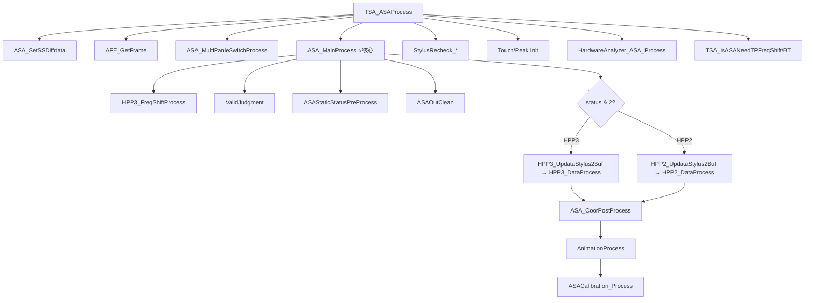

# TSA_ASAProcess 手写笔算法管线完整逆向分析

> [!NOTE]
> 基于 Ghidra 对 `TSACore.dll` 的逆向分析，入口函数 `TSA_ASAProcess` (0x18059e8d)。
> 共追踪 35+ 个子函数，覆盖完整的手写笔解算管线。

## 总体架构



---

## 完整函数调用树

| 层级 | 函数名 | 地址 | 功能描述 |
|------|--------|------|----------|
| L0 | `TSA_ASAProcess` | 0x18059e8d | 顶层入口，帧调度 |
| L1 | `TSAMS_GetSSDifPtr` | — | 获取SS差分指针 |
| L1 | `ASA_SetSSDiffdata` | — | 设置SS差分数据 |
| L1 | `AFE_GetFrame` | — | 获取当前帧指针 |
| L1 | `ASA_MultiPanleSwitchProcess` | — | 多面板切换处理 |
| L1 | **`ASA_MainProcess`** | 0x18086b5f | ⭐ 核心算法调度器 |
| L1 | `StylusRecheck_DisableRecheckInFreqShifting` | — | 频移时禁用回检 |
| L1 | `StylusRecheck_EnterStylusMode` | — | 进入手写笔模式 |
| L1 | `ASA_IsTouchNull` | — | 触控空判断 |
| L1 | `TSA_RptASAInRange` | — | 报告手写笔在范围内 |
| L1 | `PrevTouch_Init` / `Touch_Init` / `PrevPeak_Init` | — | 触控状态清零 |
| L1 | `ASA_IsHpp3TouchEnableFeatureEnabled` | — | HPP3触控使能特性检查 |
| L1 | `SideTouch_Clean` | — | 侧屏触控清理 |
| L1 | `TSALog_OutputStylus` | — | 手写笔日志输出 |
| L1 | `ASA_NeedRecordTrigger` | — | 录制触发检查 |
| L1 | `HardwareAnalyzer_ASA_Process` | — | 硬件分析器处理 |
| L1 | `TSA_IsASANeedTPFreqShift` | — | TP频移需求检查 |
| L1 | `TSA_IsASANeedBTFreqShift` | — | BT频移需求检查 |
| **L2** | `HPP3_FreqShiftProcess` | 0x180777ef | 频率切换管理 |
| L2 | `ValidJudgment` | 0x18084efc | 帧有效性验证 |
| L2 | `ASAStaticStatusPreProcess` | 0x18088d3d | 静态状态预处理 |
| L2 | `ASAPropertyPreProcess` | 0x1808839f | 属性清零 (memset 0x7ac) |
| L2 | `ASAStaticPreProcess` | 0x180889f0 | 静态预处理 |
| L2 | `ASAOutClean` | — | 输出缓冲清零 |
| **L2** | `HPP3_UpdataStylus2Buf` | 0x180828b6 | HPP3数据写入缓冲 |
| L3 | `HPP3_UpdateStylus2BufNormalGrid` | — | Grid数据两频点写入 |
| **L2** | `HPP3_DataProcess` | 0x18086aa4 | HPP3数据处理调度 |
| L3 | `ASA_HPP3TX1GridDataProcesss` | 0x1808668d | ⭐ Grid模式处理 |
| L3 | `ASA_HPP3TX1LineDataProcesss` | — | Line模式处理 |
| L3 | `ASA_HPP3TX1IQLineDataProcesss` | — | IQ Line模式处理 |
| L3 | `ASA_HPP3TX1TiedGridDataProcesss` | — | TiedGrid模式处理 |
| L3 | `ASA_HPP3Process` | 0x180869c2 | HPP3后处理 |
| **L2** | `HPP2_UpdataStylus2Buf` | 0x18080872 | HPP2数据写入缓冲 |
| **L2** | `HPP2_DataProcess` | 0x18086a4c | HPP2数据处理调度 |
| **L2** | `ASA_CoorPostProcess` | 0x180869ef | ⭐ 坐标后处理链 |
| L2 | `AnimationProcess` | 0x18063745 | 手势动画状态机 |
| L2 | `ASACalibration_Process` | 0x1806bdf0 | 校准处理 |
| **L4** | `GetGridTx1Peaks` | 0x1807c834 | TX1 Grid峰值提取 |
| L5 | `HPP3_FindPeakOfNormalGrid` | — | 洪泛填充峰值检测 |
| L4 | `TX1LinePeaksProcess` | — | TX1线峰值处理 |
| L4 | `HPP3_NoiseProcess` | 0x180791b6 | 噪声处理 |
| L5 | `NoiseJudge` | — | 噪声判决 |
| L5 | `GetRealPeak` / `GetTx2RealPeak` | — | 真实峰值提取 |
| **L4** | `TX1CoordinateProcess` | 0x1806f06d | ⭐ TX1坐标计算 |
| L5 | `GetCoordinateByTriangleOf` | — | 三角插值 |
| L5 | `GetCoordinateByGravityOf` | — | 重心插值 |
| L5 | `CoorMultiOrderFitCompensate` | — | 多阶拟合补偿 |
| L5 | `SensorPitchSizeMapDim1/Dim2` | — | 传感器间距映射 |
| L4 | `GetGridTx2Peaks` | 0x1807d3ac | TX2 Grid峰值提取 |
| **L4** | `TiltProcess` | 0x180841e6 | ⭐ 倾斜角计算 |
| L5 | `GetTX1TX2SignalRatio` | — | TX1/TX2信号比 |
| L5 | `GetTX1TX2CoorDifAverage` | — | 坐标差平均 |
| L5 | `GetTiltByCoorDif` | — | 坐标差→倾斜角 |
| L5 | `Tilt1DegreeJitFilter` | — | 1°抖动滤波 |
| **L4** | `HPP3_PressureProcess` | 0x1807fd1d | ⭐ 压力处理 |
| L5 | `GetPressInMapOrder` | — | 压力映射排序 |
| L5 | `HPP3_GetPressureMapping` | — | 压力值映射 |
| L5 | `PressureIIR` | — | 压力IIR滤波 |
| L5 | `HPP3_SuppressBtPressBySignal` | — | 按钮信号压制 |
| L4 | `HPP3_PostPressureProcess` | 0x1807ffa4 | 压力后处理+边缘信号检查 |
| L4 | `EdgeCoorProcess` | 0x1806f250 | 边缘坐标修正 |
| L4 | `HPP3_NoisePostProcess` | — | 噪声后处理 |
| L4 | `ASAStaticStatusProcess` | — | 静态状态处理 |
| **L3** | `LinearFilterProcess` | 0x18071f4b | ⭐ 直线/曲线滤波状态机 |
| L3 | `GetRealTimeCoor2Buf` | — | 实时坐标缓冲 |
| L3 | `Get3PointAvgFilter` | — | 三点均值滤波 |
| L3 | `CoorReviseProcess` | 0x180728bd | 坐标修正 |
| L4 | `CoorReviseCalculation` | — | 修正计算 |
| L4 | `CoorReviseWork` | — | 修正执行 |
| L3 | `GetCoorSpeed` | 0x1806fc0f | 坐标速度计算 |
| L3 | `GetIIRCoef` | 0x1806ffc9 | IIR系数动态计算 |
| L3 | `CoorFilterProcess` | 0x18070355 | IIR坐标滤波 |
| L4 | `CoorIIRFilterType` | — | IIR滤波类型执行 |
| L3 | `AftCoorProcess` | 0x18070456 | 抖动锁定处理 |
| **L3** | `FitToLcdScreen` | 0x180835a2 | ⭐ 映射到LCD坐标 |
| L4 | `GetClipReport` | — | 裁剪报告坐标 |
| L4 | `UpdateRptDis` | — | 更新报告距离 |

---

## 阶段详解

### 阶段1: 帧获取与预验证

```
TSA_ASAProcess(uint param_1)
  ├── TSAMS_GetSSDifPtr() → ASA_SetSSDiffdata()    // SS差分数据
  ├── AFE_GetFrame() → piVar6                       // 获取帧指针
  ├── lVar1 = piVar6[0x10] (偏移+0x40)             // slave frame指针
  ├── ASA_MultiPanleSwitchProcess(lVar1)             // 多面板处理
  ├── if lVar1==0 → ASA_Reset()                     // 空帧保护
  ├── if lVar1.status==0 → ASA_Reset()              // 禁用保护
  └── else → 进入主处理
```

**Slave Frame 结构** (偏移基于 `lVar1`):
| 偏移 | 类型 | 含义 |
|------|------|------|
| +0x00 | ptr | TX1 数据指针 |
| +0x08 | ptr | TX2 数据指针 |
| +0x10 | uint16 | tx1_freq (主频点) |
| +0x12 | uint16 | tx2_freq (辅频点) |
| +0x14 | uint16 | press (压力原始值) |
| +0x18 | uint32 | btn (按钮状态) |
| +0x1c | uint32 | status (状态位掩码) |

**Status 位掩码**:
| 位 | 含义 |
|----|------|
| bit0 (0x01) | HPP2协议 |
| bit1 (0x02) | HPP3协议 |
| bit2 (0x04) | 模式A |
| bit3 (0x08) | 模式B |
| bit4 (0x10) | Active Stylus模式 |
| bit5 (0x20) | 频率标志A |
| bit6 (0x40) | 频率标志B |
| bit7 (0x80) | 频率标志C |

### 阶段2: ASA_MainProcess 核心调度

```
ASA_MainProcess(piVar6)
  ├── 时间戳: DAT_18231a20 = sec*1000 + usec/1000
  ├── HPP3_FreqShiftProcess(lVar1)   // 仅HPP3时
  ├── ValidJudgment(lVar1)           // 帧有效性
  │     ├── 检查HPP2/HPP3协议互斥
  │     ├── 检查模式位 (bit2/3/4)
  │     └── 检查TX1/TX2数据指针非空
  ├── ASAStaticStatusPreProcess()    // Active Stylus模式切换
  ├── ASAPropertyPreProcess()        // 清零属性缓冲 (0x7ac字节)
  ├── ASAOutClean()                  // 清零输出
  │
  ├── ===== HPP3路径 (status & 2) =====
  │   ├── HPP3_UpdataStylus2Buf(lVar1)
  │   ├── HPP3_DataProcess()
  │   └── [如果返回非0 → bypass]
  │
  ├── ===== HPP2路径 (status & 1) =====
  │   ├── HPP2_UpdataStylus2Buf(lVar1)
  │   ├── HPP2_DataProcess()
  │   └── [如果返回非0 → bypass]
  │
  ├── ASA_CoorPostProcess()          // 坐标后处理链
  ├── AnimationProcess()             // 手势动画
  ├── memcpy(g_prevASOut, g_curASOut, 0xec)  // 保存当前帧
  └── ASACalibration_Process()       // 校准
```

### 阶段3: HPP3数据写入 (Grid模式)

`HPP3_UpdataStylus2Buf` 设置 `g_flagDataType = 2` (Grid模式)，然后调用 `HPP3_UpdateStylus2BufNormalGrid`:

```c
// TX1 数据复制 (两份)
for (i = 0; i < rows * cols; i++) {  // 9*9 = 81 个 uint16
    g_asaData[0x8cd0 + i] = TX1_ptr[i];   // 副本1: 原始数据
    g_asaData[0x2828 + i] = TX1_ptr[i];   // 副本2: 工作数据
}

// TX2 数据复制 (如果存在)
if (TX2_ptr != NULL) {
    for (i = 0; i < rows * cols; i++) {
        g_asaData[0x9ff8 + i] = TX2_ptr[i];  // TX2 原始
        g_asaData[0x3b48 + i] = TX2_ptr[i];  // TX2 工作
    }
}
```

> [!IMPORTANT]
> `rows` = `DAT_1820d610`, `cols` = `DAT_1820d611`，即传感器的行列数。
> 数据布局: 每个频点的9×9矩阵以 uint16 连续存储在 `g_asaData` 的不同偏移处。

### 阶段4: HPP3 Grid 数据处理

`HPP3_DataProcess` 根据 `g_flagDataType` 分派到4种处理模式:
| 值 | 函数 | 模式 |
|----|------|------|
| 0 | `ASA_HPP3TX1LineDataProcesss` | 线数据 |
| 1 | `ASA_HPP3TX1IQLineDataProcesss` | IQ线数据 |
| 2 | **`ASA_HPP3TX1GridDataProcesss`** | **Grid数据** ⭐ |
| 3 | `ASA_HPP3TX1TiedGridDataProcesss` | 绑定Grid |

处理完后统一调用 `ASA_HPP3Process()` 进行后处理。

#### 4.1 Grid 峰值检测: `ASA_HPP3TX1GridDataProcesss`

```
ASA_HPP3TX1GridDataProcesss():
  ├── GetGridTx1Peaks()
  │     ├── HPP3_FindPeakOfNormalGrid()    // 洪泛峰值检测
  │     └── 行/列投影求和 (生成1D线信号)
  ├── TX1LinePeaksProcess()                // 1D峰值搜索
  ├── HPP3_NoiseProcess()                  // 噪声判决
  │     ├── NoiseJudge(2)  // dim1
  │     ├── NoiseJudge(3)  // dim2
  │     ├── GetRealPeak()
  │     └── GetTx2RealPeak()
  ├── TX1CoordinateProcess()               // ⭐ 坐标计算
  ├── if TX2存在 → GetGridTx2Peaks() + TiltProcess()
  │   else         → TiltKeepLastFrame()
  ├── HPP3_NoisePostProcess()
  └── ASAStaticStatusProcess()
```

**`HPP3_FindPeakOfNormalGrid` 洪泛填充算法**:
1. 遍历 `rows × cols` 的Grid矩阵
2. 对每个像素检查: 噪声标记 `< 0x81` 且 信号值 `> 199`
3. 调用 `HPP3_GridTypeIsPeak` 判断是否为局部极大值
4. 若是峰值 → `Push()`入栈 → `SearchPeakFlag()` 洪泛扩展
5. 若连通区域像素数 `< 10` → `Update33PeakSum()` 计算3×3邻域和 + `UpdateGridPeakUnit()` 记录峰值单元
6. 若 `≥ 10` → `CleanData()` 清除（视为噪声）

**行/列投影** (`GetGridTx1Peaks` 后半段):
```c
// 列投影 (对选定行范围求和，生成行信号)
for (col_range) {
    for (row = 0; row < rows; row++) {
        g_asaData[0xa0 + row] += grid[col * rows + row];
    }
}
// 行投影 (对选定列范围求和，生成列信号)
for (row_range) {
    for (col = 0; col < cols; col++) {
        g_asaData[0xa0 + rows + col] += grid[col * rows + row];
    }
}
```

#### 4.2 坐标计算: `TX1CoordinateProcess`

根据 `DAT_1820d630 & 1` 选择插值算法:

**三角插值** (`GetCoordinateByTriangleOf`):
- 找到峰值位置 `peakIdx`
- 边缘情况: 使用 `TriangleAlgEdge`（取峰值+2个邻域点）
- 正常情况: 使用 `TriangleAlgUsing3Piont`（峰值前后各1个点，3点插值）
- 结果 = `peakIdx * 0x400 + interpolation_offset`

**重心插值** (`GetCoordinateByGravityOf`):
- 调用 `UpdateTX1GravityData`/`UpdateTX2GravityData` 构建重心数据
- 调用 `Gravity()` 计算重心偏移
- 结果 = `base * 0x400 + gravity_offset`

坐标后处理:
```c
coors[0] = CoorMultiOrderFitCompensate(coors[0], &dim1_params);  // X多阶拟合补偿
coors[1] = CoorMultiOrderFitCompensate(coors[1], &dim2_params);  // Y多阶拟合补偿
// 裁剪到 [0, rows*0x400-1] 和 [0, cols*0x400-1]
X_out = SensorPitchSizeMapDim1(coors[0], 0x400);  // 传感器间距映射
Y_out = SensorPitchSizeMapDim2(coors[1], 0x400);
```

> [!TIP]
> 坐标系单位: `0x400 = 1024`，即每个传感器间距分为1024个子单位。
> 例如 9行传感器的X范围 = `[0, 9*1024-1]` = `[0, 9215]`。

### 阶段5: 倾斜角计算 (`TiltProcess`)

仅在 TX2 数据存在时执行:
```
TiltProcess():
  ├── 有效性检查 (GridTx1Valid && GridTx2Valid)
  ├── GetTX1TX2SignalRatio()  → BufTX1TX2SignalRatio()
  ├── g_signalRatio = GetTX1TX2RatioAverage(3)  // 3帧平均
  ├── 计算TX1-TX2坐标差:
  │     delta_dim1 = TX2_coor_dim1 - TX1_coor_dim1
  │     delta_dim2 = TX2_coor_dim2 - TX1_coor_dim2
  ├── 坐标差限幅 (GetTX1TX2LenLimit)
  ├── IIR平滑: BufTX1TX2CoorDif → GetTX1TX2CoorDifAverage(5)
  ├── 倾斜角: GetTiltByCoorDif(delta, dim)
  ├── 矢量长度限制: |delta| = sqrt(dx²+dy²), 限制到 LenLimit
  ├── 帧间平滑: GetTiltAverage(5)
  └── 1°抖动滤波: Tilt1DegreeJitFilter()
```

> [!NOTE]
> 倾斜角原理: 两个频点(TX1/TX2)的坐标差反映笔尖倾斜。信号比值用于校正，5帧IIR平均+1°抖动滤波确保平滑。

### 阶段6: 压力处理 (`HPP3_PressureProcess` → `HPP3_PostPressureProcess`)

```
HPP3_PressureProcess():
  ├── rawPress = GetPressInMapOrder()       // 按映射顺序获取压力
  ├── press = HPP3_GetPressureMapping()     // 映射到输出范围
  ├── if (press!=0 && prevPress!=0):
  │     PressureIIR(0x40)                   // IIR系数=64(1/64)
  └── HPP3_SuppressBtPressBySignal()        // 按钮信号压制

HPP3_PostPressureProcess():
  ├── 无压力但有前帧压力 → 保持前帧值 (或衰减到10)
  ├── 笔按下 + 信号过低 → 禁止压力输出
  │     (边缘信号 < threshold → disablePressEdgeSignalIsTooLow)
  └── FakePressureDecreaseProcess()         // 假压力递减 (平滑抬笔)
```

### 阶段7: 坐标后处理链 (`ASA_CoorPostProcess`)

9个子阶段串行执行:

```
ASA_CoorPostProcess():
  1. LinearFilterProcess()     // 直线/曲线识别滤波
  2. GetRealTimeCoor2Buf()     // 实时坐标入缓冲
  3. Get3PointAvgFilter()      // 三点均值滤波
  4. CoorReviseProcess()       // 坐标修正 (TX2辅助)
  5. GetCoorSpeed()            // 速度计算 (24帧窗口, sqrt距离)
  6. GetIIRCoef()              // 动态IIR系数 (基于速度)
  7. CoorFilterProcess()       // IIR坐标滤波
  8. AftCoorProcess()          // 抖动锁定 (Jitter Lock)
  9. FitToLcdScreen()          // 映射到LCD坐标 (GetClipReport)
```

#### 7.1 直线滤波状态机 (`LinearFilterProcess`)

```
状态机 (DAT_182319a0):
  0 → 1 → 2 → 3(CurveLineProcess)
                ↕
              4(EnterStraightLineProcess)
                ↓
              5(StraightLineProcess)
                ↓
              6(ExitStraightLineProcess)
```

**功能**: 检测笔迹是直线还是曲线，对直线路径进行拟合校正。维护线性拟合参数(A,B)、距离偏差等。

#### 7.2 IIR系数动态计算 (`GetIIRCoef`)

```c
// 速度阈值: 低速=10(边缘状态=20), 高速=204
// IIR系数范围: [lowCoef, highCoef] 从 g_asaPrmtFlash
if (speed < lowThreshold)    coef = lowCoef;
else if (speed > 204)        coef = highCoef;
else                         coef = lerp(lowCoef, highCoef, speed);
// 边缘状态下: 系数减半 (更平滑)
```

#### 7.3 抖动锁定 (`AftCoorProcess`)

```c
// 笔按下时记录起始坐标
startX, startY = current_coor;
// 每帧检测偏移是否超过阈值
if (|current - start| > threshold) {
    unlock;  // 超过阈值解锁
} else {
    offset = current - start;  // 锁定偏移
    output = current - offset; // 输出=起始位置
}
// 边缘/中心使用不同阈值 (g_asaPrmtFlash+0xa58..0xa5b)
```

### 阶段8: 手势动画 (`AnimationProcess`)

```
AnimationProcess():
  ├── 笔按下瞬间记录 startX, startY
  ├── 根据 g_tsaStaticPtr+0x264 (旋转方向) 计算 diffX, diffY
  ├── 确定热区范围 (hotAreaXmin/max, hotAreaYmin/max)
  │     方向0: 右边缘区域
  │     方向1: 左上角区域
  │     方向2: 下边缘区域
  │     方向3: 右下角区域
  ├── isTriggerHotArea() → AnimalLength()
  └── 状态机:
        按下状态:
          length < 2000 → state=1
          length < 4000 → state=2
          length ≥ 4000 → state=8
        抬起状态:
          length < 2000 → state=0
          length < 4000 → state=4 (从非零状态)
          length ≥ 4000 → state=16(从8) / 0(从16)
```

### 阶段9: 校准缓冲 (`ASACalibration_Process`)

```c
// 5帧滚动平均缓冲
for (each channel) {
    buffer[4] = buffer[3]; ... buffer[0] = currentData;
    bufferAvg[ch] = sum(buffer[0..cnt-1]) / cnt;
}
// 坐标同样5帧滚动
bufferXAvg = avg(last 5 X); bufferYAvg = avg(last 5 Y);
// 帧丢失检测
if (bufferCnt > 4 && frameNo_diff != 4) frameLost = 1;
// 回调: g_mainFuncProc() (外部注册的校准回调)
```

### 阶段10: 频率管理 (`HPP3_FreqShiftProcess`)

```
HPP3_FreqShiftProcess():
  ├── HPP3_BtStatusProcess()           // BT状态更新
  ├── HPP3_UpdateFreq()                // 频率更新
  ├── 频率合法性检查 (0 < freq <= 0xf1)
  ├── 频率变化 → ClearTiltPrmt()      // 清除倾斜参数
  ├── TP/BT频率不匹配 → g_freqShift = 3
  ├── SearchForNewFreq() → g_freqShift |= 1
  ├── CheckIsFreqShiftDone() → g_freqShift = 0
  └── 状态位输出: bit5(0x20)/bit6(0x40)/bit7(0x80)
```

> [!IMPORTANT]
> `g_freqShift` 位掩码: bit0=需要频移, bit2=BT频移中, bit4=BT频移完成。
> 频率切换有1000ms的去抖间隔。

---

## HPP2 vs HPP3 对比

| 特性 | HPP2 | HPP3 |
|------|------|------|
| 协议标志 | `g_flagHPP3Protocol = 0` | `g_flagHPP3Protocol = 1` |
| 压力/按钮 | 从帧头直接读取 | 从Grid数据中提取 |
| 数据布局 | 1D线数据 (rows+cols个uint16) | 2D Grid数据 (rows×cols个uint16) |
| 频率管理 | 无 | `HPP3_FreqShiftProcess` |
| 坐标后处理 | Grid处理后直接到CoorPost | 增加 `ASA_HPP3Process` (压力+边缘+状态) |
| Tilt支持 | 有 (同算法) | 有 (同算法) |

---

## 全局数据结构关键地址

| 地址/变量 | 类型 | 含义 |
|-----------|------|------|
| `g_asaData` | byte[] | 核心数据缓冲 (多偏移段) |
| `g_asaPrpt` | struct (0x7ac) | 属性缓冲 (每帧清零) |
| `g_curASOut` / `g_prevASOut` | struct (0xec) | 当前/前帧输出 |
| `g_coors` | int[2] | 计算坐标 [X, Y] |
| `g_gridRows` / `g_gridCols` | byte | 传感器行列数 |
| `DAT_1820d610` / `DAT_1820d611` | byte | 行数 / 列数 (如9/9) |
| `DAT_18231a44/a68` | int | 原始坐标 X/Y |
| `DAT_18231a48/a6c` | int | LinearFilter后坐标 |
| `DAT_18231a4c/a70` | int | CoorRevise后坐标 |
| `DAT_18231a50/a74` | int | IIR滤波后坐标 |
| `DAT_18231a54/a78` | int | Jitter Lock后坐标 |
| `DAT_18231b14/b16` | short | 倾斜角 X/Y |
| `DAT_18231b18` | int | 当前帧压力 |
| `DAT_18231c18` | int | 上一帧压力 |
| `g_flagDataType` | byte | 数据类型 (0=Line,1=IQ,2=Grid,3=TiedGrid) |
| `g_flagTX2NotNull` | byte | TX2数据存在标志 |
| `g_flagHPP3Protocol` | byte | HPP3协议标志 |
| `g_freqShift` | int | 频移状态位掩码 |
| `g_asaPrmtFlash` | ptr | Flash参数指针 |
| `g_asaPrmtStylus` | ptr | 手写笔参数指针 |

