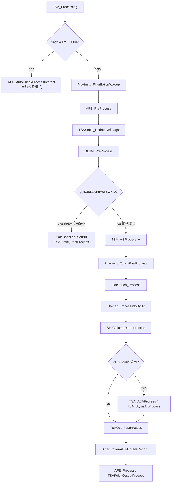
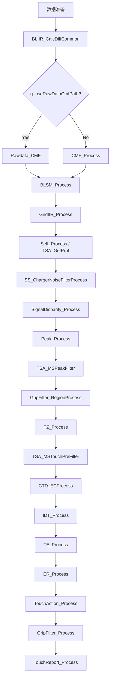
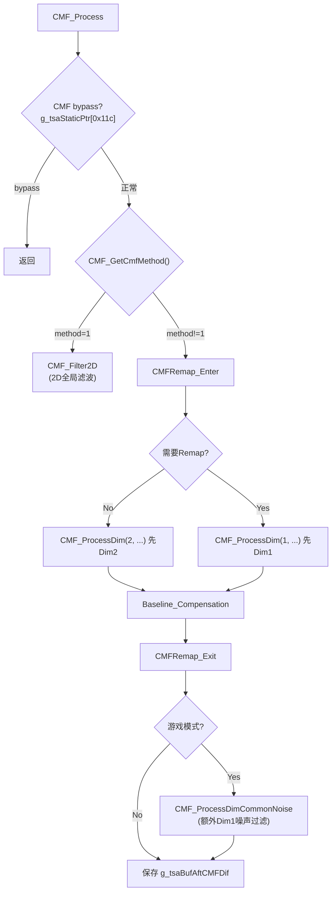
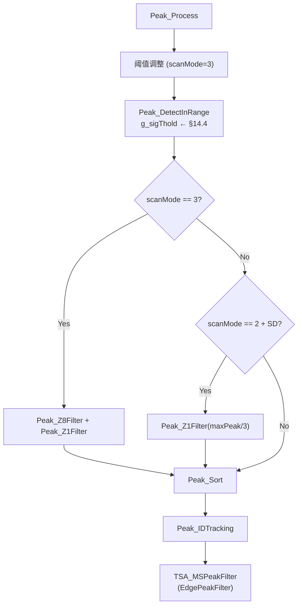
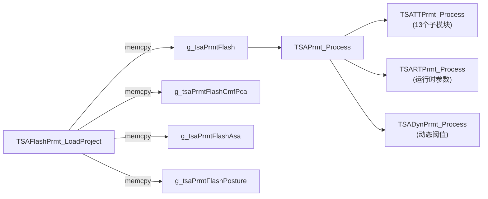

# TSACore 算法深度分析报告

> 入口函数: `TSA_ProcessingAFEFrame` @ `0x1805a7a7`
> 二进制: TSACore.dll (HuaweiThpService)
> 分析工具: Ghidra + GhydraMCP

---

## 0. 顶层入口: TSA_ProcessingAFEFrame

```c
// 地址: 0x1805a7a7, 源文件: ../../src/App/TSA_Main.c
undefined8 TSA_ProcessingAFEFrame(longlong frame, uint flags, uint64 timestamp)
{
    EventAnalyzer_Reset();
    Context_Reset();
    RecordTrigger_ClearFlag();

    if (frame == NULL) return 1;  // 错误: 空帧

    AFE_SetFrame(frame);
    lVar3 = AFE_GetFrame();
    TSA_SavePreUnifiedRaw(lVar3->rawData, flags);

    // 复制原始数据到 g_rawDataBuf
    if (lVar3->rawData != NULL) {
        memcpy_s(&g_rawDataBuf, 0x2648, lVar3->rawData, g_sensorDim2 * g_sensorDim1 * 2);
        localRawPtr = &g_rawDataBuf;
    }

    TSA_Processing(localRawPtr, flags, timestamp);  // ★ 主处理
    RecordTrigger_Process();
    TSAWrapper_Process();
    StrPrintf_FlushProcess();
    return 0;
}
```

**关键点 (GaokunHimaxCSOT — 项目代码 `W273AS2700`):**
- 传感器矩阵: **`g_sensorDim1 = 40 (TX)` × `g_sensorDim2 = 60 (RX)`** = 2400 节点
- 帧数据大小: `40 × 60 × 2 = 4800` 字节 (int16), 缓冲区上限 `0x2648` (9800 字节)
- 每帧先重置事件分析器和上下文
- `TSA_Processing` 是核心处理入口

---

## 1. TSA_Processing — 总调度

```c
// 地址: 0x1805a443, 源文件: ../../src/App/TSA_Main.c
void TSA_Processing(void* rawData, uint flags, uint64 timestamp)
```

### 分支逻辑



### 主要子系统列表

| 调用顺序 | 函数 | 功能 | 条件 |
|----------|------|------|------|
| 1 | `TSAFold_InputProcess` | 折叠屏处理 | `TSAFold_IsSupported()` |
| 2 | `Proximity_FilterExtraWakeup` | 过滤多余唤醒 | `!(flags & 0x100000)` |
| 3 | `AFE_PreProcess` → `AFE_ScanPreProcess` | AFE预处理 | 始终 |
| 4 | `TSAStatic_UpdateCtrlFlags` | 更新控制标志 | 始终 |
| 5 | `BLSM_PreProcess` | 基线状态机预处理 | 始终 |
| 6 | **`TSA_MSProcess`** | **互容主处理** | 正常模式 |
| 7 | `Proximity_TouchPostProcess` | 接近感应后处理 | 正常模式 |
| 8 | `SideTouch_Process` | 侧边触摸 | 正常模式 |
| 9 | `Thenar_ProcessInfoByDif` | 大鱼际检测 | 正常模式 |
| 10 | `SHBVolumeData_Process` | 音量键数据 | 正常模式 |
| 11 | `TSA_ASAProcess` | 自适应信号分析 | `featureFlags & 0x10000` |
| 12 | `TSA_StylusAftProcess` | 手写笔后处理 | ASA+Stylus启用 |
| 13 | `TSAOut_PostProcess` | 输出后处理 | 始终 |
| 14 | `SmartCover_Process` | 皮套检测 | `featureFlags & 0x2` |
| 15 | `AFT_Process` | AFT模式处理 | `featureFlags & 0x40000` |

---

## 2. TSA_MSProcess — 互容主处理流水线

```c
// 地址: 0x18050e43, 源文件: ../../src/App/TSA_MSProc.c
void TSA_MSProcess(void* rawData)
```



### 2.0 数据准备阶段

1. **`DataSwitch_ToGrid()`** — 切换到网格数据空间
2. **`SS_CopyRaw()`** — 复制自感数据 (rows+cols 通道)
3. **原始数据校验** — `SS_IsRawValid()` 检查数据有效性
4. **前帧差分/原始备份**:
   ```c
   memcpy_s(g_tsaBufPreDif, ..., g_tsaBufDif, g_gridNodeCount * 2);  // 保存上帧差分
   memcpy_s(&g_tsaBufPreRaw, ..., g_tsaBufRaw, g_gridNodeCount * 2); // 保存上帧原始
   ```
5. **`TSA_RawCheckProcess()`** — 原始数据检查
6. **数据路径分支**:
   - 正常路径 (`!(ctrlFlags & 0x10000)`): `memcpy → g_tsaBufRaw`, 然后 `TPSensor_ProcessRaw()`
   - Diff路径: `memcpy → g_tsaBufDif` (直接使用差分数据)

### 2.1 基线差分计算: BLIIR_CalcDiffCommon

```c
// 地址: 0x18006f4c
void BLIIR_CalcDiffCommon(short* difBuf, short* rawBuf, short* blBuf)
{
    if (g_tsaStaticPtr[0x11a] == 0) {
        // 正常极性: dif = baseline - raw
        for (i = 0; i < g_gridNodeCount; i++)
            difBuf[i] = blBuf[i] - rawBuf[i];
    } else {
        // 反极性: dif = raw - baseline
        for (i = 0; i < g_gridNodeCount; i++)
            difBuf[i] = rawBuf[i] - blBuf[i];
    }
}
```

> [!NOTE]
> 极性由 `g_tsaStaticPtr[0x11a]` 控制。触摸信号为正值时，baseline > raw (互容下降)。

### 2.1b Rawdata_CMF — 替代CMF路径

当 `g_useRawDataCmfPath` 启用时, CMF 应用到 raw 层面:

```c
void Rawdata_CMF(void) {
    BLIIR_CalcDiffCommon(dif, raw, bl);  // 先算diff
    CMF_Process();                        // 对diff做CMF
    BLIIR_CalcRawCommon(raw, bl, dif);   // 从CMF后diff反推修正raw
}
```

> [!NOTE]
> 与正常路径区别: 正常路径先 BLSM 再 CMF;
> 此路径先 CMF 再 BLSM, 将 CMF 效果嵌入 raw 数据。

### 2.2 Common Mode Filter (CMF)

```c
// 地址: 0x1800f2c8, 源文件: ../../src/Alg/CMF/CMF.c
void CMF_Process(void)
```

#### 2.2.1 整体流程



#### 2.2.2 CMF_ProcessDim — 按维度处理

```c
// 地址: 0x1800e8b5
void CMF_ProcessDim(int dim, short upperThold, short lowerThold, byte cols, byte rows)
```

- `dim=1`: 沿 Dim1 (TX方向) 处理, 遍历 `rows` 条线
- `dim=2`: 沿 Dim2 (RX方向) 处理, 遍历 `cols` 条线
- 每条线调用 `CMF_ProcessDimUnit` → `CMF_ProcessDimUnitOnBuf` → `CMF_ProcessCore`
- **边缘特殊阈值**: 若 `TouchThold_ToeUseSpecialThold()` 启用, 靠近边缘 2 行的 `upperThold` 固定为 200
- 加入 `SS_DiffCMFProcessDimUnit` 自感差分修正

#### 2.2.3 CMF_ProcessCore — 核心噪声计算

```c
// 调用链: CMF_ProcessCore → CMF_ProcessCoreWeight → CMF_NoiseCal
```

**噪声分类** (`CMF_NoiseCal`): 对一条线上的每个节点, 根据信号值和相邻差分分为 5 类:

| 类别 | 条件 | 含义 |
|------|------|------|
| 1 | `|val| ≤ upperThold` 且 `|Δ| ≤ lowerThold` | **安静节点** (用于噪声统计) |
| 2 | `Δ > lowerThold` | 正向跳变 |
| 3 | `Δ < -lowerThold` | 负向跳变 |
| 4 | `val > upperThold` | 正向大信号 (触摸) |
| 5 | `val < -upperThold` | 负向大信号 |

只有**连续两个**类别=1 的节点才参与噪声统计 (`CMF_PushNoiseData`)。
最终噪声估计 `DAT_1813f128` 从安静节点中计算, 然后从整条线所有节点中减去。

> [!IMPORTANT]
> CMF 的核心思想: **找到一条线上不受触摸影响的安静节点, 计算它们的均值作为公共模式噪声, 然后从整条线减去。**

---

### 2.3 基线状态机: BLSM

```c
// 地址: 0x1800c645
void BLSM_Process(char isHWReset, char isForceBypass)
{
    BLRecal_Process();
    BLSM_GetProperty(isHWReset_or_flag, isForceBypass_or_flag);
    BLSM_UpdateStage();
    BLSM_ProcessStage();
    BLSM_ShbProcess();
}
```

#### 2.3.1 BLSM_ProcessStage — 状态处理

`DAT_1820a8b8` 为当前阶段, 有以下状态:

| Stage | 名称 | 行为 |
|-------|------|------|
| 0 | **NoTouch** | 无触摸态, `BLIIR_DoUpdate(step)` 更新基线 |
| 1 | **Reset (type1)** | 全局重置, `BLSM_Reset()` |
| 2 | **Reset (type2)** | 全局重置, `BLSM_Reset()` |
| 3 | **Transition** | 状态切换, 跳转到 `nextStage` |
| 7-8 | **Edge** | 边缘态, 使用不同 IIR 步长 |
| 9 | **RawDrift** | 原始漂移, `BLIIR_Update` 使用负方向度量 |

#### 2.3.2 BLIIR_DoUpdate — 基线 IIR 更新

```c
// 地址: 0x18007141
void BLIIR_DoUpdate(short step)
{
    // 选择原始数据源: preCMF 或 当前 raw
    rawPtr = (DAT_18268a69 == 0) ? g_tsaBufRaw : g_tsaBufPreCMFRaw;

    for (each node) {
        diff = raw[i] - baseline[i];
        if (diff >= step)
            baseline[i] += step;    // 追升
        else if (diff <= -step)
            baseline[i] -= step;    // 追降
        // |diff| < step 时不更新 (死区)
    }
}
```

> [!NOTE]
> 基线更新采用**固定步长追踪**而非 IIR 滤波——每帧最多变化 `step` 个 LSB。
> 这保证了基线缓慢跟踪环境变化, 但不会跟踪快速触摸信号。

#### 2.3.3 BLIIR_Update — 条件守卫

```c
void BLIIR_Update(char forceUpdate, short threshold, short step) {
    maxSig = BLSM_GetMaxSig();
    minSig = BLSM_GetMinSig();
    // 只在信号在安全范围内 才更新基线
    if ((forceUpdate || minSig >= -threshold) && maxSig <= threshold)
        BLIIR_DoUpdate(step);
}
```

---

### 2.4 Grid IIR 滤波: GridIIR_Process

```c
// 地址: 0x18021098, 源文件: ../../src/Alg/GridIIR/GridIIR.c
void GridIIR_Process(void)
```

#### 条件触发

- 仅在 `TSAStatic_IsAllFreqNoisy()` 为真时启用 (全频段噪声环境)
- 若 `TSAStatic_IsAllFreqBecomeNoisy()` (刚进入噪声), 先将当前 dif 复制到 IIR 缓冲

#### IIR_Process2 — 核心 IIR 公式

```c
// 地址: 0x1802021b
int IIR_Process2(int input, int state, byte alpha, byte shift)
{
    // result = (α × input + (2^N - α) × state) / 2^N
    int N = 1 << shift;  // shift=8 → N=256
    int result = (alpha * input + (N - alpha) * state) / N;

    // 收敛助推: 若 result 偏离 input, 向 input 方向 +1/-1
    if (result < input) result += 1;
    else if (result > input) result -= 1;

    return result;
}
```

**参数**: `alpha` = `DAT_182692f8` (IIR 系数), `shift` = 8 (固定) 【Flash→`DAT_18268a3c`经TSARTPrmt, §14.3】

> [!IMPORTANT]
> `alpha/256` 为当前帧权重。alpha 越大, 响应越快但噪声越大。
> **收敛助推** (`±1`) 确保 IIR 滤波器不会因整数截断而永远无法收敛到目标值。

---

### 2.5 SS_ChargerNoiseFilterProcess — 自感充电噪声过滤

在 `Peak_Process` 之前, 利用自感信号消除充电器引入的行/列噪声:

1. 备份 `g_tsaBufDif` → `g_tsaBufSSChargerNFilterDif`
2. `SS_DiffRelatCal` 计算自感差分相关系数 (clamp 到 [0x600, 0xC00])
3. `SS_ChargerNoiseFilterSjSumCal` + `SS_ChargerNoiseFilterSigSumCal` 计算每行信号总和
4. `SS_ChargerNoiseFilterKiCal` 计算 Ki 加权系数
5. `SS_FilterChargerNoise` 逐行从互容 diff 中减去估计噪声

> 仅在 `SS_IsChargerNoiseFilterEnabled()` 且 `SS_IsChargerNoiseFilterNeeded()` 时执行。

### 2.6 SignalDisparity_Process — 信号差异补偿

利用自感信号 Dim1/Dim2 差异检测并补偿信号不均匀:

```c
sdByScoring = SignalDisparity_GetSDScalingByScoring();
sdByRatio   = SignalDisparity_GetSDScalingBySignalRatio();
g_tsaStaticPtr[0x400] = max(sdByScoring, sdByRatio);
if (featureFlags & 0x40)
    SignalDisparity_Compensation();  // 应用到 diff 数据
```

> 需要 Dim1 和 Dim2 自感均有效 (`SS_IsDim1Valid` + `SS_IsDim2Valid`)。

---

## 3. Peak_Process — 波峰检测

```c
// 地址: 0x18028c4b, 源文件: ../../src/Alg/Peak/Peak.c
void Peak_Process(void)
```

### 3.0 整体流程



### 3.1 Peak_DetectInRange — 8邻域极大值检测

```c
// 地址: 0x180285d7
void Peak_DetectInRange(short sigThold, byte startRow, byte endRow,
                        byte excludeSide, byte endCol)
```

**算法**: 遍历 `[startRow, endRow] × [excludeSide?, endCol]` 网格范围:

```
对每个像素 (row, col):
  val = g_tsaBufDif[row * cols + col]

  // 边缘特殊阈值
  if (bVar4 && (col==1 || col==cols-2 || row==rows-1))
      threshold = g_toeSigThold;

  if (val < threshold) → 跳过

  // 8邻域比较 (非对称):
  // 下方3邻居 (↓↘↙) + 右邻居: val >= neighbor (允许等于)
  // 上方3邻居 (↑↗↖) + 左邻居: val >  neighbor (严格大于)

  // PressureDrift 排除 (可选)
  if (featureFlag & 0x20)
      if (PressureDrift_Detect(col, row)) → 跳过

  Peak_Insert(col, row);
```

> [!NOTE]
> **非对称比较设计**: 下方/右方允许等于, 上方/左方严格大于。
> 效果: 当两个相邻像素值完全相等时, 只有**左上方**的像素被选为 Peak。
> 在边界处, 方向上的邻居检查被自动跳过 (边界标志 `bVar7/bVar8/bVar2/bVar3`)。

### 3.2 Peak_Z1Filter — 阈值过滤

```c
// 简单循环: 移除所有 peak.signal < threshold 的峰
void Peak_Z1Filter(short threshold) {
    for (i = peakCount-1; i >= 0; i--)
        if (peaks[i].signal < threshold)
            Peak_Remove(i);
}
```

### 3.3 Peak_IDTracking — 峰值 ID 追踪

```c
// 地址: 0x18028167
void Peak_IDTracking(void)
{
    // 1. 将 peak 坐标转为 Q8.8 格式 (像素中心)
    for (i = 0; i < peakCount; i++) {
        touches[i].x = peak[i].col * 256 + 128;  // Q8.8 + 0.5 offset
        touches[i].y = peak[i].row * 256 + 128;
    }

    // 2. 运行 IDT_Process(1) 进行帧间 ID 匹配
    IDT_Process(1);

    // 3. 将分配的 ID 写回 peak 结构
    for (i = 0; i < peakCount; i++)
        peak[i].id = touches[i].trackingId;
}
```

> [!NOTE]
> Peak 的 ID 追踪和 Touch 的 ID 追踪共用同一套 `IDT_Process` 逻辑,
> 但使用不同参数 (param=1 用于 peak, param=0 用于 touch)。

### 3.4 TSA_MSPeakFilter — 峰值后过滤

```c
void TSA_MSPeakFilter(void) {
    if (featureFlags108 & 1)
        EdgePeakFilter_WorkAround();  // 边缘峰变通处理
}
```

> 可选功能, 仅在 `g_tsaStaticPtr[0x108] & 1` 标志开启时激活。

### 3.5 GripFilter_RegionProcess — 握持区域设置

在触区生成前, 根据屏幕旋转和设备类型设置握持过滤区域:

| `DAT_182692c4` | 方案 | 函数 |
|----------------|------|------|
| 4 | Pad旋转 | `GripFilter_RegionSetByScreenRotationPad` |
| 5 | 折叠屏 | `GripFilter_RegionSetByScreenRotationFold` |
| 其他 | 标准旋转 | `GripFilter_RegionSetByScreenRotation` |

最后叠加 `GripFilter_RegionSetByHandGesture()` 手势修正。

---

## 4. TZ_Process — 触区生成

```c
// 地址: 0x1804c9f0, 源文件: ../../src/Alg/TouchZone/TZ_StateMachine.c
void TZ_Process(void)
{
    TZ_UpdatePeakTzAge();   // 可选: 更新峰值-触区年龄
    *g_touchesPtr = 0;      // 清空触点列表
    TZ_PeakBasedProcess();  // ★ 核心触区生成
    TZ_AgeProcess();        // 可选: 年龄过滤
}
```

### 4.1 TZ_PeakBasedProcess — 基于峰值的触区处理

```c
// 地址: 0x1804bffd
void TZ_PeakBasedProcess(void)
```

**流程**:
1. 清空 `g_tsaBufTz` (触区标签矩阵), `g_tsaBufSubTZ`, `g_tsaBufTzZone`
2. 设置 `g_tzZoneLabelBase = 0x10` (起始标签)
3. `TZ_CheckFatFingerSD()` — 检查是否为大面积手指
4. **逐峰遍历**: 对每个 Peak, 根据模式选择遍历方式:

| 标志 | 模式 | 函数 |
|------|------|------|
| `flags & 0x100` | Simple | `TZ_SimpleTraversal` |
| `flags & 0x80` | Centroid-to-Touch | `TZ_CentrodToTouch` |
| 默认 | **Normal** | `TZ_NormalTraversal` ★ |

5. `TZ_UpdateGripFlag()` — 更新握持标志
6. **`TZ_DilateAndErode()`** — 形态学后处理

### 4.2 TZ_NormalTraversal — 正常遍历模式

```c
// 地址: 0x18049162
void TZ_NormalTraversal(ctx, peakIdx, isFatFingerSD)
{
    sigThold = TZ_GetSigThold(ctx, peakIdx);  // 获取信号阈值
    TZ_UnitInit(ctx);
    // 禁用边缘峰的 grip 标志
    if (peak在屏幕边缘2px内)
        g_tzProcessFlags &= ~0x400;

    TZ_PeakBasedTraversal(ctx, sigThold, peakCol, peakRow);
    TZ_UnitProcess(ctx);        // ★ 验证+属性计算+注册
    g_tzZoneLabelBase += 8;     // 每个zone占8个标签位
}
```

### 4.3 TZ_GetSigThold — 动态信号阈值

```c
// 地址: 0x1804a90b
short TZ_GetSigThold(ctx, peakIdx)
```

**上下文相关阈值选择**:

| 条件 | 阈值函数 | 说明 |
|------|----------|------|
| `flags & 4` | 固定值 `DAT_1826921c` | 特殊模式 |
| SideTouch | `TZ_GetSigTholdForSideTouch` | 侧边触摸 |
| AFT模式 | `TZ_GetSigTholdForAFT` | AFT模式 |
| 充电器/扫描模式2 | `TZ_GetSigTholdForCharger` | 充电噪声环境 |
| **默认** | **`TZ_GetSigTholdCommon`** | 正常模式 |

**`TZ_GetSigTholdCommon`** 核心公式:
```c
peakSig = min(DAT_18268fb4, peak[idx].signal);  // 【§14.3 peakSig clamp】
if (非边缘peak || SD检测) {
    thold = DAT_1826921e * peakSig >> 7;  // 内部ratio 【Flash→§14.3】
} else {
    thold = DAT_1826921f * peakSig >> 7;  // 边缘ratio 【Flash→§14.2 Tz】
}
// 最终: clamp(thold, DAT_1820a910, peak.signal)
```

### 4.4 TZ_PeakBasedTraversal — BFS 洪水填充

```c
// 地址: 0x18049162, 源文件: TZ_PeakBasedTraversal.c
```

**算法**: 优先队列驱动的 BFS, 从 Peak 像素开始向外扩散:

1. **初始化**: 将 Peak 像素入队 (`PosnSpecial_Put`)
2. **主循环** (`while !empty`):
   - `PosnSpecial_ReBase()` — 重排列队
   - `pos = PosnSpecial_Get()` — 取出像素
   - `TZ_TraversalNeighbor(pos)` — 检查 4/8 邻域, 将合格邻居入队
   - **像素分类** (根据信号强度分级标记):

| 信号范围 | 标签偏移 | 含义 |
|----------|----------|------|
| `val >= sigThold` 且 4个有效邻居 | `+6` | **核心区** |
| `val >= sigThold` 且 <2个边缘邻居 | `+3` | **过渡区** (边缘邻) |
| `sigThold > val >= edgeThold` | `+4` | **边缘区** |
| `val >= rawDirectionMetric/2` | `+5` | **扩展区** |

3. **符号保留**: 标签乘以 `sign(difVal)`, 保留原始信号极性
4. **结束**: `TZ_GetEdgeWidth()` 计算边缘宽度

### 4.5 TZ_UnitProcess — 触区单元处理

```c
void TZ_UnitProcess(ctx) {
    TZ_PeakInfoRetrieval(ctx);                    // 提取峰值信息
    TZ_BeforeSDCompensationPeakInfoRetrieval(ctx); // SD前峰值信息
    if (!TZ_IsValid(ctx)) return;                  // 验证有效性
    TZ_GetPrevTouch(ctx);                          // 获取前帧触点
    TZ_GetProperty(ctx);                           // ★ 计算所有属性
    TZ_UnitToTouch(ctx);                           // 注册为触点
}
```

### 4.6 TZ_GetProperty — 触区属性计算

```c
// 地址: 0x1804b126
void TZ_GetProperty(ctx) {
    TPSensor_IsBrokenSensorInTouchZone(ctx);  // 检查坏点
    TZ_CentroidCore(ctx);        // ★ 质心计算
    TZ_GetEdgeTouchedFlag(ctx);  // 边缘接触标志
    TZ_GetHTIValidFlag(ctx);     // HTI有效标志
    TZ_GetAxis(ctx);             // 主轴方向
    TZ_GetShapeRatio(ctx);       // 形状比例
    TZ_GetGripRatio(ctx);        // 握持比例
    TZ_GetContour(ctx);          // 轮廓特征
    Exception_ProcessTouchZone(ctx);   // 异常检测
    TZ_CheckToSeparateZone(ctx);       // 是否需分裂
    SubTZ_Process(ctx);                // 子触区处理
    TZ_GetShapeFlag(ctx);              // 形状标志
    TZ_GetSurroundingStatusFlag(ctx);  // 周围状态
    TZ_GetCMFFlag(ctx);                // CMF标志
    TZ_VPProcess(ctx);                 // 虚拟峰处理
    TZ_GetType(ctx);                   // 触区类型判定
}
```

#### TZ_CentroidCore — 加权质心

```c
// CTD_BasicCalculation: Q8.8 格式质心
result = (weightedCoordSum << 8) / signalSum + 0x80

// 即: centroid = Σ(val × coord) / Σ(val)
// 结果为 Q8.8 定点数, +0x80 (0.5像素) 偏移量对齐像素中心
```

### 4.7 TZ_DilateAndErode — 形态学变换

```c
void TZ_DilateAndErode(void) {
    // 1. 膨胀: TZ_Transform(flags, 0x14, dilate=0, count=1)
    memcpy(g_tsaFlagAfterDilate, accessFlags, nodeCount);
    TZ_Transform(&g_tsaFlagAfterDilate, 0x14, 0, 1);

    // 2. 腐蚀: TZ_Transform(flags, 0x14, erode=1, count=1)
    memcpy(g_tsaFlagAfterErode, accessFlags, nodeCount);
    TZ_Transform(&g_tsaFlagAfterErode, 0x14, 1, 1);
}
```

> [!NOTE]
> 闭运算 (先膨胀后腐蚀) 用于填充触区内部小空洞,
> 同时保留触区边界形状。`0x14` 为标签阈值。

---

## 5. TSA_MSTouchPreFilter — 触前过滤

```c
void TSA_MSTouchPreFilter(void) {
    RxLineFilter_Process();
    SigSumFilter_ReserveTouch(DAT_182692b4);
}
```

### 5.1 RxLineFilter_Process — RX线串扰过滤

- 仅在 `g_tsaStaticPtr[0x111] > 1` (scanMode >= 2) 时启用
- 对每个触点调用 `RxLineFilter_IsPossibleFalseTouch`
- 判定为虚假的触点直接 `Touch_UnitRemove` 移除

### 5.2 SigSumFilter_ReserveTouch — 信号总和保留

- **排序**: 按 `touchData.signalSum` 降序冒泡排序
- **截断**: 移除排名 ≥ `reserveCount` 的触点
- `DAT_182692b4` 为保留触点数上限

---

## 6. CTD_ECProcess — 边缘补偿

```c
// 地址: 0x18015ca0
void CTD_ECProcess(void) {
    for (each touch) {
        // 保存 pre-EC 坐标
        touch.preEcX = touch.centroidX;
        touch.preEcY = touch.centroidY;
        CTD_ECProcessUnit(touchIdx);
        // 保存 post-EC 坐标为报告坐标
        touch.reportX = touch.ecX;
        touch.reportY = touch.ecY;
        Touch_SetEdgeDist(touchIdx);
    }
}
```

### 6.1 CTD_ECProcessUnit — 单触点补偿

```c
void CTD_ECProcessUnit(idx) {
    CTD_ECUpdatePosToEC(idx);   // 准备EC坐标
    CTD_ECProcessDim1(idx);      // Dim1(TX)方向补偿
    CTD_ECProcessDim2(idx);      // Dim2(RX)方向补偿
}
```

### 6.2 CTD_ECProcessDim1 — 维度1边缘补偿

**Near边 (左/上)** vs **Far边 (右/下)** 使用不同的参数集:

```c
// Near边 (edgeFlag & 1):
g_tsaPrmtRam = DAT_18269240;  // Near边LUT参数 【Flash→§14.2 Ctd】
offset = CTD_ECGetOffset(subpixelIdx, edgeWidth);
finalPos = CTD_ECGetFinalOffset(pos - nearEdge, 256 - offset) + nearEdge;

// Far边 (edgeFlag & 2):
g_tsaPrmtRam = DAT_18269251;  // Far边LUT参数
offset = CTD_ECGetOffset(subpixelIdx, edgeWidth);
finalPos = farEdge - CTD_ECGetFinalOffset(farEdge - pos, 256 - offset);
```

### 6.3 CTD_ECGetOffset — 分段LUT查表

```c
// 地址: 0x18015ca0
short CTD_ECGetOffset(byte subpixelIdx, byte edgeWidth) {
    // 在参数表中找到 subpixelIdx 所在区间段
    seg = 0;
    while (seg < numSegments-1 && paramTable[seg].boundary < edgeWidth)
        seg++;

    // 从 g_ctd256Ln[256] 查表, 做分段线性插值
    rangeStart = g_ctd256Ln[paramTable[seg].startIdx];
    rangeEnd   = g_ctd256Ln[paramTable[seg].endIdx];
    if (rangeEnd == rangeStart) return 0;

    result = (g_ctd256Ln[subpixelIdx] - rangeStart) * 256
             / (rangeEnd - rangeStart);
    return clamp(result, 0, 255);
}
```

### 6.4 CTD_ECGetFinalOffset — 平滑混合

```c
int CTD_ECGetFinalOffset(int rawDist, int ctdOffset) {
    int margin = rawDist - 256;
    if (margin > 0 && margin < 64) {
        // 过渡区: 在 [256, 320] 范围内线性混合
        return (rawDist * margin * 4 + (256 - margin*4) * ctdOffset) >> 8;
    }
    if (margin >= 64) return rawDist;  // 太远, 不补偿
    return ctdOffset;                   // 在边缘内, 完全补偿
}
```

> [!IMPORTANT]
> 混合区间 `[256, 320]` (Q8.8 = [1.0, 1.25]像素) 确保补偿效果在边缘附近平滑淡出,
> 避免在补偿区域边界产生坐标跳变。

---

## 7. IDT_Process — ID追踪 (匈牙利匹配)

```c
// 地址: 0x180211a6, 源文件: ../../src/Alg/IDTracking/IDT.c
void IDT_Process(byte mode) {
    IDT_HMProcess(&matchMap, 20);  // 匈牙利匹配
    IDT_AccCheck(mode, &matchMap, 20);  // 加速度检查
    IDT_Map(&matchMap, 20);        // ID映射
}
```

### 7.1 IDT_HMProcess — 匈牙利匹配

```c
void IDT_HMProcess(matchMap, maxTouches) {
    // 构建距离矩阵
    IDT_PopulateDistanceMap(distMatrix, direction);
    // 执行匈牙利算法 (最优分配)
    IDT_HM(numSmall, numLarge, assignment, distMatrix);
    // 写入匹配结果
    for (each prev/cur touch pair)
        matchMap[prevIdx] = curIdx;  // 或反向
}
```

> [!NOTE]
> 当前帧触点数 < 前帧时, 以前帧为行/当前为列构建矩阵;
> 反之则转置。确保匈牙利算法总是在较小维度上运行。

---

## 8. TE_Process — 触摸事件状态机

```c
// 地址: 0x180389d9
```

**状态转换**:

| 事件 | 条件 | 处理函数 |
|------|------|----------|
| **Lift-Off** | 前帧有, 当前无 | `TE_LiftOffProcess` |
| **Touch-Down** | 无tracking ID | `TE_TouchDownProcess` |
| **Move** | 有ID且前帧非debounce | `TE_MoveProcess` |
| **TD Debounce** | 有ID且前帧在debounce | `TE_TouchDownDebounce` |

---

## 9. ER_Process — 边缘拒绝

- 对 touch-down 事件: `ER_TouchDownProcess` 判定是否边缘误触
- 对 move 事件: `ER_MoveOutCheck` + `ER_MoveOutCorrection` 检测并修正移出
- 设置 `touchFlags` 标志位: `0x20`(边缘拒绝), `0x40`(移出修正)

---

## 10. TS_Process — 触摸尺寸处理

```c
void TS_Process(void) {
    for (each touch) {
        prevIdx = PrevTouch_GetIdxBasedOnCurIdx(i);
        if (!(touchFlags & 0x20))  // 非边缘拒绝
            TS_ProcessUnit(prevIdx, curIdx);
    }
}
```

`TS_ProcessUnit`: 计算触点的物理尺寸(mm), 使用 LUT 查表;
取当前帧和前帧的较大值作为最终尺寸, 确保尺寸不会突然缩小。

---

## 11. 后处理流水线

`TSA_MSProcess` 主循环的后半段按顺序执行:

| 序号 | 函数 | 功能 |
|------|------|------|
| 1 | `TSABuffer_PreProcess` | 缓冲区预处理 |
| 2 | `SafeBaseline_Process` | 安全基线 (可选) |
| 3 | `ER_Process` | 边缘拒绝 |
| 4 | `TouchAction_Process` | 触摸动作分类 (静止/滑动/点击) |
| 5 | `TSA_MSTouchPostFilter` | 后过滤 **(空函数)** |
| 6 | `TS_PostProcess` | 尺寸后处理 |
| 7 | `TouchAction_PostProcess` | 动作后处理 |
| 8 | `Exception_Process` | 异常处理 |
| 9 | `Gesture_Process` | 手势识别 |
| 10 | `GripFilter_Process` | 握持过滤 |
| 11 | `TouchMode_Process` | 触摸模式 |
| 12 | `AntiTouch_Process` | 防误触 |
| 13 | `Touch_ProcessBetaGrip` | Beta握持 |
| 14 | **`TouchReport_Process`** | **最终报告生成** |
| 15 | `Touch_ProcessExtInfo` | 扩展信息 |
| 16 | `PrevTouch_PostProcess` | 前帧保存 |
| 17 | `PrevPeak_Process` | 前帧峰保存 |

### 11.1 GripFilter_Process — 握持过滤

```c
void GripFilter_Process(void) {
    GripFilter_GetPropertyGlobal();
    for (each touch) {
        if (!(touchFlags & 0x200000))  // 非已标记grip
            GripFilter_BasicProcess(curIdx, prevIdx);
    }
    // 可选: GripFilter merge + report + IDLE
    if (featureFlags & 0x20) {
        TSABuffer_GripStageProcess();
        GripFilter_Report();
        GripFilter_IDLEProcess();
    }
}
```

### 11.2 TouchReport_Process — 报告生成

- 对每个触点调用 `TouchReport_ProcessUnit` 生成最终坐标
- **Multi-Step Back**: 若所有触点均后退, 使用前帧报告坐标 (防止抖动)

---

## 12. 侧路子系统

### 12.1 Proximity_Process — 接近感应

- 切换到 proximity 数据空间 (`DataSwitch_ToProx`)
- `Proximtiy_SignalProcess()` 处理接近信号
- 根据场景 (锁屏/通话/握持) 修改检测标志
- 分 `Proximity_IsDetectedProcess` / `IsNotDetectedProcess` 两路

### 12.2 Self_Process — 自感处理

```c
void Self_Process(void) {
    Self_ProcessDim(1);   // Dim1 自感
    Self_ProcessDim(2);   // Dim2 自感
    Self_GetProperty();   // 计算自感属性
}
```

### 12.3 SideTouch_Process — 侧边触摸

在 `TSA_Processing` 中于 `TSA_MSProcess` 之后调用, 处理侧边触摸数据。

### 12.4 Thenar_ProcessInfoByDif — 大鱼际检测

利用差分数据检测大鱼际 (手掌侧面) 的接触, 用于防误触。

---

## 13. 完整流水线总览

```mermaid
flowchart LR
    subgraph 帧输入
        A["TSA_ProcessingAFEFrame"] --> B["TSA_Processing"]
    end
    subgraph 数据预处理
        B --> C["BLIIR_CalcDiffCommon<br/>(基线减法)"]
        C --> D["CMF_Process<br/>(公共模式滤波)"]
        D --> E["GridIIR_Process<br/>(噪声IIR)"]
    end
    subgraph 特征提取
        E --> F["Peak_Process<br/>(峰值检测)"]
        F --> G["TZ_Process<br/>(触区生成)"]
    end
    subgraph 触点解算
        G --> H["PreFilter<br/>(RxLine+SigSum)"]
        H --> I["CTD_EC<br/>(边缘补偿)"]
        I --> J["IDT_Process<br/>(ID追踪)"]
    end
    subgraph 后处理
        J --> K["TE_Process<br/>(事件状态机)"]
        K --> L["ER/TS/Grip/...<br/>(各类过滤)"]
        L --> M["TouchReport<br/>(最终报告)"]
    end
```



> [!TIP]
> 数据流关键缓冲区:
> - `g_tsaBufRaw` — 原始数据
> - `g_tsaBufBl` — 基线
> - `g_tsaBufDif` — 差分 (主处理数据)
> - `g_tsaBufTz` — 触区标签矩阵
> - `g_peaksPtr` — 峰值列表 (max 20)
> - `g_touchesPtr` — 触点列表 (max 20)
> - `g_prevTouchesPtr` — 前帧触点列表

---

## 14. 参数加载流水线 (TSAPrmt)

### 14.0 Flash参数数组

| TSAPrmt 数组 | TSACore 目标 | 大小 |
|-------------|-------------|------|
| `g_tsaPrmtFlashGaokunHimaxCSOT` | `g_tsaPrmtFlash` | **0x1890** (6288B) |
| `g_tsaPrmtFlashCmfPcaGaokunHimaxCSOT` | `g_tsaPrmtFlashCmfPca` | **0x132C** (4908B) |
| `g_tsaPrmtFlashAsaGaokunHimaxCSOT` | `g_tsaPrmtFlashAsa` | **0xE40** (3648B) |
| `g_tsaPrmtFlashPostureGaokunHimaxCSOT` | `g_tsaPrmtFlashPosture` | **0x3EB20** (257KB) |

### 14.1 加载流程



### 14.2 TSATTPrmt — 静态参数分发 (g_tsaPrmtFlash → 算法变量)

| 子模块 | 目标变量 | 含义 | 影响的算法阶段 |
|--------|----------|------|--------------|
| **Sig** | `g_sigTholdLimit` | 信号阈值上限 | §3 Peak阈值基准 |
| | `DAT_18268fda` | 噪声阈值参考 | §3 PkThold噪声边界 |
| | `DAT_18268fd8` | 信号比例参数 | 阈值缩放 |
| **Sys** | `g_scanMode` | 扫描模式 (0-3) | §3 峰值过滤分支选择 |
| | `DAT_18268a60/64` | 系统配置 | 全局行为控制 |
| **Tz** | `DAT_1826921f` | TZ边缘ratio (Q7) | §4.3 TZ_GetSigTholdCommon |
| | `DAT_18269220` | TZ辅助ratio | §4.3 sigThold计算 |
| | `DAT_18269234` | 形状/边缘宽度参数 | §4 触区形状判定 |
| **Cmf** | `DAT_18269026` | CMF remap参数1 | §2.2 CMF滤波强度 |
| | `DAT_18269028` | CMF remap参数2 | §2.2 CMF方向选择 |
| **Ctd** | `DAT_18269240` | EC Near边LUT参数 | §6.2 边缘补偿 |
| | `DAT_18269251` | EC Far边LUT参数 | §6.2 边缘补偿 |
| | `DAT_18269262` | EC Dim2 Near参数 | §6.2 Dim2方向 |
| | `DAT_18269273` | EC Dim2 Far参数 | §6.2 Dim2方向 |
| **Idt** | `g_idtAccCheckDistMm` | ID追踪加速度距离(mm) | §7 IDT_AccCheck |
| **Tm** | `DAT_18269320` | 触摸模式参数 | §11 TouchMode |
| **Ta** | `DAT_182692fc` | 触摸动作阈值 | §11 TouchAction |
| | `DAT_18269304/306` | 动作距离阈值 | 静止/滑动判定 |
| | `DAT_18269308/309` | 动作角度阈值 | 方向判定 |

### 14.3 TSARTPrmt — 运行时参数 (场景切换后更新)

调用 `TSA_ScenarioProcess()` 后, 将运行时参数映射到算法变量:

| 目标变量 | 含义 | 影响阶段 |
|----------|------|----------|
| `g_sigTholdLimit` | 信号检测阈值上限 | §3 Peak + §4 TZ |
| `DAT_1826921e` | TZ 内部区域 ratio (Q7) | §4.3 sigThold (非边缘) |
| `DAT_1826921f` | TZ 边缘区域 ratio (Q7) | §4.3 sigThold (边缘) |
| `DAT_18269220` | TZ 辅助ratio | §4.3 sigThold备选 |
| `g_idtAccCheckDistMm` | IDT 加速度检查距离 | §7 IDT_AccCheck |
| `DAT_18268a3c` | 基线 IIR 系数 | §2.4 GridIIR alpha |
| `DAT_18268fba` | 峰值最大Signal上限 | §4.3 peakSig clamp |
| `DAT_18269320` | 触摸模式过滤参数 | §11 TouchMode |

### 14.4 TSADynPrmt — 动态阈值计算

`TSADynPrmt_GetPkThold` 为核心, 每帧重新计算:

```c
// 边缘峰阈值 (比正常阈值更低, ×0x38/0x50 ≈ 70%)
toeSigThold = TouchThold(g_sigTholdLimit * 0x38 / 0x50, noise);

// 正常峰阈值
g_sigThold  = TouchThold(g_sigTholdLimit, noise);

// 触摸确认阈值 (scaleFactor 为 Q4 定点)
g_touchDownThold = g_tholdScaleFactor * noiseThreshold >> 4;
```

> [!IMPORTANT]
> **参数依赖链**: `g_sigTholdLimit` (flash) → `g_sigThold` (peak检测)
> → `TZ_GetSigThold` (触区阈值) → `g_touchDownThold` (触摸确认)。
> 单个 flash 参数变化会波及整个检测灵敏度。

### 14.5 Ctd 参数的扫描方向交换

```c
// 当 scanDirection 不同 (DAT_18268a19 != DAT_18268a18):
// Dim1 和 Dim2 的 Near/Far LUT 参数互换
DAT_18269240 = EC_Dim2_Near;  // 原 Dim2 → Dim1
DAT_18269251 = EC_Dim2_Far;
DAT_18269262 = EC_Dim1_Near;  // 原 Dim1 → Dim2
DAT_18269273 = EC_Dim1_Far;
```

> 确保边缘补偿方向与实际扫描方向一致。

### 14.6 GaokunHimaxCSOT 具体参数值

> Flash 数据来源: `g_tsaPrmtFlashGaokunHimaxCSOT` 项目代码 `W273AS2700`, 地址 `0x68829980`

#### 传感器与系统

| 参数 | 值 | 说明 |
|------|------|------|
| 项目代码 | `W273AS2700` | GaokunHimaxCSOT |
| sensorDim1 (TX) | **40** | 发射通道数 |
| sensorDim2 (RX) | **60** | 接收通道数 |
| 总节点数 | **2400** | 40×60 |
| scanMode | **3** | Full InCell |
| scanDirection | `0x01, 0x01` | Dim1/Dim2方向标志 |

#### 信号阈值 (从 flash 头部偏移)

| Flash偏移 | 原始值 | 解析 | 目标变量 | 说明 |
|-----------|--------|------|----------|------|
| 0x1D | 0x3C | 60 | `g_sensorDim2` | RX通道数 |
| 0x1E | 0x28 | 40 | `g_sensorDim1` | TX通道数 |
| 0x34 | 0x03 | 3 | `g_scanMode` | 扫描模式 |

#### 可调参数及说明 (TSATTPrmt_Init)

| 变量 | 范围 | 说明 |
|------|------|------|
| `g_sigTholdLimit` | [0, max] | 手指模式信号阈值上限; 基于设备悬浮状态下4mm无膜/5mm贴膜手指的LTI调谐 |
| `DAT_18268fda` | [0, max] | 手套模式信号阈值; 基于SmartCover/厚手套LTI调谐 |
| `DAT_1826921f` | [0x30, 0x60] | TZ边缘ratio(×128): 越高多指越好但胖手指越差 (grounding) |
| `DAT_18269220` | [0x10, 0x60] | TZ浮空ratio(×128): 越高多指越好但胖手指越差 (floating) |
| `g_idtAccCheckDistMm` | [8, 24] | IDT加速度阈值(mm): 越高画线越好但双指点击越差 |
| `DAT_18269234._2_1_` | [0x1C, 0x28] | 大物体尺寸阈值(mm) |
| `DAT_18269026` | [0, 0x7FFF] | CMF噪声阈值 |
| `DAT_18269028` | [0, 1000] | CMF相邻传感器delta阈值 |
| `DAT_18269304` | [0, 100] | 非轴向移动距离(px); 越高点击越好但滑动越差 |
| `DAT_18269306` | [0, 150] | 移动距离阈值(px); 点击抑制判定 |
| `DAT_18269240` | [0x10, 0xFF] | EC顶边缘修正: 越小越容易到达边缘 |
| `DAT_18269251` | [0x10, 0xFF] | EC底边缘修正: 越小越容易到达边缘 |
| `DAT_18269262` | [0x10, 0xFF] | EC左边缘修正 |
| `DAT_18269273` | [0x10, 0xFF] | EC右边缘修正 |
