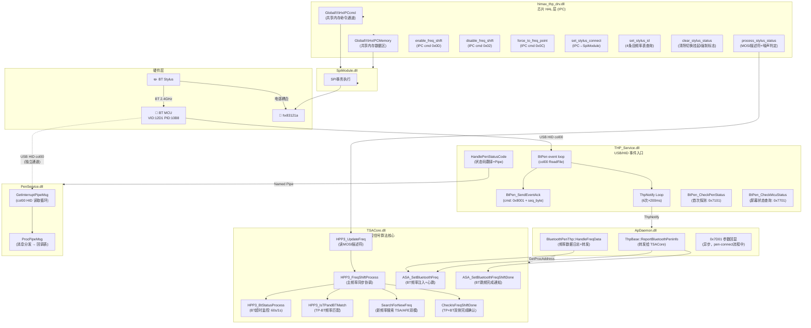
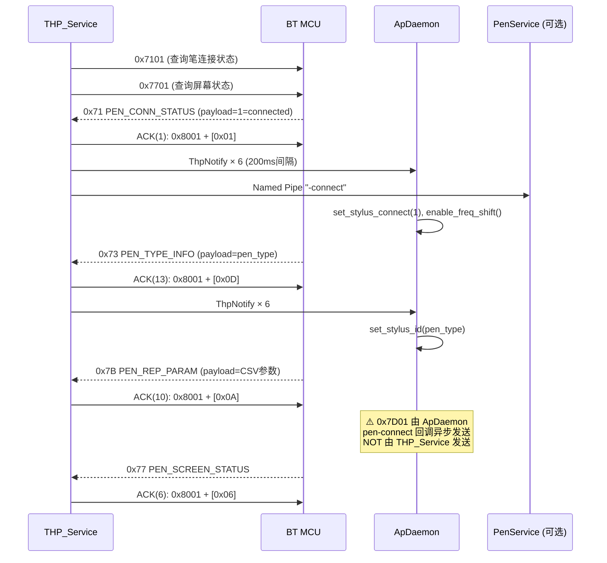
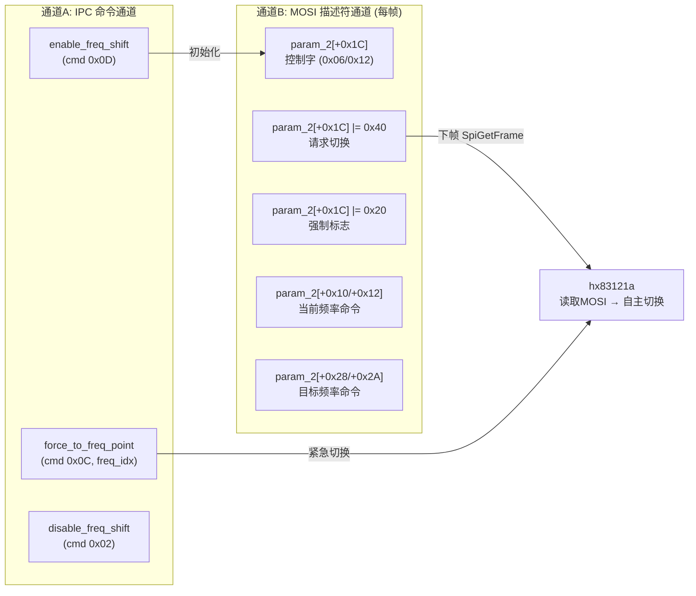
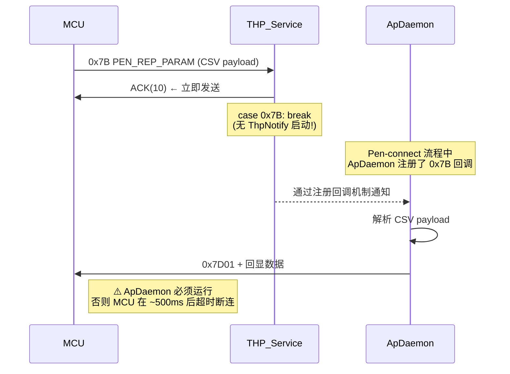
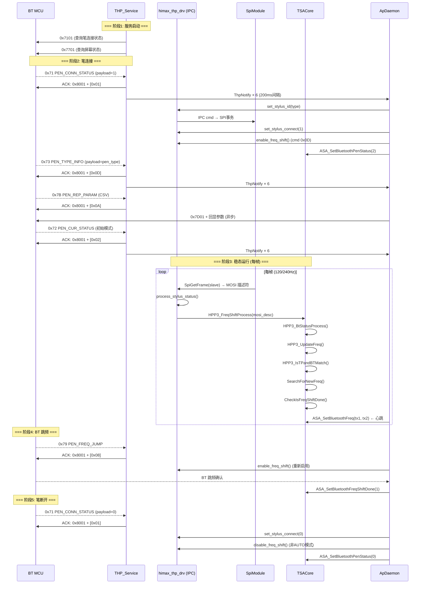
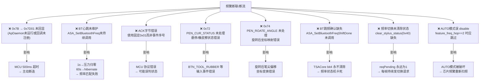

# 手写笔协议完整逆向分析（修订版）

> 来源：Ghidra 逆向 + 源码交叉验证，覆盖 `himax_thp_drv.c`、`THP_Service.c`、`TSACore.c`、`ApDaemon.c`、`PenService.c`
>
> 最后更新：2026-03-30（基于原文档修订，含重要纠错）

---

## 一、全栈模块职责总览



---

## 二、THP_Service.dll — USB/HID 事件处理层

### 2.1 完整事件码表（原文档仅列5个，实际14个）

| 事件码 | 名称 | ACK 序号 | 含义 | 状态字节影响 |
|--------|------|----------|------|-------------|
| `0x6F` | (未命名) | 11 | 未知事件 | — |
| `0x70` | (未命名) | 0 | 未知事件 | — |
| `0x71` | PEN_CONN_STATUS | **1** | 笔连接/断开 | bit0,bit1 |
| `0x72` | **PEN_CUR_STATUS** | **2** | 笔工作模式（悬停/橡皮擦） | bit2,bit3 |
| `0x73` | PEN_TYPE_INFO | **13** | 笔类型信息 | bit4,bit5 |
| `0x74` | **PEN_ROATE_ANGLE** | **3** | 屏幕旋转角度 | bit6,bit7 |
| `0x75` | **PEN_TOUCH_MODE** | **4** | 触摸模式 | byte[1] bit0 |
| `0x76` | **PEN_GLOBAL_PREVENT_MODE** | **5** | 全局防误触模式 | byte[1] bit1 |
| `0x77` | **PEN_SCREEN_STATUS** ⚠️ | **6** | 屏幕状态（非 PEN_READY！） | — |
| `0x78` | **PEN_HOLSTER** | **7** | 笔套检测 | byte[1] bit3 |
| `0x79` | PEN_FREQ_JUMP | **8** | BT 跳频触发 | — |
| `0x7B` | PEN_REP_PARAM | **10** | 初始化参数（CSV 格式） | → 异步 0x7D01 |
| `0x7C` | **PEN_GLOBAL_ANNOTATION** | **12** | 全局标注模式 | — |
| `0x7F` | **ERASER_TOGGLE** | **9** | 橡皮擦切换 | — |

> [!CAUTION]
> **⚠️ 重要纠错**
>
> 1. **ACK 字节不是固定 0x01**，每种事件有独立序号（0~13），错误的 ACK 值将导致 MCU 协议错误。
> 2. **`case 0x77` = "PEN_SCREEN_STATUS"**，不是 "PEN_READY"。`0x7701` 是主动发送的查询命令，`0x77` 是 MCU 的回应事件，两者语义完全不同。
> 3. **`case 0x7B` 不发送 0x7D01**，只发 ACK(10)。0x7D01 由 ApDaemon 异步发送（见第四节）。

### 2.2 ACK 报文格式

```
命令字段: [0x07][0x01][0x02][0x00][0x01][0x80][0x00][0x20]
                                    ↑         ↑
                               cmd_lo=0x01  cmd_hi=0x80 → cmd=0x8001

完整报文: [0x07][0x01][0x02][0x00][0x01][0x80][0x00][0x20][event_seq_byte]
                                                             ↑
                                                    见上表第三列（0~13）
```

### 2.3 BtPen_SendPacket 报文格式（主动命令）

```
0x40 bytes total (zero-initialized):
┌─────────────────────────────────────────────────┐
│ [0..5]  : 从 header template 复制                │
│ [6]     : 强制 0x11（固定标识符）                  │
│ [7]     : header[7]                              │
│ [8..N]  : payload (N = payload_len + 8)          │
│ [N..63] : 零填充                                  │
└─────────────────────────────────────────────────┘
WriteFile(handle, buf, payload_len + 8)
```

### 2.4 状态字节 `qword_1800B5AA0` 详解

```c
// Byte[0]: 笔硬件状态
bit 0    : 笔 BT 连接标志 (0x71 payload=1 → 置位)
bit 1    : 笔 BT 连接标志（冗余位）
bit 2    : 悬停模式 (0x72 payload=2 → 置位)
bit 3    : 橡皮擦模式 (0x72 payload=3 → 置位)
bit 4-5  : 笔类型分类 (0x73 payload << 4，掩码 0x30)
bit 6-7  : 屏幕旋转角度 (0x74: payload=2→清零, payload=4→0x80, else payload<<6)

// Byte[1]: 附加功能标志
bit 0    : 触摸模式 (0x75 payload)
bit 1    : 全局防误触 (0x76 payload)
bit 2    : 按键/模式状态 (多个事件可设置)
bit 3    : 笔套状态 (0x78 payload)
```

### 2.5 `case 0x72` PEN_CUR_STATUS 详解

```c
// 笔当前工作模式（Linux 实现需映射到 BTN_TOOL_* 输入事件）
switch (payload) {
    case 1:  // 普通书写
        state_byte &= ~0x0C;  // 清 bit2、bit3
        break;
    case 2:  // 悬停 (In-Range)
        state_byte = (state_byte & ~0x08) | 0x04;  // 置 bit2
        break;
    case 3:  // 橡皮擦
        state_byte = (state_byte & ~0x04) | 0x08;  // 置 bit3
        break;
}
```

### 2.6 ThpNotify 异步分发机制

```c
// sub_180013820 = ThpNotify 循环，由多个事件处理完成后启动独立线程
void sub_180013820() {
    for (int i = 5; i >= 0; --i) {
        ThpNotify();      // 通知 ApDaemon 有新事件
        Sleep(200);       // 200ms 间隔，共 1.2s 通知窗口
    }
}
```

触发 ThpNotify 的事件：`0x71`, `0x72`, `0x73`, `0x74`, `0x75`, `0x76`, `0x78`, `0x7C`, `0x7F`

> [!NOTE]
> `case 0x77` 和 `case 0x79` 使用 `break`（不启动 ThpNotify 线程）；`case 0x7B` 也只用 `break`。
> 这意味着 **0x7D01 参数回显无法通过 ThpNotify 触发**，需要由 pen-connect 流程中的专用回调完成。

### 2.7 HandlePenStatusCode（`sub_180005BA0`）

由 `0x71` 事件触发，将状态码翻译并通过 Named Pipe 发送给 PenService：

| status code | PenkitPipe 消息 | 含义 |
|-------------|----------------|------|
| `0` | `"-disconnect"` | 笔断开 |
| `1` | `L"-connect"` (WCHAR) | 笔连接 |
| `2` | `L"-start 2"` (WCHAR) | 笔模式2 |
| `3` | `"-erase"` | 橡皮擦 |
| `4` | `L"-doubleclick"` (WCHAR) | 双击 |
| `16` | `L"-start 16"` (WCHAR) | 笔模式16 |

> Named Pipe 路径：`\\.\Pipe\2F4B70D9618044F1B64B3D25E5FD3AF1.{SessionId}`
> WaitNamedPipe 超时 3 秒；PenService 未运行时事件**静默丢弃**，但 ACK 仍正常发送。

### 2.8 初始握手时序（修正版）



---

## 三、himax_thp_drv.dll — 芯片 HAL 层

### 3.1 IPC 架构（重要修正）

原文档描述 IPC cmd 为直接发往芯片的命令，实际是通过 **Windows 命名共享内存**：

```
thp_afe_*(cmd) → 写入共享内存 → SpiModule.dll → 实际 SPI 事务 → hx83121a
```

| 共享内存 | 大小 | 用途 |
|----------|------|------|
| `"Global\\HxIPCMemory"` | 0x50E0 (20704字节) | 数据区（帧数据、MOSI描述符） |
| `"Global\\HxIPCcmd"` | 0x2CFC (11516字节) | 命令通道（freq cmd等） |

**Linux 实现**：需要用 sysfs/ioctl 或自定义驱动接口替代这两个共享内存通道。

### 3.2 频率切换双通道设计



### 3.3 `thp_afe_set_stylus_id` 频率表结构

```c
// 频率表: 最多 4 条目，每条目步长 168 字节 (42 × int32)
// 基址: dword_18016EC80
for (int v10 = 0; v10 < 4; v10++) {
    if (freq_table[v10 * 42] == pen_id) {
        // 找到匹配 → 绑定频率对
        break;
    }
    // 未找到 → "Pen_ID %u requested no match!" → return 1 (error)
}
// 需要 dword_18019638C >= 3 (projectInitState > AFE_STARTED)
```

### 3.4 `process_stylus_status` 完整逻辑（每帧）

```mermaid
flowchart TD
    START["process_stylus_status\n(每帧调用)"] --> SEQ["写入帧序列号\ng_FrameSequenceCounter++"]
    SEQ --> FLAGS["计算 StatusFlags\n(param_1[0xd])"]
    FLAGS --> DATA{"param_3 或 param_5 ≠ 0?"}
    DATA -->|"有笔/有触摸"| SET2["StatusFlags = 2"]
    DATA -->|"无数据"| SET0["StatusFlags = 0"]
    SET2 --> RETRY{"DAT_180195390 == 1?\n(FW请求重试)"}
    SET0 --> RETRY
    RETRY -->|"是"| SET3["StatusFlags = 3\nRetryEnable = 1"]
    RETRY -->|"否"| FREQ_DONE

    SET3 --> FREQ_DONE{"freqShiftStatus有效\n且 AfeCurrentFreqCmd 匹配\n且 FreqShiftDone ≠ 0?"}
    FREQ_DONE -->|"是"| OR4["StatusFlags |= 0x04\n(频率偏移已激活)"]
    FREQ_DONE -->|"否"| CHECK_0xBB

    OR4 --> CHECK_0xBB{"DAT_180195396 == 0xBB?\n(调试/异常)"}
    CHECK_0xBB -->|"是"| OR8["StatusFlags |= 0x08"]
    CHECK_0xBB -->|"否"| NOISE_HI

    OR8 --> NOISE_HI
    NOISE_HI{"噪声 > 0x5DB (1499)?"}
    NOISE_HI -->|"是"| OR20["StatusFlags |= 0x20"]
    NOISE_HI -->|"否"| PENDING

    OR20 --> PENDING
    PENDING{"DAT_18019539c ≠ 0?\n(有未完成切换)"}
    PENDING -->|"是"| OR40["StatusFlags |= 0x40"]
    PENDING -->|"否"| MOSI_WRITE

    OR40 --> MOSI_WRITE

    MOSI_WRITE["写入 MOSI 描述符\nparam_2[+0x10] = 当前频率命令\nparam_2[+0x12] = 0xA1\nparam_2[+0x1C] = 0x06(无笔)/0x12(有笔)"]

    MOSI_WRITE --> POLICY{"g_StylusFreqSwitchPolicy >= 2?"}
    POLICY -->|"否"| FINAL["写 param_1[+0xC]\n= AFE当前频率槽\n→ 返回"]
    POLICY -->|"是"| NOISE_CMP

    NOISE_CMP{"比较 F0_noise 和 F1_noise"}
    NOISE_CMP -->|"F0 > F1\n差值 ≥ 5001"| SWITCH_TO_1["请求切到频点1\nparam_2[+0x1C] |= 0x40\n..."]
    NOISE_CMP -->|"F1 > F0\n差值 > 5000"| SWITCH_TO_0["请求切到频点0\n..."]

    SWITCH_TO_1 --> FORCE_FLAG
    SWITCH_TO_0 --> FORCE_FLAG
    NOISE_CMP -->|"相等"| KEEP_PENDING

    KEEP_PENDING{"g_StylusFreqSwitchReqPending\n且 targetIdx ≠ freqIdx?"}
    KEEP_PENDING -->|"是"| PERSIST["持续设置\nparam_2[+0x1C] |= 0x40"]
    KEEP_PENDING -->|"否"| FORCE_FLAG

    PERSIST --> FORCE_FLAG
    FORCE_FLAG{"g_StylusFreqSwitchForceFlag?"}
    FORCE_FLAG -->|"是"| SET_FORCE["param_2[+0x1C] |= 0x20"]
    FORCE_FLAG -->|"否"| FINAL
    SET_FORCE --> FINAL
```



### 3.5 关键全局变量

| 变量 | 类型 | 说明 |
|------|------|------|
| `g_StylusFreqSwitchPolicy` | u8 | ≥2 启用噪声自动切频 |
| `g_StylusFreqIndex` | u16 | 当前频点索引 (0=F0, 1=F1) |
| `g_StylusFreqSwitchTargetIndex` | u16 | 目标频点索引 |
| `g_StylusFreqSwitchReqPending` | u8 | 1=切换请求挂起 |
| `g_StylusFreqSwitchForceFlag` | u8 | 1=强制切换标志 |
| `g_StylusConnectFlag` | bool | 手写笔连接标志 |
| `g_StylusFreqCommandPairPtr` | u16* | 当前笔的 [freq0_cmd, freq1_cmd] |
| `freqShiftStatus` | u8 | 频率偏移功能状态 |
| `g_AfeCurrentFreqCommand` | u32 | AFE 当前使用的频率命令 |
| `projectInitState` | int | 芯片状态机 (≥2=opened, >3=started) |
| `feature_freq_hop` | int | 2=AUTO模式 (disable_freq_shift 无效) |

### 3.6 `force_to_freq_point` 前置条件

```c
void thp_afe_force_to_freq_point(byte freq_idx) {
    if (projectInitState < 2) { return; }   // 未初始化
    if (projectInitState <= 3) { return; }  // AFE 未启动

    if (freq_idx < 2 && freq_idx < freq_table_size) {
        if (hx_send_command(0x0C, freq_idx) & 1) {
            freqShiftStatus = 1;
            g_AfeCurrentFreqCommand = g_AfeFreqTablePtr[freq_idx];
        }
    }
}
```

### 3.7 `disable_freq_shift` 的 AUTO 模式保护

```c
void thp_afe_disable_freq_shift() {
    if (feature_freq_hop == 2) {  // THP_AFE_FEATURE_AUTO
        return;  // ← AUTO 模式下忽略，频率偏移始终启用
    }
    hx_send_command(0x02, 0);
}
```

### 3.8 `clear_stylus_status`

```c
void thp_afe_clear_stylus_status(int param) {
    if (projectInitState <= 3) return;
    if (param == 0x40)  g_StylusFreqSwitchReqPending = 0;  // 清切换请求
    else if (param == 0x20) g_StylusFreqSwitchForceFlag = 0;  // 清强制标志
}
```

---

## 四、TSACore.dll — 频率同步协调核心

### 4.1 `g_asaHpp3Freq` 全局结构布局

```c
// 基址: &g_asaHpp3Freq (addr: 6BB9D600)
struct AsaHpp3FreqState {
    uint8_t  freq_count;       // +0  [6BB9D600] 总频点数
    uint8_t  _pad[3];
    int32_t  bt_active;        // +4  [6BB9D604] 0=断连, 1=活跃, 2=休眠
    uint8_t  _pad2[2];
    uint8_t  tp_tx1_prev;      // +8  [6BB9D608] TP上一帧TX1 (检测变化用)
    uint8_t  tp_tx2_prev;      // +9  [6BB9D609]
    uint8_t  tp_tx1_cur;       // +10 [6BB9D60A] TP AFE 当前扫描TX1
    uint8_t  tp_tx2_cur;       // +11 [6BB9D60B] TP AFE 当前扫描TX2
    uint8_t  bt_tx1_cur;       // +12 [6BB9D60C] BT 报告当前TX1
    uint8_t  bt_tx2_cur;       // +13 [6BB9D60D] BT 报告当前TX2
    uint8_t  tp_tx1_tgt;       // +14 [6BB9D60E] MOSI 描述符目标TX1
    uint8_t  tp_tx2_tgt;       // +15 [6BB9D60F] MOSI 描述符目标TX2
    uint16_t freq_table[60];   // +16 [6BB9D610] 频率命令表 (3 word per entry)
    // ...
    uint8_t  new_tx1;          // [6BB9D6C1] SearchForNewFreq 选出的新TX1
    uint8_t  new_tx2;          // [6BB9D6C2]
};

// 心跳时间戳（独立全局）
uint64_t g_lastBtCmdTime;      // [&g_lastBtCmdTime] 最后一次 BT 命令时间

// 频移使能
uint8_t g_asaHpp3FreqShiftEnable;  // [6BB9D688]

// 频移状态字
uint8_t g_freqShift;           // [6BB9D6C0]
```

### 4.2 `g_freqShift` 位标志

| 位 | 值 | 含义 | 置位条件 |
|----|-----|------|---------|
| bit0 | 0x01 | TP侧需要切换 | `SearchForNewFreq()` 返回1 或 TP-BT不匹配 |
| bit1 | 0x02 | TP侧切换已开始 | `HPP3_GetFreqShiftTpStart()` |
| bit2 | 0x04 | BT侧切换已开始 | `HPP3_GetFreqShiftBTStart()` |
| bit3 | 0x08 | TP侧切换已完成 | `HPP3_SetFreqShiftTpDone()` |
| bit4 | 0x10 | BT侧切换已完成 | `HPP3_SetFreqShiftBTDone()` |
| bit5 | 0x20 | 全部完成 | `CheckIsFreqShiftDone()` 中 bit3&&bit4 |

当 `g_freqShift = 3` = bit0|bit1，表示 **TP+BT 双侧均需切换**（TP-BT 频率不匹配触发的场景）。

### 4.3 `HPP3_UpdateFreq` — MOSI 描述符读取

```c
void HPP3_UpdateFreq(int64_t param_2) {
    if (!dword_6BB9D604) {    // BT未连接时清零
        byte_6BB9D60C = 0;
        byte_6BB9D60D = 0;
    }

    // 从 MOSI 描述符读取 TP AFE 当前频率
    byte_6BB9D60A = *(uint16_t*)(param_2 + 0x10);  // 当前TX1
    byte_6BB9D60B = *(uint16_t*)(param_2 + 0x12);  // 当前TX2

    // 从 MOSI 描述符读取目标频率
    byte_6BB9D60E = *(uint16_t*)(param_2 + 0x28);  // 目标TX1
    byte_6BB9D60F = *(uint16_t*)(param_2 + 0x2a);  // 目标TX2

    // 目标频率非法时回退
    if (!byte_6BB9D60E || byte_6BB9D60E > 0xF1 ||
        !byte_6BB9D60F || byte_6BB9D60F > 0xF1) {
        byte_6BB9D60E = byte_6BB9D60A;
        byte_6BB9D60F = byte_6BB9D60B;
    }

    // 可选: 从 param_2+0x20 读取扩展频率表 (最多 g_asaHpp3Freq 条)
    if (g_asaHpp3Freq && *(int64_t*)(param_2 + 0x20)) {
        for (int i = 0; i < g_asaHpp3Freq; i++)
            word_6BB9D610[3*i + 1] = *(uint16_t*)(*(int64_t*)(param_2+0x20) + 2*i);
    }
}
```

### 4.4 `HPP3_FreqShiftProcess` 完整逻辑（修正版）

```c
int HPP3_FreqShiftProcess(int64_t mosi_desc) {
    HPP3_BtStatusProcess();   // 检查 BT 心跳
    HPP3_UpdateFreq(mosi_desc);  // 读取 MOSI 频率

    // 守卫: TP 频率必须合法
    if (!byte_6BB9D60A || byte_6BB9D60A > 0xF1 ||
        !byte_6BB9D60B || byte_6BB9D60B > 0xF1)
        goto invalid_log;

    // 守卫: BT 活跃时 BT 频率也必须合法
    if (dword_6BB9D604 == 1 &&
        (!byte_6BB9D60C || byte_6BB9D60C > 0xF1 ||
         !byte_6BB9D60D || byte_6BB9D60D > 0xF1))
        goto invalid_log;

    // TP 频率变化 → 清除倾斜参数
    if (byte_6BB9D60A != byte_6BB9D608 || byte_6BB9D60B != byte_6BB9D609) {
        byte_6BB9D608 = byte_6BB9D60A;
        byte_6BB9D609 = byte_6BB9D60B;
        ClearTiltPrmt();
    }

    uint64_t now = GetRealtime();

    // 检测 TP-BT 频率不匹配 (debounce: 30ms + 1s 冷却)
    if (dword_6BB9D604 == 1 && !HPP3_IsTPandBTMatch() &&
        qword_6BB9D6E8 + 30 < now &&    // ← 30ms，非 30帧！
        (!g_freqShift || qword_6BB9D6C8 + 1000 < now)) {
        // 目标 = TP 当前频率 (让 BT 跟上 TP)
        byte_6BB9D6C1 = byte_6BB9D60A;
        byte_6BB9D6C2 = byte_6BB9D60B;
        g_freqShift = 3;  // TP+BT 双侧切换
    }

    // BT 启动超时重试 (仅特定笔型: asaPrmtStylus[622]=1)
    if (asaPrmtStylus[622]) {
        if (dword_6BB9D604 == 1 && HPP3_IsTPandBTMatch() &&
            (g_freqShift & 4) && !(g_freqShift & 0x10) &&
            qword_6BB9D6D8 + 1000 < now) {
            g_freqShift = 1;  // BT 未在 1s 内完成 → 重置为 TP-only 重试
        }
    }

    // AFE 自动搜频
    if (g_asaHpp3FreqShiftEnable && !(g_freqShift & 1) && SearchForNewFreq())
        g_freqShift |= 1;

    // 切换完成检查
    if ((g_freqShift & 1) && CheckIsFreqShiftDone()) {
        g_freqShift = 0;   // 全部完成
        // 记录各阶段时间戳...
    }

    // 更新 asaStatic 状态位
    asaStatic[8] = 0;
    if (asaStatic[6] & 0x20) asaStatic[8] |= 0x20;  // 切换挂起
    if (asaStatic[6] & 0x40 && !g_freqShift) asaStatic[8] |= 0x40;  // 频率已稳定
    if (asaStatic[6] & 0x80) asaStatic[8] |= 0x80;

    return HPP3_LogFreqInfo();

invalid_log:
    HPP3_LogFreqInfo();
    if (*refptr_g_tsaLogLoglevel)
        StrPrintf_Process(0, " TP BT freq illegal!");
}
```

> [!WARNING]
> **原文档错误**：TP-BT 不匹配的 debounce 是 **30ms**（`qword_6BB9D6E8 + 30 < now`），不是"30帧"。

### 4.5 `SearchForNewFreq` 的两种工作模式

```c
int64_t SearchForNewFreq() {
    // 模式1: TSA控制 (TSA_CTRL feature enabled)
    if (ASA_IsHpp3FreqShiftTsaCtrlFeatureEnabled()) {
        if (byte_6BB9D60E != byte_6BB9D60A || byte_6BB9D60F != byte_6BB9D60B) {
            byte_6BB9D6C1 = byte_6BB9D60E;  // new = target
            byte_6BB9D6C2 = byte_6BB9D60F;
            return 1;
        }
        return 0;
    }

    // 模式2: AFE控制 (AFE_CTRL feature)
    if (!ASA_IsHpp3FreqShiftAfeCtrlFeatureEnabled()) return 0;
    if (!(*(asaStatic+6) & 0x40)) return 0;  // AFE 必须置 0x40 请求位
    if (byte_6BB9D60E == byte_6BB9D60A && byte_6BB9D60F == byte_6BB9D60B) return 0;
    if (byte_6BB9D60E == byte_6BB9D60F) return 0;  // TX1 != TX2

    byte_6BB9D6C1 = byte_6BB9D60E;
    byte_6BB9D6C2 = byte_6BB9D60F;
    return 1;
}
```

### 4.6 `HPP3_BtStatusProcess` — BT 心跳超时

```c
uint64_t HPP3_BtStatusProcess() {
    uint64_t now = GetRealtime();

    if (now > *g_lastBtCmdTime + 60000 && dword_6BB9D604 == 1) {
        dword_6BB9D604 = 2;  // 60s无活动 → hibernate
    } else if (now > *g_lastBtCmdTime + 1000) {
        BtPressureInit();    // 1s无活动 → 清零压力数据
    }
}
```

**`dword_6BB9D604` 状态机**：`0`=未连接，`1`=活跃，`2`=hibernate

### 4.7 `ASA_SetBluetoothFreq` — BT 频率注入+心跳

```c
char* ASA_SetBluetoothFreq(uint16_t tx1, uint16_t tx2) {
    log("[BT IN] freq:%4d,%4d", tx1, tx2);
    *g_lastBtCmdTime = GetRealtime();              // 刷新心跳
    *(dword*)(refptr_g_asaHpp3Freq + 4) = 1;      // BT 状态→活跃
    refptr_g_asaHpp3Freq[12] = (char)tx1;         // 存储 BT TX1 freq
    // tx2 → refptr_g_asaHpp3Freq[13]
    return refptr_g_asaHpp3Freq;
}
```

> [!IMPORTANT]
> `ASA_SetBluetoothFreq` 必须**每帧调用**（由 ApDaemon 的 HandleFreqData 驱动），否则：
> - 1秒无调用 → `BtPressureInit()` 清零压力数据
> - 60秒无调用 → BT 状态降为 hibernate → 频率匹配检查失效

### 4.8 新发现：`ASA_SetBluetoothFreqShiftDone`（文档遗漏）

```c
char* ASA_SetBluetoothFreqShiftDone(char done_flag) {
    // 由 ApDaemon 在收到 MCU 确认 BT 跳频完成后调用
    // 对应 TSA 内部 HPP3_SetFreqShiftBTDone()
}
```

此函数是 BT 侧跳频完成的专用确认接口，**原文档完全未提及**。
ApDaemon 在收到 MCU 的 BT 频率变更确认后，需要通过此函数通知 TSACore 清除 bit4 等待。

### 4.9 `HPP3_LockFreqTo` — 强制锁定频率

```c
int64_t HPP3_LockFreqTo(int16_t tx1, int16_t tx2) {
    // 验证 tx1 和 tx2 均在频率表中
    // 找到 → 调用 HPP3_DisableFreqShift() + 设置 g_freqShift=1
    // 找不到 → return 0
    byte_6BB9D6C1 = tx1;
    byte_6BB9D6C2 = tx2;
}
```

### 4.10 `CheckIsFreqShiftDone` 完整逻辑

```c
int64_t CheckIsFreqShiftDone() {
    // TP 完成条件: bit3 未置 & bit1 已置 & 当前TP freq == 目标
    if (!(g_freqShift & 8) && (g_freqShift & 2) &&
        byte_6BB9D60A == byte_6BB9D6C1 && byte_6BB9D60B == byte_6BB9D6C2) {
        HPP3_SetFreqShiftTpDone();  // g_freqShift |= 8
        if (dword_6BB9D604 != 1) return 1;  // BT未连接→直接完成
    }

    // BT 完成条件: bit4 未置 & bit2 已置 & BT报告freq == 目标
    if (!(g_freqShift & 0x10) && (g_freqShift & 4) &&
        byte_6BB9D60C == byte_6BB9D6C1 && byte_6BB9D60D == byte_6BB9D6C2) {
        HPP3_SetFreqShiftBTDone();  // g_freqShift |= 0x10
    }

    // 全部完成
    if ((g_freqShift & 8) && (g_freqShift & 0x10)) {
        g_freqShift |= 0x20u;
        return 1;
    }
    return 0;
}
```

---

## 五、PenService.dll — 配对管理（可选）

### 5.1 消息分发机制（精确逆向）

```
MCU → USB HID col00 → GetInterruptPipeMsg
  ReadFile(0x40 bytes)
  过滤: BYTE4(buf) == 1 (报文类型字段)
  事件码: BYTE5(buf) (报文命令字段)
  
  查表: unk_180014130[] 每条目16字节
  → 匹配 → funcs_18000AF8C[2 * match_idx](packet_ptr)

环形缓冲:
  生产者: GetInterruptPipeMsg (+ CriticalSection + ReleaseSemaphore)
  消费者: ProcPipeMsg (WaitForSingleObject + EnterCriticalSection)
  容量: 256 条目 × 64 字节/条
```

回调表范围：`(0x180014280 - 0x180014130) / 16 = 21 条目`

### 5.2 回调函数列表（从导出符号整理）

```
RegisterCallBackUpdatePenConnectStatus      → pen 连接状态
RegisterCallBackUpdateBatteryVolume         → 电量
RegisterCallBackUpdatePenFirmwareVersion    → 固件版本
RegisterCallBackUpdatePenChargingStatus     → 充电状态
RegisterCallBackNewPenConnectRequest        → 新笔配对请求
RegisterCallBackUpdatePenKeySupport         → 按键支持查询
RegisterCallBackUpdatePenKeyFuncSet         → 按键功能设置
RegisterCallBackUpdatePenKeyFuncGet         → 按键功能读取
RegisterCallBackUpdatePenModule             → 模块信息
RegisterCallBackTransferPenMode             → 模式切换
RegisterCallBackNewPenConnectResult         → 配对结果
RegisterCallbackPenTopBatteryWindow         → 电量悬浮窗
RegisterCallbackPenCloseConnectWindow       → 关闭配对窗
RegisterCallbackPenDeviationReminder        → 偏差校准提醒
RegisterCallbackPenOskPrevensionMode        → 软键盘防误触
RegisterCallbackPenUpdateProgress           → 固件更新进度
RegisterCallbackPenUpdateRessult            → 固件更新结果
RegisterCallbackPenFirstBatAfterConn        → 连接后首次电量
RegisterCallbackTpRotateAngle               → TP 旋转角度
RegisterCallbackSysLang                     → 系统语言
RegisterCallbackPenCurrentFunc              → 当前功能
```

### 5.3 PenService 与核心功能的关系

> [!TIP]
> PenService 对手写笔**基本书写功能非必要**，其职责是：
> 1. 笔蓝牙配对 UI（新笔首次连接弹窗）
> 2. 固件更新管理（含电量前置检查）
> 3. 按键功能自定义
> 4. 电量/充电状态显示
> 5. 偏差校准提醒
> 6. OSK 防误触模式
>
> THP_Service 通过 Named Pipe 通知 PenService，但即使管道连接失败（PenService 未运行），
> ACK/Echo 仍然正常发送给 MCU，**不影响手写笔的基本连接和数据流**。

---

## 六、ApDaemon.dll — 应用编排层

### 6.1 TSA 接口动态加载

ApDaemon 通过 `GetProcAddress` 动态绑定 TSACore 导出函数：

| 偏移 | 函数名 | 用途 |
|------|--------|------|
| `+1248` | `TSA_RptASAButtonStatus` | 按键状态上报 |
| `+1256` | `TSA_SetASABluetoothPenStatus` | 笔在线状态 |
| `+1264` | `TSA_SetASABluetoothPressure` | 笔压数据 |
| `+1272` | `TSA_SetASABluetoothFreq` | **频率数据（心跳入口）** |
| `+1280` | `TSA_SetASABluetoothConnectStatus` | BT 连接状态 |

`TSA_SetASABluetoothFreq` 在内部调用 `ASA_SetBluetoothFreq`，受 feature 标志位保护：
```c
result = *(dword*)(*tsaStaticPtr + 63*4) & 0x10000;  // feature 检查
if (result) return ASA_SetBluetoothFreq(tx1, tx2);
```

### 6.2 `BluetoothPenThp::HandleFreqData` 日志格式

```
BluetoothPenThp::HandleFreqData [108]
  日志格式: "+ Freq[preF1, preF2, curF1, curF2]"
  bt_freq 数据来自: *(obj + 288) → offset +48/+49 (tx1/tx2)
```

### 6.3 0x7D01 参数回显的真实路径



0x7D01 报文格式：
```
[0x07][len=0x20][0x01][0x00][0x01][0x7D][0x11][0x20] + [parsed_params up to 0x20 bytes]
```

参数类型解析（CSV 格式，偏移 +8 开始）：

| 类型ID | 含义 | 解析方式 |
|--------|------|----------|
| 1 | 单字节值 | `[byte0]` → `strtol` |
| 2 | 双字节值 | `[byte1][byte0]` 各自 `strtol` |
| 3 | 三字节值 | `[byte1,byte2][byte0]` |
| 4 | 四字节值 | `[byte2,byte3][byte0,byte1]` |

---

## 七、完整连接生命周期时序



---

## 八、关键时序约束

| 约束 | 值 | 来源 | 违反后果 |
|------|-----|------|---------|
| 0x7D01 回显超时 | ~500ms | MCU 固件 | MCU 主动断开 BT 链路 |
| BT 心跳间隔 | 每帧 (~8ms) | `ASA_SetBluetoothFreq` | 1s无调用→压力归零 |
| BT hibernate 超时 | 60s | `HPP3_BtStatusProcess` | BT 状态降为 hibernate |
| TP-BT 不匹配 debounce | **30ms**（非30帧！） | `HPP3_FreqShiftProcess` | — |
| TP-BT 切换冷却 | 1000ms | `HPP3_FreqShiftProcess` | 防频繁切换 |
| BT跳频超时 | 1000ms | BT retry 检查 | g_freqShift 重置为1 |
| 噪声切频阈值 | 5000 (0x1388) | `process_stylus_status` | F0-F1 差值触发切换 |
| 噪声高阈值 | 1499 (0x5DB) | StatusFlags 位0x20 | 单侧噪声绝对值过高 |
| AFE 频率合法范围 | 1 ~ 0xF1 | `HPP3_UpdateFreq` | 超范围视为非法，跳过处理 |
| ThpNotify 通知窗口 | 6 × 200ms = 1.2s | `sub_180013820` | — |

---

## 九、断联/断流根因分析（更新版）



### 与原文档的差距清单（更新）

| # | 原厂行为 | 原文档状态 | 本次修正 | 优先级 |
|---|---------|-----------|---------|--------|
| 1 | **ACK 字节按事件序号** | ❌ 文档说固定0x01 | 见完整事件码表 | 🔴 P0 |
| 2 | **0x7B → 0x7D01 由 ApDaemon 异步发送** | ❌ 文档说 THP_Service 内联 | 需实现异步回调机制 | 🔴 P0 |
| 3 | **0x77 = PEN_SCREEN_STATUS** | ❌ 文档误判为 PEN_READY | 已修正 | 🔴 P0 |
| 4 | **0x72 PEN_CUR_STATUS 处理** | ❌ 未记录 | 新增，含悬停/橡皮擦逻辑 | 🔴 P0 |
| 5 | **0x74 PEN_ROATE_ANGLE 处理** | ❌ 未记录 | 新增，影响坐标变换 | 🔴 P0 |
| 6 | **BT 心跳（每帧 ASA_SetBluetoothFreq）** | ❌ 未实现 | 60s→hibernate | 🔴 P0 |
| 7 | **ASA_SetBluetoothFreqShiftDone** | ❌ 文档未提及 | BT跳频确认专用接口 | 🟡 P1 |
| 8 | **TP-BT debounce = 30ms（非30帧）** | ❌ 文档说30帧 | 已修正 | 🟡 P1 |
| 9 | **IPC 为共享内存，非直接SPI** | ❌ 文档未说明 | 需对应 Linux 接口 | 🟡 P1 |
| 10 | **0x79 FREQ_JUMP → re-enable + FreqShiftDone** | ❓ 未确认 | 需同时调用两个接口 | 🟡 P1 |
| 11 | **clear_stylus_status(0x40) 切换后** | ❓ 未确认 | reqPending 残留风险 | 🟡 P1 |
| 12 | **feature_freq_hop AUTO 保护** | ❌ disconnect时可能误disable | 已分析 | 🟢 P2 |
| 13 | **MOSI 描述符通道** | ❌ 当前用 ForceToFreqPoint 替代 | 长期完善方向 | 🟢 P2 |

---

## 十、Linux 实现关键行动项

### P0 — 立即修复

1. **修正 ACK 字节**：按事件码使用对应序号（0~13），不能统一用 0x01

2. **0x7D01 参数回显异步实现**：
   - 接收 `0x7B` 后先发 ACK(10)
   - 在独立工作队列/线程中解析 CSV payload
   - 必须在 500ms 内完成回显

3. **实现 `0x72` PEN_CUR_STATUS**：
   - payload=1 → 清除悬停/橡皮擦标志
   - payload=2 → `BTN_TOOL_RUBBER=0`, `BTN_TOOL_PEN=1`（悬停）
   - payload=3 → `BTN_TOOL_RUBBER=1`（橡皮擦）

4. **实现 `0x74` PEN_ROATE_ANGLE**：
   - 通知上层应用当前屏幕旋转角度
   - 影响触控坐标的 X/Y 映射

5. **BT 心跳机制**：
   - 每帧调用 `ASA_SetBluetoothFreq(tx1, tx2)`
   - 从 MCU 频率报告中提取 tx1/tx2 值

### P1 — 重要改进

6. **`0x79` FREQ_JUMP 事件**：
   - 发 ACK(8)
   - 调用 `enable_freq_shift()`（重启芯片频率搜索）
   - 等待 BT 确认后调用 `ASA_SetBluetoothFreqShiftDone(1)`

7. **切换完成后调用 `clear_stylus_status(0x40)`**

8. **disconnect 时检查 `feature_freq_hop` 模式**：
   - AUTO 模式下不执行 `disable_freq_shift`

### P2 — 完善优化

9. **实现 MOSI 描述符通道**：
   - 当前 `ForceToFreqPoint` 可工作，但原厂 MOSI 方式更优

10. **实现 `0x78` PEN_HOLSTER** 事件处理（可选，影响笔套检测功能）

---

> [!NOTE]
> 本文档基于 Ghidra 逆向分析 5 个 DLL 的完整反编译结果（ApDaemon.c ~5MB、THP_Service.c ~1.6MB、TSACore.c ~4.3MB、himax_thp_drv.c ~1MB、PenService.c ~258KB）。
>
> 所有函数逻辑已与原始 `.c` 源码交叉验证，修正了原 `freq_sync_and_connection_maintenance.md` 中的重大错误。
>
> PenService.dll 对基本手写笔功能**非必要**，仅用于配对管理 UI。
