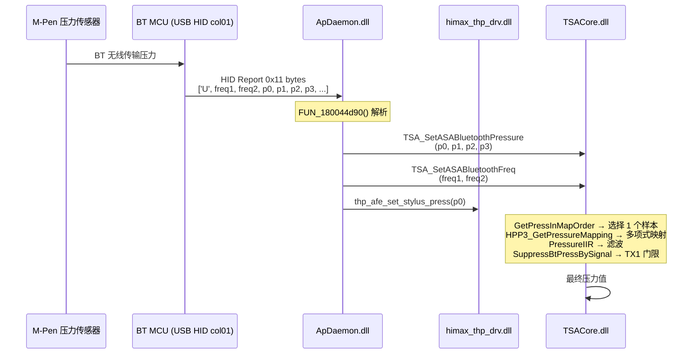

# BT MCU 压力通道 — 完整逆向分析

## 压力 HID 设备

### USB 设备标识

```
VID: 12D1 (Huawei)
PID: 10B8
MI:  00   (Interface 0)
COL: 01   (Collection 1)

匹配字符串: "vid_12d1&pid_10b8&mi_00&col01"
```

### 打开方式
```c
// ApDaemon: FUN_1800a1e90
// 1. FUN_1800a0780() 枚举 HID 设备路径
// 2. 用 "vid_12d1&pid_10b8&mi_00&col01" 匹配设备路径
// 3. CreateFileA(devicePath, GENERIC_READ|GENERIC_WRITE, 
//               FILE_SHARE_READ|FILE_SHARE_WRITE, NULL, OPEN_EXISTING, 0, NULL)
// 4. 存入全局 MCUPressureDevice
```

---

## 17 字节 HID Report 格式

```
ReadFile(MCUPressureDevice, buffer, 0x11, &bytesRead, NULL)
```

### 'U' (0x55) — 压力更新报文

```
Offset  Size    Field           描述
0x00    1       reportType      'U' (0x55) = 压力更新
0x01    1       btFreq1         BT频率1
0x02    1       btFreq2         BT频率2
0x03    2 LE    pressure[0]     压力样本 0 (最新)
0x05    2 LE    pressure[1]     压力样本 1
0x07    2 LE    pressure[2]     压力样本 2
0x09    2 LE    pressure[3]     压力样本 3 (最旧)
0x0B    1       newFreq1        新频率1
0x0C    1       newFreq2        新频率2
0x0D    4       ...             (剩余填充)
```

### 'W' (0x57) — 笔连接信息报文

> 由 `vtable+0xb0` 处理，根据ApDaemon处理可能包含笔配对和版本信息

### 'X' (0x58) — 其他信息报文

> 由 `vtable+0xb8` 处理

---

## 完整数据流



### ApDaemon 'U' 包处理逻辑 (FUN_180044d90)

```c
// param_2 = 17-byte HID report buffer  (byte[0] = 'U')

// 1. 前置调用: 某个锁/同步操作
(*vtable_bt_status + 0x60)(bt_status);

// 2. 调用 TSA_SetASABluetoothPressure(p0, p1, p2, p3)
//    vtable offset +0x4f0 → TSACore 导出函数
(*vtable_tsacore + 0x4F0)(
    *(uint16_t*)(param_2 + 3),   // p0 = 压力样本0
    *(uint16_t*)(param_2 + 5),   // p1 = 压力样本1
    *(uint16_t*)(param_2 + 7),   // p2 = 压力样本2
    *(uint16_t*)(param_2 + 9)    // p3 = 压力样本3
);

// 3. 调用 TSA_SetASABluetoothFreq(freq1, freq2)
//    vtable offset +0x4F8
(*vtable_tsacore + 0x4F8)(
    *(uint8_t*)(param_2 + 1),    // freq1
    *(uint8_t*)(param_2 + 2)     // freq2
);

// 4. 调用 thp_afe_set_stylus_press(p0)
//    通过 himax_thp_drv 的 vtable
(*vtable_drv + 0x1a8)(drv_context, param_2);

// 5. 日志: "pressure is %d %d %d %d freq %d %d"
```

---

## 我们项目的对应关系

### 已有代码

| 原厂组件 | 我们的对应 | 状态 |
|---------|-----------|------|
| MCU HID 枚举+打开 | `PenUsbClient` (win32/PenHidTransport) | ✅ 已有 |
| USB HID ReadFile | `PenSession::PollOnce` → `IPenUsbTransport::ReadPacket` | ✅ 已有 |
| 包解析 | `PenUsbCodec::ParsePacket` | ⚠️ 需要扩展 |
| 压力事件回调 | `PenEventCallback` | ✅ 已有 |
| 连接握手 | - | ❌ 缺失 |
| 压力 → Pipeline | - | ❌ 缺失 |

### 需要做的具体改动

#### 1. 确认 HID 设备路径匹配

在 `PenHidTransport` / `PenUsbClient` 中的设备枚举代码中，确认使用的是 `vid_12d1&pid_10b8&mi_00&col01`（或类似 GUID），而不是事件通道的设备。

> [!IMPORTANT]
> 原厂使用了两个**不同的 HID collection**：
> - **THP_Service** 打开的是**事件通道** (可能是 col00)
> - **ApDaemon** 打开的是**压力通道** (col01)
> 
> 你目前的 `PenUsbClient` 连接的是哪一个？

#### 2. 解析 17 字节压力报文

```cpp
// 在 PenSession::HandleIncomingPacket 或等效位置添加:
struct PenPressureReport {
    uint8_t  reportType;    // 'U' = 0x55
    uint8_t  btFreq1;
    uint8_t  btFreq2;
    uint16_t pressure[4];   // LE, at offset 3,5,7,9
    uint8_t  newFreq1;      // offset 0x0B
    uint8_t  newFreq2;      // offset 0x0C
    uint8_t  pad[4];        // offset 0x0D-0x10
};
// sizeof = 17 (0x11)

// ReadFile 直接读取 17 字节，不经过事件通道的包格式
```

#### 3. 连接到 StylusPipeline

```cpp
// 调用顺序:
// 1. ReadFile → PenPressureReport
// 2. 如果 reportType == 'U':
//      pipeline.SetBluetoothPressure(p[0], p[1], p[2], p[3]);
//      pipeline.SetBluetoothFreq(freq1, freq2);
```

#### 4. 压力映射 (TSACore 内部)

从 TSACore 逆向的映射链:
```
GetPressInMapOrder(p0,p1,p2,p3) → 选择1个样本
  ↓
HPP3_GetPressureMapping(sample) → 多项式映射到 [0, 4095]
  ↓
PressureIIR(0x40) → IIR 低通滤波 (weight=50%)
  ↓
HPP3_SuppressBtPressBySignal() → TX1 信号门限检查
  ↓
最终压力
```

---

## 开放问题

> [!WARNING]
> 1. **你的 `PenUsbClient` 目前连接的 HID 设备的 VID/PID/Collection 是什么？** 需要确认是否已经连上了正确的压力通道设备 (col01)。
> 
> 2. **压力 HID 是无需握手的？** 从逆向来看，ApDaemon 的压力通道似乎**不需要**像事件通道那样发 0x7101/0x7701 握手 — 它直接 `CreateFile + ReadFile` 就开始收数据了。
> 
> 3. **17 字节 raw read vs 你现有的包格式** — 压力通道直接 `ReadFile(0x11)` 读取 **raw 17 字节**，**不走**事件通道那套 0x40 字节包+ header + transportTag 格式。这是一个完全不同的协议。

## 结论

压力通道实际上比事件通道**更简单**：
- 不需要握手序列
- 不需要 ACK
- 直接 `ReadFile(17 bytes)` → 解析第一个字节判断类型 → 提取 4×uint16 压力
- 唯一需要确保的是：**打开正确的 HID Collection (col01)**
