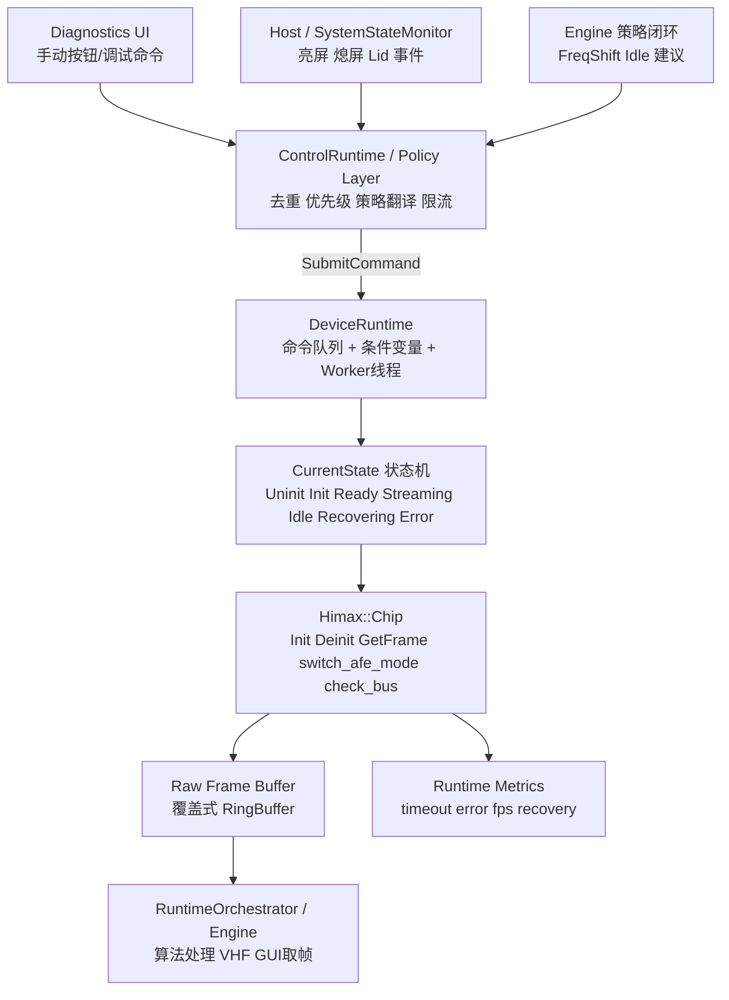
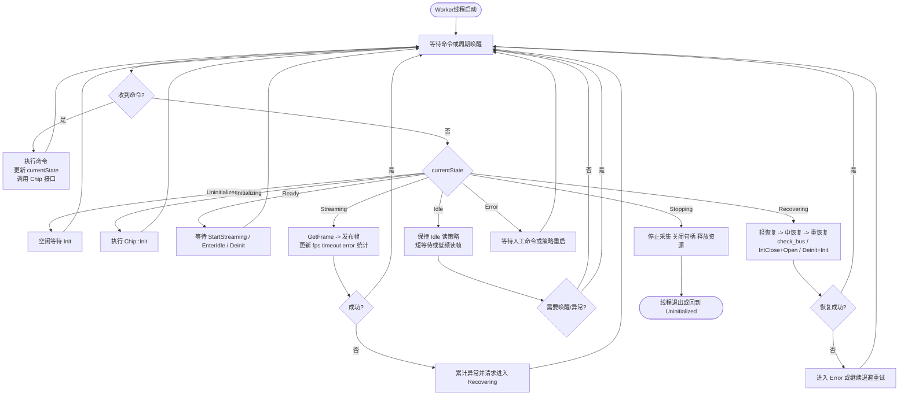

# DeviceRuntime 控制图

下面的流程图基于当前仓库现状与建议演进方向整理，目标是把 `Himax::Chip` 的访问统一收敛到 `DeviceRuntime`，由它负责命令执行、状态维持、采集与恢复。

## 1. 总体控制链路



## 2. DeviceRuntime 状态机

```mermaid
stateDiagram-v2
    [*] --> Uninitialized

    Uninitialized --> Initializing: Init
    Initializing --> Ready: Chip::Init 成功
    Initializing --> Error: Init失败

    Ready --> Streaming: StartStreaming
    Ready --> Stopping: Deinit / Shutdown

    Streaming --> Idle: EnterIdle
    Idle --> Streaming: TouchWakeup / ExitIdle

    Streaming --> Recovering: 连续超时 / 通信异常
    Idle --> Recovering: 通信异常
    Recovering --> Streaming: 恢复成功且需继续采集
    Recovering --> Ready: 恢复成功但未进入采集
    Recovering --> Error: 超过恢复上限 / BusDead

    Streaming --> Stopping: StopStreaming / Deinit / Shutdown
    Idle --> Stopping: Deinit / Shutdown
    Error --> Stopping: Shutdown / 人工停止
    Stopping --> Uninitialized: 收尾完成
```

## 3. Worker 主循环



## 4. 设计要点

- `Himax::Chip` 只允许 `DeviceRuntime` 独占访问。
- 外部模块提交的是“命令”，不是直接修改设备内部状态。
- `currentState` 只允许 worker 线程修改，避免并发竞态。
- 恢复流程必须是状态机的一部分，不能只是错误后直接返回。
